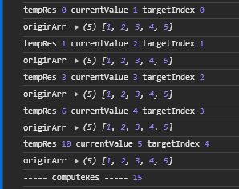

# **数组方法：reduce实现原理**

本篇文章主要介绍数组API-`reduce`的使用以及简单的实现原理。
<!-- more -->

## 1. 认识reduce与使用

### 1.1 了解reduce

`reduce` 是数组原型上的一个方法，用于对数组进行循环处理，处理的动作是外部提供进来的函数，每一次运行该函数会将上一次执行的计算结果作为下一次函数执行的参数传入。

最后，将执行结束的结果汇总为单个返回值。

**注意，** 在第一次执行函数时，因为不存在“上一次执行”，因此，如果需要回调函数从数组索引为 0 的元素开始执行，则需要传递初始值。

否则，数组索引为 0 的元素将被用作初始值，迭代器将从第二个元素开始执行（即从索引为 1 而不是 0 的位置开始）。

大致格式与形参如下：

```js
Array.prototype.reduce(callback(accumulator, currentValue[, index[, array]])[, initialValue])
```

这样看可能很复杂，我们单个拆出来做简单阐述：

- callback：外部提供的函数；

- accumulator：累积器，即上一次回调函数执行的返回值；

- currentValue：当前元素的值；

- index：当前元素的下标；

- array：原始数组；

- initialValue：【可选】表示累积器的初始值。

简单总结一下`reduce`的执行过程可被描述为如下：

1. 如果没有提供 initialValue，则将数组的第一个元素作为累积器的初始值，否则将 initialValue 作为累积器的初始值。

2. 从数组的第二个元素开始，依次对数组中的每个元素执行回调函数。

3. 回调函数的返回值作为下一次回调函数执行时的累积器的值。

4. 对数组中的每个元素执行完回调函数后，reduce 函数返回最后一次回调函数的返回值，即最终的累积值。

### 1.2 简单案例

了解理论概念后，下面通过一个简单的案例来帮助我们更好的理解他的使用方法以及执行过程。

需求如下：计算数组中每个元素出现的次数。

> 输入：\['blue', 'pink', 'blue', 'red', 'pink', 'blue'\]
>
> 输出：\{ blue: 3, pink: 2, red: 1 \}

用`reduce`方法实现如下：

```js
const colors = ['blue', 'pink', 'blue', 'red', 'pink', 'blue'];

const count = colors.reduce((accumulator, currentValue) => {
  accumulator[currentValue] = (accumulator[currentValue] || 0) + 1;
  return accumulator;
}, {});

console.log(count);
```

## 2. 应用场景

简单列举常见的部分应用场景，如下：

- 数值计算，求和、求积、求平均值等；

- 获取数组中最大值；

- 数组去重；

- 统计数组中特定元素的出现次数；

- 将数组中的元素按照特性条件进行分组；

- 筛选出满足特定条件的元素；

- 扁平化数组，将多维数组扁平为一维数组；

- 反转字符串；

- 递归获取对象属性值；

## 3. 原理与实现

看到这里对于`reduce`的原理以及执行过程其实已经了解了，接下来是如何手写实现`reduce`函数。

在实现之前我们先确定下实现思路：

1. **确定初始值：** 判断是否提供了初始值，如有则使用它；否则将使用数组第一个元素来作为函数的初始值。

2. **遍历数组元素：** 从数组的第一个元素（如果第一个被作为初始值则从第二个）开始，对每个元素调用回调函数。

3. **累积结果值：** 回调函数的返回值将被作为下一次调用回调函数的参数。

4. **遍历完成：** 当数组中的每个元素都被回调函数执行处理过后，返回最终的累积值。

**注意，** 在开始的时候我们还需要做好容错：

- 判断传入的回调是否是函数，如果不是函数类型需要抛出错误;

- 当数组长度为0，并且没有设置初始值时，抛出错误；

确定思路后，我们可以来实现`reduce`函数如下：

```js
// Array.prototype.reduce(callback(accumulator, currentValue[, index[, array]])[, initialValue])
function selfReduce (callback, initialValue) {
  let targetArr = this
  // 先做判断
  // TypeError
  if (typeof callback != 'function') {
    throw new TypeError( callback +'不是一个函数！');
  }

  // TypeError
  if (this.length == 0 && typeof initialValue == 'undefined') {
    throw new TypeError('禁止为"reduce"方法提供空数组以及未定义的原始值！');
  }

  let accumulator = initialValue === undefined ? targetArr[0] : initialValue
  let startIndex = initialValue === undefined ? 1 : 0

  for (let index = startIndex; index < targetArr.length; index ++) {
    accumulator = callback(accumulator, targetArr[index], index, targetArr)
  }

  return accumulator
}

// 将 selfReduce 方法绑定到数组的原型链上
Array.prototype.selfReduce = selfReduce

// 编写一个测试的数组，期望输入15
let testArr = [1, 2, 3, 4, 5]

// 测试手写的reduce是否可行
let computeRes = testArr.selfReduce((tempRes, currentValue, targetIndex, originArr) => {
  console.log('tempRes', tempRes, 'currentValue', currentValue, 'targetIndex', targetIndex)
  console.log('originArr', originArr)

  return tempRes + currentValue
}, 0)

console.log('----- computeRes -----', computeRes)
```

复制以上代码，并在浏览器的控制台粘贴运行试一下效果：

