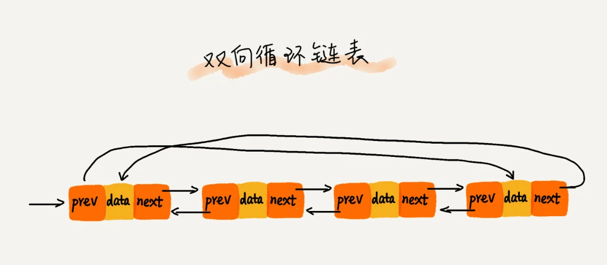

# **链表结构**

本篇文章将学习“链表”结构，理解其概念，并尝试用JS实现一个“链表”结构。
<!-- more -->

## 1. 认识链表

> 定义
> 链表（Linked list） 通过“指针”将一组零散的内存块串联起来使用，它并不需要一块连续的内存空间。

最常见的链表结构有：单链表、循环链表和双向链表。

**链表结构的优缺点：**

- 优点：存储空间不必事先分配，在需要存储空间的时候可以临时申请，不会造成空间的浪费；链表最大的优点在于可以灵活的添加和删除元素，插入、移动、删除元素的时间效率远比数组高。

- 缺点：不仅数据元素本身的数据信息要占用存储空间，指针也需要占用存储空间，链表结构比数组结构的空间开销大。

### 1.1 单链表


内存块（data + next）称为链表的 “节点”。

为了将所有的节点串起来，每个链表的节点除了存储数据之外，还需要记录链上的下一个节点的地址。

这个记录下个节点地址的指针叫作后继指针next。

第一个节点叫作头节点，把最后一个节点叫作尾节点。

其中，头节点用来记录链表的基地址，有了它就可以遍历得到整条链表。

而尾节点特殊的地方是：指针不是指向下一个节点，而是指向一个空地址 NULL，表示这是链表上最后一个节点。

### 1.2 循环链表


循环链表是一种特殊的单链表。它跟单链表唯一的区别就在尾节点。

单链表的尾节点指针指向空地址，表示这就是最后的节点了；而循环链表的尾节点指针是指向链表的头节点，像一个环一样首尾相连，所以叫作“循环”链表。

和单链表相比，循环链表的优点是从链尾到链头比较方便，当要处理的数据具有环型结构特点时，就特别适合采用循环链表。

比如著名的约瑟夫问题，尽管用单链表也可以实现，但是用循环链表实现的话，代码就会简洁很多。

### 1.3 双向链表


单向链表只有一个方向，节点只有一个后继指针 next 指向后面的节点。

而双向链表支持两个方向，每个节点不止有一个后继指针 next 指向后面的节点，还有一个前驱指针 prev 指向前面的节点。

双向链表需要额外的两个空间来存储后继节点和前驱节点的地址，所以存储同样多的数据，双向链表要比单链表占用更多的内存空间。

虽然两个指针比较浪费存储空间，但可以支持双向遍历，支持 O(1) 时间复杂度的情况下找到前驱节点，这也使双向链表在某些情况下的插入、删除等操作都要比单链表简单、高效。

除了插入、删除操作有优势之外，对于一个有序链表，双向链表的按值查询的效率也要比单链表高一些。

因为可以记录上次查找的位置 p，每次查询时，根据要查找的值与 p 的大小关系，决定是往前还是往后查找，所以平均只需要查找一半的数据。

**这就是用空间换时间的设计思想。**

当内存空间充足的时候，如果我们更加追求代码的执行速度，我们就可以选择空间复杂度相对较高、但时间复杂度相对很低的算法或者数据结构。

相反，如果内存比较紧缺，比如代码跑在手机或者单片机上，这个时候，就要反过来用时间换空间的设计思路。

### 1.4 双向循环链表



把循环链表和双向链表这两种链表整合在一起，就是双向循环链表。


## 2. 操作链表

数据结构的操作一般涉及到增、删、改、查 4 种情况，链表的操作也基本上是这 4 种情况。

### 2.1 插


向链表中插入一个节点的效率很高，需要修改它前面的节点(前驱)，使其指向新加入的节点，而将新节点指向原来前驱节点指向的节点即可。

### 2.2 删

只需将待删节点的前驱节点指向待删节点的，同时将待删节点指向 null，那么节点就删除成功了。

但是，如果要删除链表中的最后一个节点，则需要特殊处理，判断head节点的下一个节点是否指向null，若是则把head置为null。

在进行数组的插入、删除操作时，为了保持内存数据的连续性，需要做大量的数据搬移，所以时间复杂度是 O(n)。

而在链表中插入或者删除一个数据，我们并不需要为了保持内存的连续性而搬移节点，因为链表的存储空间本身就不是连续的。所以，在链表中插入和删除一个数据是非常快速的，我们只需要考虑相邻节点的指针改变，所以对应的时间复杂度是 O(1)。

### 2.3 查

链表要想随机访问第 k 个元素，没有数组那么高效。

因为链表中的数据并非连续存储的，无法像数组那样，根据首地址和下标，通过寻址公式直接计算出对应的内存地址，而是需要根据指针一个节点一个节点地依次遍历，直到找到相应的节点。

所以，链表随机访问的性能没有数组好，需要 O(n) 的时间复杂度。

### 2.4 改

修改链表中某个节点的值，只需修改该节点的data值即可。

### 2.5 增加节点

向链表尾部添加节点，需要判断以下链表是否为空，若是空链表，直接将链表的 head 指向新节点，否则需要遍历链表直至找到链表尾节点，再将尾节点的 head 指向新节点。

## 3. 实现链表

### 3.1 单向链表

单向链表的实现包含两个类：

- 一个是 Node 类，用来表示节点；

- 一个是 LinkedList 类，提供了对链表进行操作的方法。

Node 类包含两个属性：data 保存节点上的数据，next 指向后一个节点；

LinkedList 类包含两个属性：head 保存该链表的头节点，length 保存链表包含的节点个数，还提供了对链表进行操作的方法：

- push(data) 向链表尾部添加一个新的项；

- insert(position, data) 向链表的特定位置插入一个新的项；

- indexOf(data) 返回节点在链表中的索引，如果链表中没有该节点就返回 -1；

- update(position, data) 修改某个位置的节点；

- removeAt(position) 从链表的特定位置移除一项；

- remove(data) 从链表中移除一项；

- getNode(position) 获取对应位置的节点；

- getLength() 返回链表包含的节点个数，与数组的 length 属性类似；

- isEmpty() 判断链表是否为空，返回 Boolean 值；

- toString() 将链表中节点以字符串形式返回；

```js
// 节点类
class Node {
  constructor(data) {
    this.data = data;
    this.next = null;
  }
}

// 单项链表类
class LinkedList {
  constructor() {
    this.head = null;
    this.length = 0;
  }

  // 在链尾添加节点
  upsh(data) {
    let node = new Node(data);
    if (this.head === null) {
      this.head = node;
    } else {
      let current = this.head;
      while (current.next) {
        current = current.next;
      }
      current.next = node;
    }
    this.length++;
  }

  // 在指定位置（position）插入节点
  // position = 0 表示新插入后是第一个节点
  // position = 1 表示新插入后是第二个节点，以此类推
  insert(position, data) {
    if (position < 0 || position > this.length) return false;
    let node = new Node(data);
    let prev = new Node(0);
    prev.next = this.head;
    let index = 0;
    while (index < position) {
      prev = prev.next;
      index++;
    }
    let temp = prev.next;
    prev.next = node;
    node.next = temp;
    if (position === 0) {
      this.head = node;
    }
    this.length++;
    return node;
  }

  // 获取指定位置（position）的元素
  getNode(position) {
    if (position < 0 || position >= this.length) return null;
    let prev = this.head;
    let index = 0;
    while (index < position) {
      prev = prev.next;
      index++;
    }
    return prev.data;
  }

  // 返回指定 data 的 index，如果没有则返回 -1
  indexOf(data) {
    let prev = this.head;
    let index = 0;
    while (prev) {
      if (prev.data === data) return index;
      prev = prev.next;
      index++;
    }
    return -1;
  }

  // 修改指定位置（position）的节点
  update(position, data) {
    if (position < 0 || position >= this.length) return null;
    let prev = this.head;
    let index = 0;
    while (index < position) {
      prev = prev.next;
      index++;
    }
    prev.data = data;
  }

  // 删除指定位置（position）的节点
  removeAt(position) {
    if (position < 0 || position >= this.length) return false;
    let prev = new Node(0);
    prev.next = this.head;
    let index = 0;
    while (index < position) {
      prev = prev.next;
      index++;
    }
    let node = prev.next;
    prev.next = node.next;
    if (position === 0) {
      this.head = node.next;
    }
    this.length--;
    return node;
  }

  // 删除节点
  remove(data) {
    return this.removeAt(this.indexOf(data));
  }

  // 判断链表是否为空，返回 Boolean 值
  isEmpty() {
    return this.length === 0;
  }

  // 返回链表包含的节点个数
  getLength() {
    return this.length;
  }

  // 将链表中节点以字符串形式返回
  toString() {
    let prev = this.head;
    let res = [];
    while (prev) {
      res.push(prev.data);
      prev = prev.next;
    }
    return res.join(",");
  }
}
```

### 3.2 双向链表

双向链表相连的过程是双向的，实现原理包含两个类：

- 一个是 DoublyNode 类，用来表示节点，它除了有指向后一个节点的 next 指针，还有指向前一个节点的 prev 指针，第一个节点的 prev 指向 null，最后一个节点的 next 指向 null；

- 一个是 DoublyLinkedList 类，提供了对双向链表进行操作的方法，它不仅有 head 指针指向第一个节点，而且有 tail 指针指向最后一个节点。

DoublyNode 类包含三个属性：data 储存数据，prev 指向前一个节点，next 指向后一个节点；

DoublyLinkedList 类包含三个属性：head 保存该链表的头节点，tail 保存该链表的尾节点，length 保存链表包含的节点个数，还提供了对双向链表进行操作的方法：

- append(data) 向链表尾部添加一个新的项；

- insert(position, data) 向链表的特定位置插入一个新的项；

- getData(position) 获取对应位置的节点；

- indexOf(data) 返回节点在链表中的索引，如果链表中没有该节点就返回 -1；

- update(position, data) 修改某个位置的节点；

- removeAt(position) 从链表的特定位置移除一项；

- remove(data) 从链表中移除一项；

- isEmpty() 判断链表是否为空，返回 Boolean 值；

- count() 返回链表包含的节点个数，与数组的 length 属性类似；

- toString() 将链表中节点以字符串形式返回；

- backwordString() 反向遍历节点，以字符串形式返回；


```js
// 双向链表的节点类（继承单向链表的节点类）
class DoublyNode extends Node {
  constructor(data) {
    super(data);
    this.prev = null;
  }
}
// 双向链表类（继承单向链表类）
class DoublyLinkedList extends LinkedList {
  constructor() {
    super();
    this.tail = null;
  }
  // 在链尾添加节点，重写 push()
  push(data) {
    let node = new DoublyNode(data);
    if (this.head === null) {
      this.head = node;
      this.tail = node;
    } else {
      // 直接通过 tail 指针在链尾添加节点
      this.tail.next = node;
      node.prev = this.tail;
      this.tail = node;
    }
    this.length++;
  }

  // 在指定位置（position）插入节点，重写 insert()
  insert(position, data) {
    if (position < 0 || position > this.length) return false;
    let node = new DoublyNode(data);
    let cur = new DoublyNode(null);
    cur.next = this.head;
    let index = 0;
    while (index < position) {
      cur = cur.next;
      index++;
    }
    let temp = cur.next;
    cur.next = node;
    node.next = temp;
    node.prev = cur;
    temp.prev = node;
    if (position === 0) {
      this.head = node;
      this.head.prev = null;
    }
    if (position === this.length) {
      this.tail = node;
    }
    this.length++;
    return node;
  }

  // 删除指定位置（position）的节点，重写 removeAt()
  removeAt(position) {
    if (position < 0 || position >= this.length) return false;
    let cur = new DoublyNode(null);
    cur.next = this.head;
    let index = 0;
    while (index < position) {
      cur = cur.next;
      index++;
    }
    let node = cur.next;
    cur.next = node.next;
    if (node.next) {
      node.next.prev = cur;
    }
    if (position === 0) {
      this.head = node.next;
      this.head.prev = null;
    }
    if (position === this.length - 1) {
      this.tail = this.tail.prev;
    }
    this.length--;
    return node;
  }

  // 反向遍历节点，以字符串形式返回
  backwordString() {
    let cur = this.tail;
    let res = [];
    while (cur) {
      res.push(cur.data);
      cur = cur.prev;
    }
    return res.join(",");
  }

  // 其他方法都继承 LinkedList 类的
}
```

## 4. 应用场景

待完善。