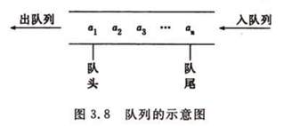

# **队列结构**

本篇文章将学习“队列”结构，理解其概念，并尝试用JS实现一个“队列”结构。
<!-- more -->

## 1. 认识队列结构

队列（Queue）是一种特殊类型的线性数据结构，它遵循先进先出（FIFO）的原则。

这与日常生活中的排队非常相似，先来的人先得到服务，后来的人后得到服务。

在计算机科学中，队列被广泛应用于各种场景，如任务调度、缓冲区管理、打印机打印任务管理等。

队列是一种操作受限的线性数据结构，基本操作主要有两个：入队和出队。

- 入队（Enqueue）：入队操作是在队列的末尾添加一个新的元素。在实现时，我们通常需要检查队列是否已满，如果已满则无法继续添加新元素，这称为“上溢”现象。为了避免这种情况，有时我们会提前分配更大的空间，或者使用动态扩展的策略。

- 出队（Dequeue）：出队操作是移除队列的头部元素，并返回这个元素的值。这意味着最早进入队列的元素将被最先移除。如果队列为空时进行出队操作，就会出现“下溢”现象。在正常情况下，下溢是一种需要处理的边界情况，而不是错误。



我们还需要认识几个名词：队头、队尾、空队。

- 队头：允许插入数据的一端

- 队尾：允许删除数据的一端

- 空队：没有任何数据元素的队列

综上，我们对队列进行一个总结，大致就是：

队列是一个特殊的线性表，元素具有前驱后继的线性关系，数据只能一个一个进入队列，并且先进队列的元素也会优先出队，也就是“先进先出”。

队列中的元素按照前后顺序进行排队，第一个元素称为队头，最后一个元素称为队尾，没有任何元素的队列成为空队。

## 2. 实现队列结构

```js
class Queue {
    constructor() {
        // 初始化一个空数组来存储队列元素
        this.items = [];
    }

    // 入队操作：在队列尾部添加元素
    enqueue(element) {
        // 将元素添加到数组末尾
        this.items.push(element);
    }

    // 出队操作：移除队列头部的元素并返回它
    dequeue() {
        // 检查队列是否为空
        if (this.isEmpty()) {
            // 如果为空，则抛出错误或返回null/undefined
            return null;
        }
        // 移除并返回数组的第一个元素
        return this.items.shift();
    }

    // 检查队列是否为空
    isEmpty() {
        // 如果数组长度为0，则队列为空
        return this.items.length === 0;
    }

    // 获取队列的长度
    size() {
        // 返回数组的长度，即队列的元素个数
        return this.items.length;
    }

    // 查看队列的前端元素
    front() {
        // 如果队列不为空，返回队列的第一个元素
        if (!this.isEmpty()) {
            return this.items[0];
        }
        // 如果队列为空，返回null或undefined
        return null;
    }

    // 清空队列
    clear() {
        // 将数组长度设置为0，清空队列
        this.items.length = 0;
    }

    // 打印队列内容
    printQueue() {
        console.log(this.items);
    }
}

// 使用示例
const queue = new Queue();

console.log(queue.isEmpty()); // 输出: true

queue.enqueue('Apple');
queue.enqueue('Banana');
queue.enqueue('Cherry');

console.log(queue.size()); // 输出: 3
queue.printQueue(); // 输出: ['Apple', 'Banana', 'Cherry']

console.log(queue.front()); // 输出: 'Apple'

const removedElement = queue.dequeue();
console.log(removedElement); // 输出: 'Apple'

queue.printQueue(); // 输出: ['Banana', 'Cherry']

console.log(queue.isEmpty()); // 输出: false

queue.clear();
console.log(queue.isEmpty()); // 输出: true
```

在上述代码中，我们定义了一个Queue类，它有一个私有属性items，用于存储队列中的元素，里面还实现了以下几个方法：

- enqueue：用于在队列尾部添加元素，通过push方法实现。

- dequeue：用于移除队列头部的元素，并返回该元素，通过shift方法实现。

- isEmpty：检查队列是否为空，

- size：返回队列中元素的数量。

- front：返回队列的第一个元素但不移除它。

- clear：清空队列，

- printQueue：用于打印队列的内容。

在实际使用中，我们可以根据需要进一步扩展这个队列类，比如添加对队列容量的限制，或者在入队和出队时添加异常处理等。

## 3. 应用场景

队列在业务场景中有着广泛的应用，以下是一些常见的业务场景示例：

1. 订单处理系统

在电商或零售业务中，订单处理系统需要处理大量的订单。当新订单到达时，它们被放入队列中，等待被处理。系统按照队列的顺序依次处理订单，确保每个订单都能得到及时且正确的处理。

2. 金融交易系统

金融领域的交易系统，如股票交易或外汇交易，需要快速且准确地处理大量的交易请求。通过使用队列，交易请求可以按照到达的顺序被有序地处理，确保交易的公平性和一致性。

3. 消息推送服务

在移动应用或Web应用中，经常需要向用户推送消息，如通知、提醒或广告。这些消息请求可以被放入队列中，然后由推送服务按照队列的顺序发送给用户。这种方式可以确保消息的有序性和及时性。

4. 异步任务处理

在许多业务场景中，存在一些耗时的异步任务，如视频处理、图片压缩或数据分析等。这些任务可以被放入队列中，由后台服务异步地处理。这样，主线程可以继续处理其他任务，而不需要等待这些耗时任务完成。

5. 日志收集与分析

在大型系统中，日志的收集和分析对于系统监控和故障排查至关重要。通过使用队列，日志数据可以被有序地收集并发送到分析系统。这种方式可以确保日志的完整性和一致性，便于后续的分析和处理。

6. 缓存失效与刷新

在缓存系统中，当某个缓存项失效或需要刷新时，可以将其放入队列中。缓存管理系统可以按照队列的顺序处理这些失效或刷新的请求，确保缓存的一致性和可靠性。

这些只是队列在业务场景中的一些常见应用示例。实际上，随着业务需求的不断发展和变化，队列的应用也在不断扩展和创新。队列作为一种高效的数据处理机制，为业务系统的稳定性和性能提供了有力的支持。
