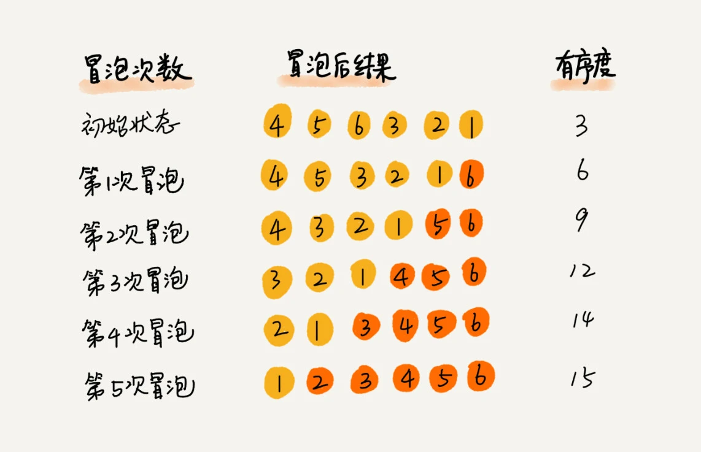
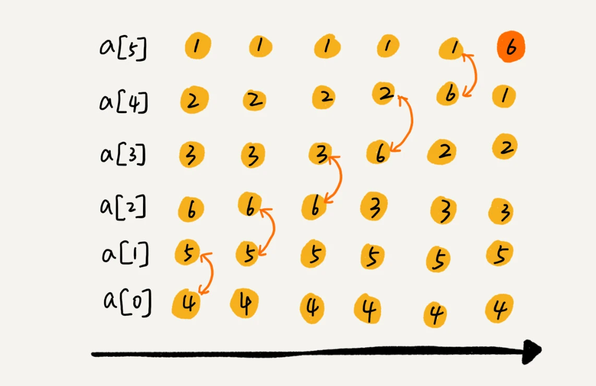

# **冒泡排序**

本篇文章从理解冒泡排序，到实现，再到应用场景做一个阐述。
<!-- more -->

## 1. 认识冒泡排序

冒泡排序（Bubble Sort）是一种简单的排序算法。它重复地走访过要排序的数列，一次比较两个元素，如果他们的顺序错误就把他们交换过来。走访数列的工作是重复地进行直到没有再需要交换，也就是说该数列已经排序完成。

这个算法的名字由来是因为越小的元素会经由交换慢慢“浮”到数列的顶端。就如同汽水中二氧化碳的气泡最终会上浮到顶端一样，故名“冒泡排序”。

以下是冒泡排序的基本步骤：

1. 比较相邻的元素。如果第一个元素比第二个元素大，就交换他们两个。

2. 对每一对相邻元素作同样的工作，从开始第一对到结尾的最后一对。这步做完后，最后的元素会是最大的数。

3. 针对所有的元素重复以上的步骤，除了最后一个。

4. 持续每次对越来越少的元素重复上面的步骤，直到没有任何一对数字需要比较。

冒泡排序的时间复杂度为O(n^2)，其中n是待排序元素的数量。这意味着冒泡排序在处理大型数据集时可能效率较低。然而，由于其实现简单且易于理解，冒泡排序在教学和简单的应用中仍然有其价值。

值得注意的是，冒泡排序在最好的情况下（即输入序列已经是排序好的）的时间复杂度为O(n)。但在实际应用中，我们通常更关注最坏情况和平均情况的时间复杂度，因为无法保证输入序列总是已经排序好的。

冒泡的过程只涉及相邻数据的交换操作，只需要常量级的临时空间，所以它的空间复杂度为 O(1)，是一个原地排序算法。相同大小的数据在排序前后不会改变顺序，所以冒泡排序是稳定的排序算法。

**示意图：**





## 2. 实现冒泡排序

```js
function bubbleSort(arr) {
  // 获取数组长度
  const len = arr.length;

  // 外层循环控制所有轮数
  for (let i = 0; i < len - 1; i++) {
    // 内层循环负责相邻元素的比较和交换
    for (let j = 0; j < len - 1 - i; j++) {
      // 如果当前元素大于下一个元素，则交换它们
      if (arr[j] > arr[j + 1]) {
        // 使用解构赋值进行元素交换
        // [arr[j], arr[j + 1]] = [arr[j + 1], arr[j]];
        // 使用临时数据实现交换
        let temp = arr[j + 1]; // 交换
        arr[j + 1] = arr[j];
        arr[j] = temp;
      }
    }
  }

  // 返回排序后的数组
  return arr;
}

// 示例数组
const numbers = [64, 34, 25, 12, 22, 11, 90];

// 对数组进行冒泡排序
const sortedNumbers = bubbleSort(numbers);

// 打印排序后的数组
console.log(sortedNumbers);
```

在上面的代码中：

- bubbleSort 函数接收一个数组 arr 作为参数，并返回排序后的数组。

- 外层循环 for (let i = 0; i < len - 1; i++) 负责控制排序的轮数。由于每一轮排序都会将一个最大的数冒泡到数组末尾，所以每一轮过后，最大的数已经就位，不需要再参与后续的排序，因此内层循环的次数会逐轮减少。

- 内层循环 for (let j = 0; j < len - 1 - i; j++) 用来比较相邻元素并进行交换。因为每轮最大的数会冒泡到末尾，所以每次比较只需要比较到未排序部分的末尾即可。

- 如果 arr[j] 大于 arr[j + 1]，则交换这两个元素的位置。这里使用了ES6的解构赋值来简化交换操作。

- 最后，返回排序后的数组。

示例数组 numbers 包含了几个无序的数字，通过调用 bubbleSort 函数，这些数字会被排序，并打印出排序后的结果。

## 3. 应用场景

冒泡排序的应用场景主要集中在对稳定性有要求，数据量不大且基本有序的情况下。以下是几个具体的应用实例：

- 购物选择：在购物时，顾客可能会比较不同商品的价格、品质等因素，以选择最符合自己需求的商品。这个过程可以类比为冒泡排序，通过不断比较和交换，最终选出最优选项。

- 活动安排：在组织活动或安排日程时，如节目的演出顺序，可以根据各个节目的时长、效果等因素进行排序，通过冒泡排序的思想，先初步安排，然后根据实际需要进行调整，最终得到最佳的安排顺序。

-数据分析和统计：冒泡排序也常用于数据分析和统计。例如，我们可以使用冒泡排序对一组数据进行排序，然后根据排序结果进行统计和分析，找出其中的规律和特点，为后续的决策提供支持。

- 教学示例：冒泡排序的逻辑相对简单，易于理解，因此在教学过程中，经常被用作for循环和分析算法复杂度的示例。

需要注意的是，虽然冒泡排序在某些场景下是有效的，但其时间复杂度为O(n^2)，在处理大型数据集时可能效率较低。因此，在实际应用中，需要根据具体需求和数据规模来选择合适的排序算法。

## 参考文章

- 图片来源：[LeetCode-JS 通关指南 - 冒泡排序](https://2xiao.github.io/leetcode-js/leetcode/algorithm/sort.html#%E5%86%92%E6%B3%A1%E6%8E%92%E5%BA%8F-bubble-sort)