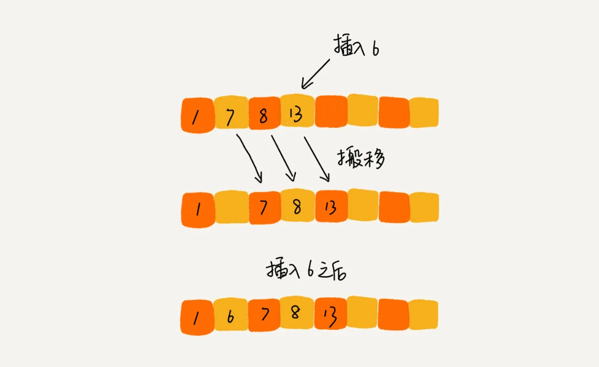

# **插入排序**

本篇文章从理解插入排序，到实现，再到应用场景做一个阐述。
<!-- more -->

## 1. 认识插入排序

插入排序（Insertion Sort）是一种简单直观的排序算法。它的工作原理是通过构建有序序列，对于未排序数据，在已排序序列中从后向前扫描，找到相应位置并插入。插入排序在实现上，通常采用in-place排序（即只需用到O(1)的额外空间的排序），因而在从后向前扫描过程中，需要反复把已排序元素逐步向后挪位，为最新元素提供插入空间。

以下是插入排序的基本步骤：

1. 从第一个元素开始，该元素可以认为已经被排序。

2. 取出下一个元素，在已经排序的元素序列中从后向前扫描。

3. 如果该元素（已排序）大于新元素，将该元素移到下一位置。

4. 重复步骤3，直到找到已排序的元素小于或者等于新元素的位置。

5. 将新元素插入到该位置后。

6. 重复步骤2~5，直到所有元素均排序完毕。

插入排序的特点如下：

- 稳定性：插入排序是稳定的排序方法，即相等的元素在排序后不会改变相对顺序。

- 时间复杂度：插入排序的时间复杂度为O(n^2)，其中n是待排序元素的数量。在最坏和平均情况下，其性能表现相同。然而，对于部分有序的数组，插入排序可能表现得更好。

- 空间复杂度：插入排序的空间复杂度为O(1)，即它只需要常量级的额外空间。

插入排序适用于数据量较小，或者部分有序的情况。对于几乎有序的数组，插入排序的时间复杂度可以接近O(n)。然而，对于大型且完全无序的数组，插入排序的性能可能不如其他更高效的排序算法。

总的来说，插入排序是一种简单直观的排序方法，适用于特定场景，如数据量小或部分有序的情况。在选择排序算法时，应根据数据的规模、有序程度以及性能要求来综合考虑。



## 2. 实现插入排序

```js
function insertionSort(arr) {
  // 遍历从1到数组长度的所有元素
  for (let i = 1; i < arr.length; i++) {
    // 当前需要插入的元素
    const current = arr[i];
    // 当前元素需要插入的位置的前一个元素的索引
    let j = i - 1;

    // 将大于当前元素的值向后移动，直到找到当前元素正确的位置
    while (j >= 0 && arr[j] > current) {
      // 将前一个元素向后移动一个位置
      arr[j + 1] = arr[j];
      // 将索引向前移动一位
      j--;
    }

    // 将当前元素插入到正确的位置
    arr[j + 1] = current;
  }

  // 返回排序后的数组
  return arr;
}

// 示例数组
const numbers = [64, 34, 25, 12, 22, 11, 90];

// 对数组进行插入排序
const sortedNumbers = insertionSort(numbers);

// 打印排序后的数组
console.log(sortedNumbers);
```

在上面的代码中：

- insertionSort 函数接收一个数组 arr 作为参数，并返回排序后的数组。

- 外层循环 for (let i = 1; i < arr.length; i++) 从数组的第二个元素开始遍历（索引为1），因为第一个元素默认已经是有序的。

- const current = arr[i] 取出当前需要插入的元素。

- let j = i - 1 初始化一个索引 j，用于比较当前元素与已排序部分的元素。

- while 循环用于比较 arr[j] 和 current，如果 arr[j] 大于 current，则将 arr[j] 向后移动一位，并将 j 减1，直到找到 current 的正确插入位置。

- 在找到正确位置后，将 current 插入到 arr[j + 1] 的位置。

- 重复上述过程，直到数组完全排序。

示例数组 numbers 包含了几个无序的数字，通过调用 insertionSort 函数，这些数字会被排序，并打印出排序后的结果。

插入排序通常适用于数据量较小或部分有序的数组，因为它对于已排序部分的元素只需做少量的移动操作。然而，对于大型且完全无序的数组，插入排序可能不是最高效的选择。在选择排序算法时，应考虑数据的规模、有序程度以及性能要求。

## 3. 应用场景

插入排序的应用场景主要包括以下几个方面：

1. 数据量较小的情况：当需要排序的数据量较小时，插入排序的效率相对较高。由于其实现简单，对于小规模的数据排序非常适用。

2. 数据局部有序或整体有序的情况：如果数据已经部分有序，插入排序的性能会更好。这是因为插入排序的思想是将一个记录插入到已经排好序的有序表中，对于已经有序的部分，插入排序只需要少量的移动操作即可完成排序。

3. 对稳定性要求高的场景：插入排序是一种稳定的排序方式。对于有相同元素的情况，插入排序能够保持它们的相对顺序不变。因此，在需要保持元素相对顺序的场景中，插入排序是一个很好的选择。

4. 对数据的插入操作频繁的场景：由于插入排序的实现方式相对简单，它适合于频繁进行插入和删除操作的场景。当需要经常向已排序的数据集中插入新元素时，插入排序能够高效地维护数据的排序状态。

需要注意的是，虽然插入排序在某些场景下表现出色，但其时间复杂度为O(n^2)，在处理大型数据集时可能效率较低。因此，在选择排序算法时，应根据数据的规模、有序程度以及性能要求来综合考虑。对于大型数据集，通常推荐使用更高效的排序算法，如快速排序或归并排序。

## 参考文章

- 图片来源：[LeetCode-JS 通关指南 - 插入排序](https://2xiao.github.io/leetcode-js/leetcode/algorithm/sort.html#%E6%8F%92%E5%85%A5%E6%8E%92%E5%BA%8F-insertion-sort)
