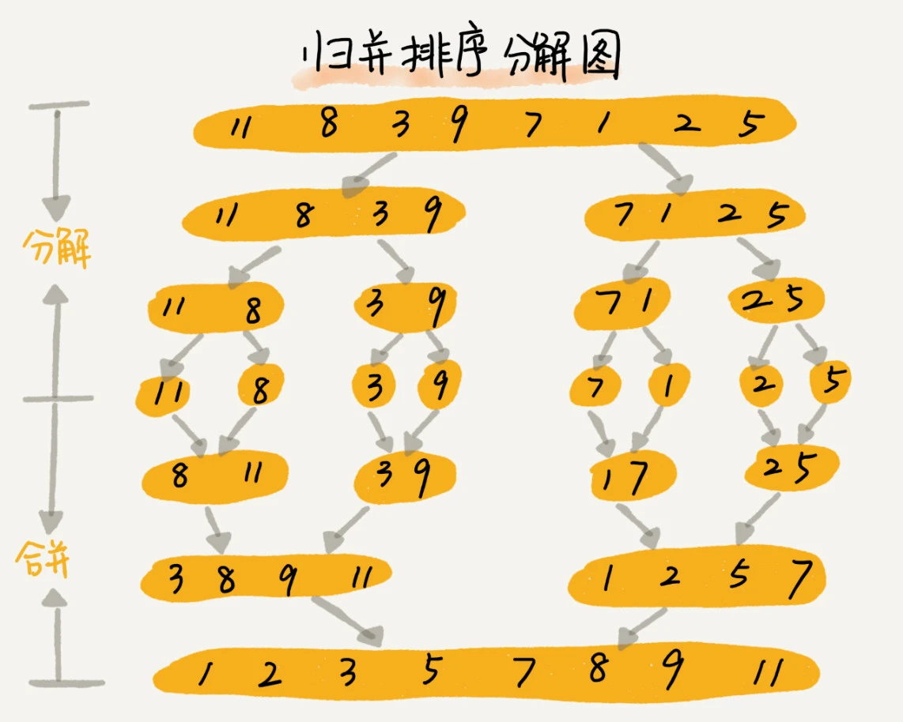

# **归并排序**

本篇文章从理解归并排序，到实现，再到应用场景做一个阐述。
<!-- more -->

## 1. 认识归并排序

归并排序（Merge Sort）是一种分治思想的排序算法，它将待排序的序列划分为若干个子序列，每个子序列是有序的，然后再把有序子序列合并为整体有序序列。

归并排序的基本步骤可以分为以下三步：

1. 分解：将数组分解成两个较小的子数组，直到子数组的大小为1。

2. 递归进行排序并合并：递归地对子数组进行排序，并将已排序的子数组合并成一个大的有序数组，直到合并为1个完整的数组。

3. 合并：合并两个已排序的子数组，生成一个完全排序的数组。

在合并的过程中，通常我们会用到两个指针，一个指向左边子数组的起始位置，另一个指向右边子数组的起始位置。然后，我们比较这两个指针所指向的元素，将较小的元素放入临时数组或原数组（通过移动元素的方式），并将指针向后移动一位。当其中一个子数组的所有元素都已经被放入临时数组或原数组后，我们将另一个子数组剩余的元素依次放入。

归并排序的时间复杂度是O(n log n)，其中n是待排序数组的长度。这是因为归并排序的递归深度是log n，每一层递归都需要遍历整个数组，所以总的时间复杂度是O(n log n)。虽然归并排序的时间复杂度与快速排序相同，但由于归并排序是稳定的排序算法，且其递归过程相对简单，因此在某些情况下可能会更受欢迎。

归并排序的空间复杂度主要取决于合并操作时的临时存储空间，最坏情况下需要额外的O(n)空间来存储临时数组。然而，如果我们在原数组上进行合并操作（通过移动元素的方式），那么空间复杂度可以降低到O(1)，但这会增加算法的复杂度。

总的来说，归并排序是一种非常有效且稳定的排序算法，特别适用于大规模数据的排序问题。



## 2. 实现归并排序

```js
function mergeSort(arr) {
  // 如果数组长度小于等于1，则直接返回，因为长度为1的数组已是有序数组
  if (arr.length <= 1) {
    return arr;
  }

  // 找出中点，将数组分为左右两个子数组
  const mid = Math.floor(arr.length / 2);
  const left = arr.slice(0, mid);
  const right = arr.slice(mid);

  // 递归地对左右两个子数组进行归并排序
  const sortedLeft = mergeSort(left);
  const sortedRight = mergeSort(right);

  // 合并两个已排序的子数组
  return merge(sortedLeft, sortedRight);
}

function merge(left, right) {
  let result = []; // 用于存放合并后的有序数组
  let leftIndex = 0; // 指向左子数组的指针
  let rightIndex = 0; // 指向右子数组的指针

  // 当左右两个子数组都有元素时，比较并取较小的元素放入结果数组
  while (leftIndex < left.length && rightIndex < right.length) {
    if (left[leftIndex] < right[rightIndex]) {
      result.push(left[leftIndex]);
      leftIndex++;
    } else {
      result.push(right[rightIndex]);
      rightIndex++;
    }
  }

  // 将左子数组剩余的元素加入结果数组
  while (leftIndex < left.length) {
    result.push(left[leftIndex]);
    leftIndex++;
  }

  // 将右子数组剩余的元素加入结果数组
  while (rightIndex < right.length) {
    result.push(right[rightIndex]);
    rightIndex++;
  }

  return result;
}

// 示例数组
const numbers = [64, 34, 25, 12, 22, 11, 90];

// 对数组进行归并排序
const sortedNumbers = mergeSort(numbers);

// 打印排序后的数组
console.log(sortedNumbers);
```

在这段代码中，mergeSort 函数是归并排序的主要函数，它接受一个数组 arr 作为参数，并通过递归地将数组划分为更小的子数组，直到子数组长度为1，然后调用 merge 函数将已排序的子数组合并成一个大的有序数组。

merge 函数则负责合并两个已排序的子数组。它使用两个指针分别指向两个子数组的起始位置，比较两个指针所指向的元素，并将较小的元素添加到结果数组中。当其中一个子数组的所有元素都被添加到结果数组后，它将另一个子数组剩余的元素依次添加到结果数组中。

最后，代码创建了一个示例数组 numbers，调用 mergeSort 函数对其进行排序，并打印出排序后的数组 sortedNumbers。

## 3. 应用场景

归并排序的应用场景非常广泛，特别是在处理大规模数据排序和需要稳定排序算法的情况下。以下是归并排序的一些主要应用场景：

1. 大规模数据处理：当需要处理的数据量非常大时，归并排序是一个很好的选择。归并排序的时间复杂度为O(n log n)，在处理大规模数据时具有相对高效的性能。无论是从磁盘读取数据还是进行内存中的排序，归并排序都能提供稳定且可预测的性能。

2. 外部排序：当数据无法一次性加载到内存中进行排序时，需要使用外部排序算法。归并排序可以很好地与外部排序相结合。通过将大文件分割成多个小文件，对每个小文件进行排序，并使用归并排序将排序后的小文件合并成最终的有序文件，可以高效地完成外部排序任务。

3. 稳定排序需求：归并排序是一种稳定的排序算法，即相等的元素在排序后保持原有的相对顺序。这种稳定性在某些应用场景中非常重要。例如，在根据多个关键字进行排序时，如果两个元素的主关键字相同，那么它们的次关键字顺序应该保持不变。归并排序能够确保这种稳定性，因此适用于这类需求。

4. 数据库和搜索引擎：在数据库和搜索引擎中，经常需要对大量数据进行排序和检索。归并排序的高效性和稳定性使得它成为这些系统中常用的排序算法之一。通过快速地将数据排序成有序状态，可以提高查询和检索的效率。

5. 科学计算和数据分析：在科学计算和数据分析领域，经常需要处理大量的数值数据，并进行排序、统计和分析等操作。归并排序的高效性和稳定性使得它成为这些应用中常用的排序算法之一。

需要注意的是，虽然归并排序具有许多优点，但在某些特定场景下可能不是最优选择。例如，当数据已经部分有序或几乎有序时，插入排序或希尔排序可能具有更好的性能。因此，在选择排序算法时，需要根据具体的应用场景和数据特点进行综合考虑。

## 参考文章

- 图片来源：[LeetCode-JS 通关指南 - 归并排序](https://2xiao.github.io/leetcode-js/leetcode/algorithm/sort.html#%E5%BD%92%E5%B9%B6%E6%8E%92%E5%BA%8F-merge-sort)
