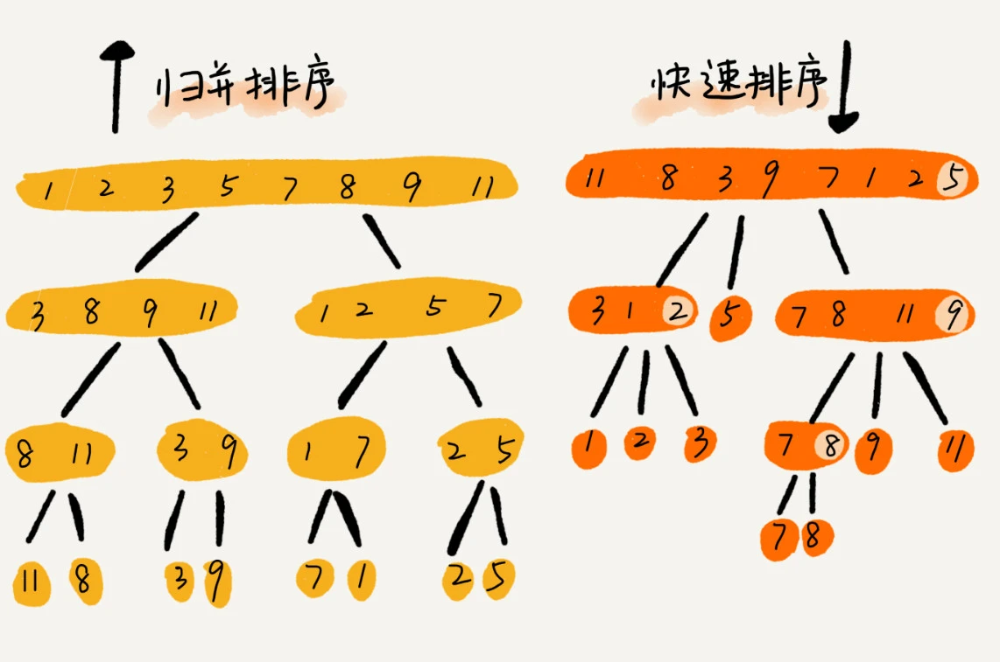

# **快速排序**

本篇文章从理解快速排序，到实现，再到应用场景做一个阐述。
<!-- more -->

## 1. 认识快速排序

快速排序是一种高效的排序算法，它采用了分治法的思想来将一个大问题划分为若干个小问题来解决。具体来说，快速排序通过选择一个基准元素，将待排序的数组分为两部分，其中一部分的所有元素都比基准元素小，另一部分的所有元素都比基准元素大，然后递归地对这两部分进行快速排序，最终使得整个数组有序。

快速排序的基本步骤包括：

1. 选择一个基准元素，通常可以选择数组的第一个元素、最后一个元素或者随机选择一个元素。

2. 通过一趟排序将数组分成两部分，其中一部分的所有元素都比基准元素小，另一部分的所有元素都比基准元素大。这个过程称为分区操作，可以通过双指针法实现。

3. 递归地对基准元素左右两侧的子数组进行快速排序。

快速排序的性能在很大程度上取决于基准元素的选择和分区操作的实现。如果每次都能将数组均匀地划分为两个子数组，那么快速排序的性能将非常接近其最优时间复杂度O(n log n)。然而，如果基准元素的选择不当，可能导致数组划分不均匀，最坏情况下时间复杂度会退化为O(n^2)。

快速排序具有一些显著的优点，例如原地排序（只需要常数级别的额外空间）、平均情况下性能优异等。这使得它在许多应用场景中非常受欢迎，如通用排序需求、数据库索引构建、文件系统排序、编译器优化、财务系统交易排序以及搜索引擎排名等。

需要注意的是，快速排序在处理包含大量重复元素的数据集时可能不够高效，因为重复元素可能导致分区操作不均匀。此外，快速排序的稳定性也较差，即相等的元素在排序后可能会改变原有的相对顺序。

总之，快速排序是一种高效且实用的排序算法，掌握其原理和实现方法对于提高编程能力和解决实际问题具有重要意义。



## 2. 实现快速排序

```js
function quickSort(arr) {
  // 如果数组长度小于等于1，则直接返回，因为长度为1的数组已是有序数组
  if (arr.length <= 1) {
    return arr;
  }

  // 选择基准元素，这里选择数组的第一个元素
  const pivot = arr[0];

  // 初始化两个空数组，分别用于存放比基准元素小和大的元素
  const less = [];
  const greater = [];

  // 遍历数组（从第二个元素开始），将元素分配到less或greater数组中
  for (let i = 1; i < arr.length; i++) {
    if (arr[i] < pivot) {
      // 如果当前元素小于基准元素，则放入less数组中
      less.push(arr[i]);
    } else {
      // 否则放入greater数组中
      greater.push(arr[i]);
    }
  }

  // 递归地对less和greater数组进行快速排序，并将排序后的数组与基准元素合并起来
  return quickSort(less).concat(pivot, quickSort(greater));
}

// 示例数组
const numbers = [64, 34, 25, 12, 22, 11, 90];

// 对数组进行快速排序
const sortedNumbers = quickSort(numbers);

// 打印排序后的数组
console.log(sortedNumbers);
```

在这段代码中，quickSort 函数是快速排序的主要函数。它接受一个数组 arr 作为参数，并通过选择基准元素、划分数组、递归排序子数组的方式来实现排序。

首先，函数检查数组的长度。如果数组长度小于等于1，那么它已经是排序好的，直接返回即可。

然后，选择数组的第一个元素作为基准元素 pivot。这里也可以选择其他元素作为基准，比如随机选择一个元素或者使用三数取中法来选择一个合适的基准。

接下来，创建两个空数组 less 和 greater，用于存放比基准元素小和大的元素。

遍历数组（从第二个元素开始），比较每个元素与基准元素的大小，然后将元素放入相应的 less 或 greater 数组中。

最后，递归地对 less 和 greater 数组进行快速排序，并将排序后的数组与基准元素合并起来。这里使用了 concat 方法来合并数组。

注意，在递归调用 quickSort 函数时，less 和 greater 数组作为新的子数组传入，这样每个递归调用都会处理更小的子问题，直到最终每个子数组的长度都为1，递归终止。

最后，代码创建了一个示例数组 numbers，调用 quickSort 函数对其进行排序，并打印出排序后的数组 sortedNumbers。

## 3. 应用场景

快速排序是一种高效的排序算法，它适用于多种应用场景。以下是快速排序的一些主要应用场景：

1. 大规模数据处理：当数据量非常大时，快速排序的平均时间性能非常优秀，能够高效地处理大量数据。它可以在相对短的时间内对大数据集进行排序，因此在处理大数据时非常有用。

2. 数据库索引构建：在数据库中，快速排序常用于构建索引，通过对数据库表中的数据进行排序，可以加速对数据的检索操作，提高数据库查询性能。

3. 文件系统排序：在文件系统中，需要对文件或目录进行排序时，快速排序是一个快速且常用的算法。例如，按照文件名、文件大小或创建时间对文件进行排序。

4. 编译器优化：在编译器优化过程中，常涉及到对代码中的符号表、变量等信息进行排序。快速排序是一个被广泛使用的算法，用于加速这类排序操作。

5. 实时系统和嵌入式系统：在这些系统中，快速排序的高效性使其成为处理实时数据和嵌入式应用中的排序问题的理想选择。

需要注意的是，尽管快速排序在平均情况下表现优秀，但在最坏情况下（例如输入数据已经有序或接近有序）的时间复杂度会退化到O(n^2)。因此，在选择排序算法时，还需要根据具体的数据特点和需求进行综合考虑。对于特定情况，可能需要选择其他更适合的排序算法，如堆排序或归并排序。

## 参考文章

- 图片来源：[LeetCode-JS 通关指南 - 快速排序](https://2xiao.github.io/leetcode-js/leetcode/algorithm/sort.html#%E5%BF%AB%E9%80%9F%E6%8E%92%E5%BA%8F-quick-sort)
