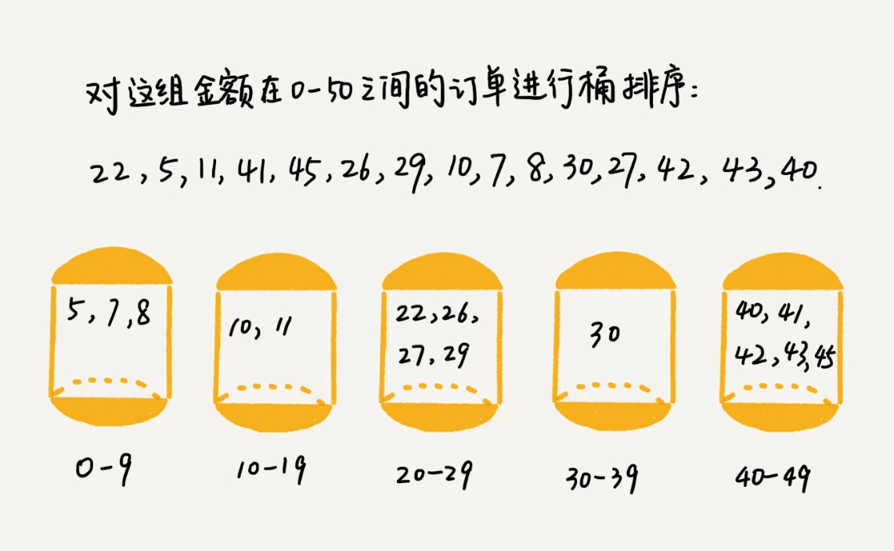

# **桶排序**

本篇文章从理解桶排序，到实现，再到应用场景做一个阐述。
<!-- more -->

## 1. 认识桶排序

桶排序（Bucket Sort）是一种分配式的排序算法，它假设输入数据服从均匀分布。在桶排序中，首先将待排序的数据均匀地分配到有限数量的桶中，然后对每个桶中的数据进行个别排序（可能使用其他排序算法或递归地继续使用桶排序），最后按照顺序将每个桶中的数据连接起来，得到有序的数据序列。

桶排序的基本步骤如下：

1. 初始化桶：根据数据的范围和数量，创建适当数量的桶，每个桶用来装一段区间内的数据。

2. 分配数据到桶：遍历待排序的数据，根据数据的值将其分配到对应的桶中。分配的过程通常是通过计算数据的值来确定其所属的桶的索引。

3. 桶内排序：对每个桶中的数据使用适当的排序算法进行排序。这里可以使用任何其他的排序算法，包括递归地继续使用桶排序。

4. 合并桶：按照桶的顺序，将每个桶中的数据连接起来，形成最终的有序序列。

桶排序的效率在很大程度上取决于数据的分布和桶的数量。当数据均匀分布且桶的数量适当时，桶排序可以达到线性时间复杂度，即O(n)。然而，如果数据分布不均匀或者桶的数量选择不当，桶排序的性能可能会下降。

需要注意的是，桶排序并不是比较排序，它不受到O(n log n)下限的影响。此外，桶排序要求数据的长度必须完全一样，否则可能无法正确进行分配和排序。

总的来说，桶排序是一种灵活且高效的排序算法，特别适用于处理均匀分布的数据。然而，在处理非均匀分布的数据或需要处理具有特定性质的数据时，可能需要考虑其他排序算法。



## 2. 实现桶排序

```js
function bucketSort(array) {
  // 1. 确定桶的个数
  const bucketSize = 5; // 假设每个桶存放的元素个数为5，这个值可以根据实际情况调整
  const minValue = Math.min(...array); // 数组中的最小值
  const maxValue = Math.max(...array); // 数组中的最大值
  const bucketCount = Math.floor((maxValue - minValue) / bucketSize) + 1; // 计算桶的个数

  // 2. 初始化桶
  const buckets = Array.from({ length: bucketCount }, () => []);

  // 3. 将数据分配到桶中
  for (let i = 0; i < array.length; i++) {
    // 计算当前数据应该放入哪个桶
    const bucketIndex = Math.floor((array[i] - minValue) / bucketSize);
    buckets[bucketIndex].push(array[i]);
  }

  // 4. 对每个桶进行排序
  for (let i = 0; i < buckets.length; i++) {
    // 可以选择任何排序算法，这里简单起见使用内置的sort方法
    buckets[i].sort((a, b) => a - b);
  }

  // 5. 合并桶中的数据
  let sortedArray = [];
  for (let i = 0; i < buckets.length; i++) {
    sortedArray = sortedArray.concat(buckets[i]);
  }

  return sortedArray;
}

// 示例数组
const numbers = [64, 34, 25, 12, 22, 11, 90, 43, 56, 78];

// 对数组进行桶排序
const sortedNumbers = bucketSort(numbers);

// 打印排序后的数组
console.log(sortedNumbers);
```

在这段代码中，bucketSort 函数实现了桶排序算法。下面是代码执行的详细步骤和注释：

1. 确定桶的个数：
- bucketSize 变量定义了每个桶中应存放的元素个数。

- 找出数组中的最小值和最大值，用于计算桶的数量。

- 根据桶的大小和数据的范围计算桶的个数。

2. 初始化桶：

- 使用 Array.from 方法创建一个空桶数组，桶的数量由 bucketCount 确定。

3. 将数据分配到桶中：

- 遍历输入数组中的每个元素。

- 计算每个元素应该放入哪个桶中，并将元素推入对应的桶。

4. 对每个桶进行排序：

- 遍历每个桶，并使用内置的 sort 方法对每个桶中的元素进行排序。

- 这里为了简单起见使用了JavaScript内置的排序方法，但你也可以使用其他排序算法，如插入排序或快速排序。

5. 合并桶中的数据：

- 遍历所有桶，并将每个桶中的元素依次连接到 sortedArray 数组中。

- 最终 sortedArray 将包含排序后的所有元素。

最后，sortedNumbers 数组将包含桶排序后的有序元素，通过 console.log 打印出来。

需要注意的是，桶排序的性能高度依赖于数据的分布和桶的大小。如果数据分布非常不均匀，或者桶的大小设置不当，桶排序的性能可能会下降。因此，在实际应用中，可能需要根据具体的数据特征来调整桶的大小和数量。

## 3. 应用场景

桶排序（Bucket Sort）的应用场景主要集中在数据分布较为均匀的情况下。当待排序的数据能够容易地划分成若干个桶，并且桶与桶之间有着天然的大小顺序时，桶排序是一种非常有效的排序方法。以下是桶排序的一些具体应用场景：

1. 外部排序：当需要处理的数据量非常大，无法一次性加载到内存中进行排序时，桶排序可以作为一种有效的外部排序方法。通过将数据划分到不同的桶中，可以分别对每个桶中的数据进行排序，然后再合并各个桶的排序结果，从而实现对整个数据集的排序。

2. 邮件地址排序：在处理大量邮件地址数据时，如果按照地址字典序进行排序，桶排序可以是一个很好的选择。通过将地址数据划分到不同的桶中，并对每个桶内的数据进行排序，可以高效地完成整个排序过程。

3. 图像处理和计算机视觉：在处理图像或视频数据时，桶排序可以用于对像素值或特征值进行排序。这种排序有助于后续的图像处理和分析任务，如边缘检测、特征提取等。

4. 统计和数据分析：在统计和数据分析领域，桶排序可以用于对大量数据进行分组和排序。通过将数据划分到不同的桶中，可以方便地统计各个桶内的数据分布情况，进而进行更深入的数据分析。

需要注意的是，桶排序并不适用于所有数据分布场景。如果数据分布非常不均匀，可能会导致某些桶中的数据非常多，而其他桶中的数据非常少，这会影响桶排序的性能。因此，在选择排序算法时，需要根据具体的数据特征和需求进行综合考虑。

## 参考文章

- 图片来源：[LeetCode-JS 通关指南 - 桶排序](https://2xiao.github.io/leetcode-js/leetcode/algorithm/sort.html#%E6%A1%B6%E6%8E%92%E5%BA%8F-bucket-sort)
