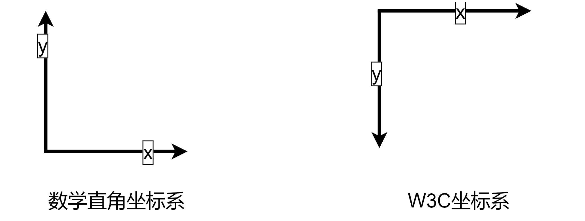

# **1. 入门篇**

Canvas学习第一篇，入门篇。
<!-- more -->

## 1. Canvas初识

Canvas，单单从表面含义看，中文翻译就是“画布”的意思，而在前端领域中，它是HTML5中重要的元素，和audio、video元素类似完全不需要任何外部插件就能够运行，并且，它提供了强大的图形的处理功能(绘制,变换,像素处理…)。

但是需要注意，canvas 元素本身并不能绘制图形，它只是相当于一张空画布，如果开发者需要向 canvas 上绘制图形，则必须使用 JavaScript 脚本进行绘制。

做一个小结，总的来说，canvas在前端中：

*   Canvas 中文名叫 “画布”，是 HTML5 新增的一个标签。
*   Canvas 允许开发者通过 JS在这个标签上绘制各种图案。
*   Canvas 拥有多种绘制路径、矩形、圆形、字符以及图片的方法。
*   Canvas 在某些情况下可以 “代替” 图片。
*   Canvas 可用于多个领域，简单举例如下：
    *   文字的绘制
    *   图形的变形和图片的合成
    *   图片和视频的处理
    *   动画的实现
    *   小游戏的制作
    *   数据可视化
    *   ......

其兼容性如何呢？

Mozilla 程序从 Gecko 1.8 (Firefox 1.5 (en-US)) 开始支持 `<canvas>`。它首先是由 Apple 引入的，用于 OS X Dashboard 和 Safari。Internet Explorer 从 IE9 开始支持`<canvas>` ，更旧版本的 IE 中，页面可以通过引入 Google 的 Explorer Canvas 项目中的脚本来获得`<canvas>`支持。Google Chrome 和 Opera 9+ 也支持 `<canvas>`。

表格中的数字表示支持 ``<canvas>`` 元素的第一个浏览器版本号。

| 元素     | 谷歌 | IE   | 火狐 | safari | opera |
| -------- | ---- | ---- | ---- | ------ | ----- |
| \<canvas\> | 4.0  | 9.0  | 2.0  | 3.1    | 9.0   |

## 2. Canvas对前端的意义

Canvas是H5当中的一个新元素，别看它只是一个元素，但是对于整个前端技术的影响是非常巨大的。

在以前的HTML版本中，图像绝大部分是通过插入图片文件来实现的，使用SVG的方式来描述图像已经算得上是相当细致了。

但是当Canvas诞生之后，上面所说的图像表述方式就都成了渣渣。因为Canvas是通过像素点来描述图像的，它可以逐像素地进行渲染。在 canvas 中，一旦图形被绘制完成，它就不会继续得到浏览器的关注。如果其位置发生变化，那么整个场景也需要重新绘制。

虽然Canvas如此的强大，但也有明显的缺点，严格意义上说，Canvas本身没有任何的作用，它的一切功能都需要JavaScript来赋予，使用起来还是非常复杂的。与其说Canvas强大，倒不如说JS强大。

功能强大，但非常负责，这就导致了网站前端人员对它不屑一顾。而在页游中，需要对web中的图像进行复杂而且灵活的处理时，Canvas又变得无可替代。由于Canvas的出现，导致前端人员分成了网站前端和游戏前端两大流派。

但无论哪个流派，都体现了canvas在前端中的重要性，在接下来的前端发展趋势中，可视化、2D、3D、动画等可能是流行技术和领域，学习好、掌握好canvas，提升自身竞争优势还是很有必要的。

## 3. Canvas起步

### 3.1 初步接触

`<canvas>` 看起来和 ` `标签一样，只是 `<canvas>` 只有两个可选的属性 width、height 属性，而没有 src、alt 属性。

如果不给 `<canvas>` 设置 width、height 属性时，则默认 width为300、height 为 150，单位都是 px。也可以使用 css 属性来设置宽高，但是如果宽高属性和初始比例不一致，它会出现扭曲。所以，建议永远不要使用 css 属性来设置 `<canvas>` 的宽高。

+ **替换内容**

由于某些较老的浏览器（尤其是 IE9 之前的 IE 浏览器）或者浏览器不支持 HTML 元素 `<canvas>`，在这些浏览器上你应该总是能展示替代内容。

支持 `<canvas>` 的浏览器会只渲染 `<canvas>` 标签，而忽略其中的替代内容。不支持 `<canvas>` 的浏览器则 会直接渲染替代内容。

用文本替换：

```html
<canvas>
    你的浏览器不支持 canvas，请升级你的浏览器。
</canvas>
```

用 `` 替换：

```html
<canvas>
    
</canvas>
```

**结束标签 `</canvas> `不可省略。**

与 `` 元素不同，`<canvas>` 元素需要结束标签(`</canvas>`)。如果结束标签不存在，则文档的其余部分会被认为是替代内容，将不会显示出来。

### 3.2 基础绘制

在绘制基础图形之前，需要先搞清楚 Canvas 使用的坐标系。

Canvas 使用的是 W3C 坐标系 ，也就是遵循我们对屏幕、报纸的阅读习惯，从上往下，从左往右。



W3C 坐标系 和 数学直角坐标系 的 X轴 是一样的，只是 Y轴 的反向相反。

W3C 坐标系 的 Y轴 正方向向下。

Canvas 提供了很多 API 来绘制各种图形，包括线条、矩形、圆形、弧形等。

下面是一些常见的绘制图形的方法：

+ **绘制线条**

最简单的起步方式是画一条直线。这里所说的 “直线” 是几何学里的 “线段” 的意思。

需要用到这3个方法：

moveTo(x1, y1)：起点坐标 (x, y)

lineTo(x2, y2)：下一个点的坐标 (x, y)

stroke()：将所有坐标用一条线连起来

```javascript
var canvas = document.getElementById("myCanvas");
var ctx = canvas.getContext("2d");
ctx.moveTo(0,0);
ctx.lineTo(200,100);
ctx.stroke();
```

首先代码定义了一个 Canvas 元素，然后获取了它的上下文对象。

接下来，使用 moveTo() 方法设置起点，使用 lineTo() 方法设置终点，然后使用 stroke() 方法绘制线条。

+ **绘制矩形**

```javascript
var canvas = document.getElementById("myCanvas");
var ctx = canvas.getContext("2d");
ctx.fillRect(50,50,100,100);
```

上面的代码定义了一个 Canvas 元素，然后获取了它的上下文对象。接下来，使用 fillRect() 方法绘制一个矩形，参数分别表示矩形的左上角坐标(x, y)和宽度、高度(width, height)。

+ **绘制圆形**

```javascript
var canvas = document.getElementById("myCanvas");
var ctx = canvas.getContext("2d");
ctx.beginPath();
ctx.arc(100,100,50,0,2*Math.PI);
ctx.fill();
```

上面的代码定义了一个 Canvas 元素，然后获取了它的上下文对象。接下来，使用 beginPath() 方法开始绘制路径，使用 arc() 方法绘制一个圆形，参数分别表示圆心坐标、半径、起始角度、终止角度。最后使用 fill() 方法填充圆形。

+ **绘制文本**

Canvas 还可以用来绘制文本，可以设置文本的字体、大小、颜色等属性。下面是一些常见的绘制文本的方法：

```javascript
var canvas = document.getElementById("myCanvas");
var ctx = canvas.getContext("2d");
ctx.font = "30px Arial";
ctx.fillStyle = "red";
ctx.fillText("Hello World", 50, 50);
```

上面的代码定义了一个 Canvas 元素，然后获取了它的上下文对象。接下来，使用 font 属性设置文本的字体和大小，使用 fillStyle 属性设置文本的颜色，然后使用 fillText() 方法绘制文本，参数分别表示文本内容和左上角坐标。

+ **图片渲染**

渲染图片的方式有两种，一种是在JS里加载图片再渲染，另一种是把DOM里的图片拿到 canvas 里渲染。

渲染语法：

```javascript
drawImage(image, dx, dy)
```

*   image: 要渲染的图片对象。

*   dx: 图片左上角的横坐标位置。

*   dy: 图片左上角的纵坐标位置。

在 JS 里加载图片并渲染，有以下几个步骤：

* 创建 Image 对象

* 引入图片

* 等待图片加载完成

* 使用 drawImage() 方法渲染图片

```html
  <!---- JS版 ---->
  <canvas id="c" width="500" height="500" style="border: 1px solid #ccc;"></canvas>

  <script>
    const cnv = document.getElementById('c')
    const cxt = cnv.getContext('2d')
    // 1 创建 Image 对象
    const image = new Image()
    // 2 引入图片
    image.src = './images/dog.jpg'
    // 3 等待图片加载完成
    image.onload = () => {
      // 4 使用 drawImage() 方法渲染图片
      cxt.drawImage(image, 30, 30)
    }
  </script>
```

```html
  <!---- DOM版 ---->

  <style>
    #dogImg {
      display: none;
    }
  </style>


  

  <canvas id="c" width="500" height="500" style="border: 1px solid #ccc;"></canvas>

  <script>
    const cnv = document.getElementById('c')
    const cxt = cnv.getContext('2d')

    const image = document.getElementById('dogImg')
  	// 设置图片属性
    cxt.drawImage(image, 70, 70)
  </script>
```

因为图片是从 DOM 里获取到的，所以一般来说，只要在 window.onload 这个生命周期内使用 drawImage 都可以正常渲染图片。

### 3.3 canvas动画

Canvas 还可以用来实现动画效果，可以通过不断绘制图形来实现动态效果。下面是一个简单的例子：

```javascript
var canvas = document.getElementById("myCanvas");
var ctx = canvas.getContext("2d");
var x = 0;
function draw() {
    ctx.clearRect(0, 0, canvas.width, canvas.height);
    ctx.fillRect(x, 50, 50, 50);
    x++;
    requestAnimationFrame(draw);
}
requestAnimationFrame(draw);
```

上面的代码定义了一个 Canvas 元素，然后获取了它的上下文对象。接下来，定义了一个变量 x，表示矩形的横坐标，然后定义了一个 draw() 函数，用于不断绘制矩形并移动横坐标。最后使用 requestAnimationFrame() 方法循环调用 draw() 函数，实现动画效果。

### 3.4 性能优化注意点

Canvas 可以实现非常复杂的交互效果，但是如果使用不当，可能会影响性能。下面是一些优化 Canvas 性能的方法：

+ **减少绘制次数**

Canvas 的绘制次数越多，性能就越低。因此，可以通过减少绘制次数来提高性能。比如，可以把多个图形合并成一个，然后一次性绘制。

+ **使用缓存**

Canvas 可以使用缓存来提高性能。比如，可以使用 offscreenCanvas 技术，将图形先绘制到一个离屏 Canvas 上，然后再将整个 Canvas 复制到主 Canvas 上。

+ **避免频繁DOM操作**

Canvas 的性能优化还需要避免频繁的 DOM 操作。因为 DOM 操作通常比 Canvas 操作要慢得多。因此，可以将 Canvas 放在一个独立的容器中，避免频繁的 DOM 操作。

关于性能注意点，这里简单介绍，后续单独开文章详细阐述。

## 4. 总结

通过本文的基础介绍，从基础认识canvas，到了解canvas在前端领域的应用，再到基础入门案例做了一个简单的介绍与案例展示，基础语法并不复杂，只是需要花点时间熟悉canvas的语法，一些规则，以及一些常用的api。

Canvas 是一种非常强大的技术，可以用于在网页上绘制图像、动画和其他视觉效果。Canvas 可以通过 JavaScript 进行控制，可以实现非常复杂的交互效果，而且它的性能也非常出色。

但是，性能出色并不意味着在使用 Canvas时可以随心所欲，还是需要注意性能优化，避免频繁的绘制和 DOM 操作，这样还是会产生不必要的性能开销，能省则省，代码还是需要保持一定的优雅性、可读性、可维护性以及健壮性，开发人员不仅只是开发业务，还需要从实际出发，考虑开发的业务是否可用，性能是否可观等。

后面还会继续写文章关于canvas开发的其他方面，本文仅作为入门文章，并未详细阐述，后续会细分某块应用，从真实业务出发，学习canvas。