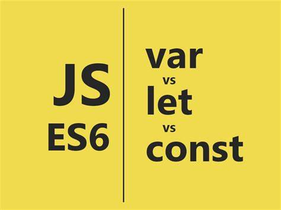

# **1. var, let, const**

ES6学习第一篇，var, let, const。
<!-- more -->

# （1）var、let、const

## 前言

var、let、const都是js声明变量的方法，var是es5语法，存在变量提升，let和const是es6语法新提出的块级作用域概念，存在暂时性死区，没有变量提升机制。

var在全局作用域声明的变量有一种行为会挂载在window对象上，它会创建一个新的全局变量作为全局对象的属性，这种行为说不定会覆盖到window对象上的某个属性，而let const声明的变量则不会有这一行为。

接下来让我们一起渐进地学习这三者的用法和区别。



## 1. var

在ES5中，顶层对象的属性和全局变量是等价的，用var声明的变量既是全局变量，也是顶层变量

注意：顶层对象，在浏览器环境指的是window对象，在 Node 指的是global对象

```javascript
var a = 10;
console.log(window.a) // 10
```

使用var声明的变量存在变量提升的情况

```javascript
console.log(a) // undefined
var a = 20
```

在编译阶段，编译器会将其变成以下执行

```javascript
var a
console.log(a)
a = 20
```

使用var，我们能够对一个变量进行多次声明，后面声明的变量会覆盖前面的变量声明

```javascript
var a = 20
var a = 30
console.log(a) // 30
```

在函数中使用var声明变量的时候，该变量是局部的

```javascript
var a = 20
function change(){
    var a = 30
}
change()
console.log(a) // 20
```

而如果在函数内不使用var，该变量是全局的

```javascript
var a = 20
function change(){
   a = 30
}
change()
console.log(a) // 30
```

## 2. let

let是ES6新增的命令，用来声明变量。

用法类似于var，但是所声明的变量，只在let命令所在的代码块内有效。

```javascript
{
    let a = 20
}
console.log(a) // ReferenceError: a is not defined.
```

不存在变量提升

```javascript
console.log(a) // 报错ReferenceError
let a = 2
```


这表示在声明它之前，变量a是不存在的，这时如果用到它，就会抛出一个错误。

只要块级作用域内存在let命令，这个区域就不再受外部影响。

```javascript
var a = 123
if (true) {
    a = 'abc' // ReferenceError
    let a;
}
```

使用let声明变量前，该变量都不可用，也就是大家常说的“暂时性死区”。

最后，let不允许在相同作用域中重复声明。

```javascript
let a = 20
let a = 30
// Uncaught SyntaxError: Identifier 'a' has already been declared
```

注意的是相同作用域，下面这种情况是不会报错的

```javascript
let a = 20
{
    let a = 30
}
```


因此，我们不能在函数内部重新声明参数

```javascript
function func(arg) {
  let arg;
}
func()
// Uncaught SyntaxError: Identifier 'arg' has already been declared
```

## 3. const

const声明一个只读的常量，一旦声明，常量的值就不能改变。

```javascript
const a = 1
a = 3
// TypeError: Assignment to constant variable.
```

这意味着，const一旦声明变量，就必须立即初始化，不能留到以后赋值。

```javascript
const a;
// SyntaxError: Missing initializer in const declaration
```

如果之前用var或let声明过变量，再用const声明同样会报错。

```javascript
var a = 20
let b = 20
const a = 30
const b = 30
// 都会报错
```

const实际上保证的并不是变量的值不得改动，而是变量指向的那个内存地址所保存的数据不得改动。

对于简单类型的数据，值就保存在变量指向的那个内存地址，因此等同于常量。

对于复杂类型的数据，变量指向的内存地址，保存的只是一个指向实际数据的指针，const只能保证这个指针是固定的，并不能确保该变量的结构不变

```javascript
const foo = {};

// 为 foo 添加一个属性，可以成功
foo.prop = 123;
foo.prop // 123

// 将 foo 指向另一个对象，就会报错
foo = {}; // TypeError: "foo" is read-only
```

其他情况，const与let一致。

## 4. 区别

var、let、const三者的区别可以围绕下面五点展开：

*   变量提升

*   暂时性死区

*   块级作用域

*   重复声明

*   修改声明的变量

*   使用

### 4.1 变量提升

var声明的变量存在变量提升，即变量可以在声明之前调用，值为undefined，

let和const不存在变量提升，即它们所声明的变量一定要在声明后使用，否则报错。

```javascript
// var
console.log(a)  // undefined
var a = 10

// let
console.log(b)  // Cannot access 'b' before initialization
let b = 10

// const
console.log(c)  // Cannot access 'c' before initialization
const c = 10
```

### 4.2 暂时性死区

var不存在暂时性死区，

let和const存在暂时性死区，只有等到声明变量的那一行代码出现，才可以获取和使用该变量。

```javascript
// var
console.log(a)  // undefined
var a = 10

// let
console.log(b)  // Cannot access 'b' before initialization
let b = 10

// const
console.log(c)  // Cannot access 'c' before initialization
const c = 10
```

### 4.3块级作用域

var不存在块级作用域，let和const存在块级作用域

```javascript
// var
{
    var a = 20
}
console.log(a)  // 20

// let
{
    let b = 20
}
console.log(b)  // Uncaught ReferenceError: b is not defined

// const
{
    const c = 20
}
console.log(c)  // Uncaught ReferenceError: c is not defined
```

### 4.4 重复声明

var允许重复声明变量，let和const在同一作用域不允许重复声明变量

```javascript
// var
var a = 10
var a = 20 // 20

// let
let b = 10
let b = 20 // Identifier 'b' has already been declared

// const
const c = 10
const c = 20 // Identifier 'c' has already been declared
```


### 4.5 修改声明的变量

var和let可以，const声明一个只读的常量。一旦声明，常量的值就不能改变

```javascript
// var
var a = 10
a = 20
console.log(a)  // 20

//let
let b = 10
b = 20
console.log(b)  // 20

// const
const c = 10
c = 20
console.log(c) // Uncaught TypeError: Assignment to constant variable
```

## 5. 总结

从上面的var到let和const的比较可以看到，var可以的特性let和const基本都不可以，也就是说使用let和const比var有了更多的限制，但同时可以看到这些特性让代码更加规范和严谨。

因此，能用const的情况尽量使用const，其他情况下大多数使用let，避免使用var