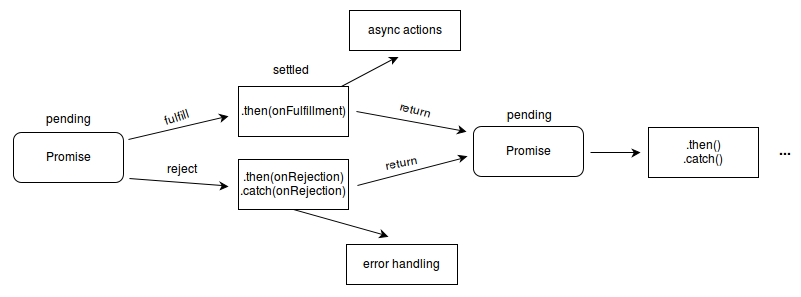

# **6. Promise的理解与使用**

ES6学习第六篇，ES6中Promise的理解与使用。
<!-- more -->

## 1. 介绍

异步编程一直是一个备受争议的话题，因为它通常需要我们编写更加复杂和冗长的代码。在以往，我们为了处理多层异步操作，常常会采用传统的回调函数方案。然而，这种方案在可读性和可维护性方面存在一些问题。为了解决这个问题，Promise 应运而生，成为异步编程的一种解决方案。

Promise ，翻译为承诺，是异步编程的一种解决方案，比传统的解决方案（回调函数）更加合理和更加强大。在以往，如果我们处理多层异步操作，往往可能会像下面那样编写我们的代码：

```javascript
doSomething(function(result) {
  doSomethingElse(result, function(newResult) {
    doThirdThing(newResult, function(finalResult) {
      console.log('得到最终结果: ' + finalResult);
    }, failureCallback);
  }, failureCallback);
}, failureCallback);
```

上述代码形成了异步编程中经典的回调地狱，现在通过Promise的改写上面的代码

```javascript
doSomething().then(function(result) {
  return doSomethingElse(result);
})
.then(function(newResult) {
  return doThirdThing(newResult);
})
.then(function(finalResult) {
  console.log('得到最终结果: ' + finalResult);
})
.catch(failureCallback);
```

在这里我们已经能够初步感受到promise解决异步操作的优点：

*   链式操作降低了编码难度
*   代码可读性明显增强

下面我们正式来认识promise：

*   Promise 是一个用于异步操作的对象，它由一个 Promise 对象表示。
*   Promise 对象有三种状态：pending（等待中）、fulfilled（已成功）和 rejected（已失败）。
*   当 Promise 对象从 pending 状态变为 fulfilled 状态时，我们称其为成功（resolve）；
*   反之，当 Promise 对象从 pending 状态变为 rejected 状态时，我们称其为失败（reject）。

+ **特点**

对象的状态不受外界影响，只有异步操作的结果，可以决定当前是哪一种状态。一旦状态改变（从pending变为fulfilled和从pending变为rejected），就不会再变，任何时候都可以得到这个结果。

+ **流程**

认真阅读下图，我们能够轻松了解promise整个流程



## 2. 用法

Promise对象是一个构造函数，用来生成Promise实例：

```javascript
const promise = new Promise(function(resolve, reject) {});
```

Promise构造函数接受一个函数作为参数，该函数的两个参数分别是resolve和reject：

resolve函数的作用是，将Promise对象的状态从“未完成”变为“成功”；

reject函数的作用是，将Promise对象的状态从“未完成”变为“失败”；

### 2.1 实例方法

Promise构建出来的实例存在以下方法：

*   then( )

*   catch( )

*   finally( )

*   then( )

#### 2.1.1 then()

then是实例状态发生改变时的回调函数，它接受两个回调函数：第一个参数是resolved状态的回调函数，第二个参数是rejected状态的回调函数。

第一个回调函数在 Promise 对象成功时被调用，第二个回调函数在 Promise 对象失败时被调用。如果一个 Promise 对象有多个 then() 方法，它们会依次执行。

then方法返回的是一个新的Promise实例，也就是promise能链式书写的原因：

```javascript
getJSON("/posts.json").then(function(json) {
  return json.post;
}).then(function(post) {
  // ...
});
```

#### 2.1.2 catch

Promise 对象的catch( ) 方法，它接受一个回调函数，用于捕获所有失败的 Promise 对象。当一个 Promise 对象失败时，如果它的 then( ) 方法被执行，它的回调函数会在 catch( ) 方法中被调用。

catch( )方法是.then(null, rejection)或.then(undefined, rejection)的别名，用于指定发生错误时的回调函数：

```javascript
getJSON('/posts.json').then(function(posts) {
  // ...
}).catch(function(error) {
  // 处理 getJSON 和 前一个回调函数运行时发生的错误
  console.log('发生错误！', error);
});
```

Promise 对象的错误具有“冒泡”性质，会一直向后传递，直到被捕获为止

```javascript
getJSON('/post/1.json').then(function(post) {
  return getJSON(post.commentURL);
}).then(function(comments) {
  // some code
}).catch(function(error) {
  // 处理前面三个Promise产生的错误
});
```

一般来说，使用catch方法代替then( )第二个参数

Promise 对象抛出的错误不会传递到外层代码，即不会有任何反应

```javascript
const someAsyncThing = function() {
  return new Promise(function(resolve, reject) {
    // 下面一行会报错，因为x没有声明
    resolve(x + 2);
  });
};
```

浏览器运行到这一行，会打印出错误提示ReferenceError: x is not defined，但是不会退出进程

catch()方法之中，还能再抛出错误，通过后面catch方法捕获到

#### 2.1.3 finally()

finally()方法用于指定不管 Promise 对象最后状态如何，都会执行的操作

```javascript
promise
.then(result => {···})
.catch(error => {···})
.finally(() => {···});
```

### 2.2 构造函数方法

Promise构造函数存在以下方法：all( )、race( )、allSettled( )、resolve( )、reject( )、try( )、all( )

+ **all( )**

Promise.all( )方法用于将多个 Promise 实例，包装成一个新的 Promise 实例

```javascript
const p = Promise.all([p1, p2, p3]);
```

接受一个数组（迭代对象）作为参数，数组成员都应为Promise实例。实例p的状态由p1、p2、p3决定，分为两种：

*   只有p1、p2、p3的状态都变成fulfilled，p的状态才会变成fulfilled，此时p1、p2、p3的返回值组成一个数组，传递给p的回调函数

*   只要p1、p2、p3之中有一个被rejected，p的状态就变成rejected，此时第一个被reject的实例的返回值，会传递给p的回调函数

注意，如果作为参数的 Promise 实例，自己定义了catch方法，那么它一旦被rejected，并不会触发Promise.all()的catch方法

```javascript
const p1 = new Promise((resolve, reject) => {
  resolve('hello');
})
.then(result => result)
.catch(e => e);

const p2 = new Promise((resolve, reject) => {
  throw new Error('报错了');
})
.then(result => result)
.catch(e => e);

Promise.all([p1, p2])
.then(result => console.log(result))
.catch(e => console.log(e));
// ["hello", Error: 报错了]
```

如果p2没有自己的catch方法，就会调用Promise.all()的catch方法

```javascript
const p1 = new Promise((resolve, reject) => {
  resolve('hello');
})
.then(result => result);

const p2 = new Promise((resolve, reject) => {
  throw new Error('报错了');
})
.then(result => result);

Promise.all([p1, p2])
.then(result => console.log(result))
.catch(e => console.log(e));
// Error: 报错了
```

+ **race()**

Promise.race()方法同样是将多个 Promise 实例，包装成一个新的 Promise 实例

```javascript
const p = Promise.race([p1, p2, p3]);
```

只要p1、p2、p3之中有一个实例率先改变状态，p的状态就跟着改变

率先改变的 Promise 实例的返回值则传递给p的回调函数

```javascript
const p = Promise.race([
  fetch('/resource-that-may-take-a-while'),
  new Promise(function (resolve, reject) {
    setTimeout(() => reject(new Error('request timeout')), 5000)
  })
]);

p
.then(console.log)
.catch(console.error);
```

+ **allSettled()**

Promise.allSettled()方法接受一组 Promise 实例作为参数，包装成一个新的 Promise 实例

只有等到所有这些参数实例都返回结果，不管是fulfilled还是rejected，包装实例才会结束

```javascript
const promises = [
  fetch('/api-1'),
  fetch('/api-2'),
  fetch('/api-3'),
];

await Promise.allSettled(promises);
removeLoadingIndicator();
```

+ **resolve()**

将现有对象转为 Promise 对象

```javascript
Promise.resolve('foo')
// 等价于
new Promise(resolve => resolve('foo'))
```

参数可以分成四种情况，分别如下：

*   参数是一个 Promise 实例，promise.resolve将不做任何修改、原封不动地返回这个实例
*   参数是一个thenable对象，promise.resolve会将这个对象转为 Promise 对象，然后就立即执行thenable对象的then()方法
*   参数不是具有then()方法的对象，或根本就不是对象，Promise.resolve()会返回一个新的 Promise 对象，状态为resolved
*   没有参数时，直接返回一个resolved状态的 Promise 对象

+ **reject()**

Promise.reject(reason)方法也会返回一个新的 Promise 实例，该实例的状态为rejected

```javascript
const p = Promise.reject('出错了');
// 等同于
const p = new Promise((resolve, reject) => reject('出错了'))

p.then(null, function (s) {
  console.log(s)
});
// 出错了
```

Promise.reject()方法的参数，会原封不动地变成后续方法的参数

```javascript
Promise.reject('出错了')
.catch(e => {
  console.log(e === '出错了')
})
// true
```

## 3. 使用场景

Promise 对象可以用于各种异步操作，如 Ajax 请求、定时器、定时刷新、数据库操作等。使用 Promise，我们可以更加简洁地编写代码，并提高代码的可读性和可维护性。此外，Promise 还具有一些其他的优点，如可以实现链式调用、可以通过 finally() 方法保证一些必要的操作在异步操作完成后执行等。

例如：将图片的加载写成一个Promise，一旦加载完成，Promise的状态就发生变化

```javascript
const preloadImage = function (path) {
  return new Promise(function (resolve, reject) {
    const image = new Image();
    image.onload  = resolve;
    image.onerror = reject;
    image.src = path;
  });
};
```

通过链式操作，将多个渲染数据分别给个then，让其各司其职。或当下个异步请求依赖上个请求结果的时候，我们也能够通过链式操作友好解决问题

```javascript
// 各司其职
getInfo().then(res=>{
    let { bannerList } = res
    //渲染轮播图
    console.log(bannerList)
    return res
}).then(res=>{

    let { storeList } = res
    //渲染店铺列表
    console.log(storeList)
    return res
}).then(res=>{
    let { categoryList } = res
    console.log(categoryList)
    //渲染分类列表
    return res
})
```

通过all()实现多个请求合并在一起，汇总所有请求结果，只需设置一个loading即可

```javascript
function initLoad(){
    // loading.show() //加载loading
    Promise.all([getBannerList(),getStoreList(),getCategoryList()]).then(res=>{
        console.log(res)
        loading.hide() //关闭loading
    }).catch(err=>{
        console.log(err)
        loading.hide()//关闭loading
    })
}
//数据初始化
initLoad()
```

通过race可以设置图片请求超时

```javascript
//请求某个图片资源
function requestImg(){
    var p = new Promise(function(resolve, reject){
        var img = new Image();
        img.onload = function(){
           resolve(img);
        }
        //img.src = "https://b-gold-cdn.xitu.io/v3/static/img/logo.a7995ad.svg"; 正确的
        img.src = "https://b-gold-cdn.xitu.io/v3/static/img/logo.a7995ad.svg1";
    });
    return p;
}

//延时函数，用于给请求计时
function timeout(){
    var p = new Promise(function(resolve, reject){
        setTimeout(function(){
            reject('图片请求超时');
        }, 5000);
    });
    return p;
}

Promise
.race([requestImg(), timeout()])
.then(function(results){
    console.log(results);
})
.catch(function(reason){
    console.log(reason);
});
```

## 4. 总结

总之，Promise 是一种非常实用的异步编程方案，它可以帮助我们编写更加简洁、可读性更高的代码。   

Promise 通过 then() 方法的链式调用，将多个异步操作串联起来，并提供了一些优雅和可控的错误处理方式。

除此之外，Promise 还具有一些其他的优点，如避免回调地狱、提高代码的可测试性、减少代码的复杂度等。

在实际的开发中，我们应该积极地使用 Promise，并结合具体的场景，灵活地运用它的优点，提高代码的质量和可维护性。