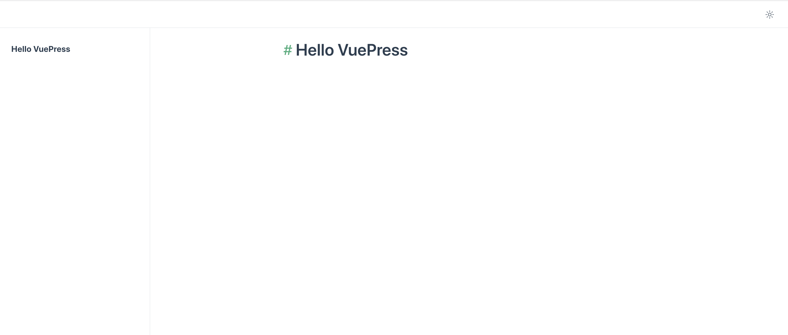
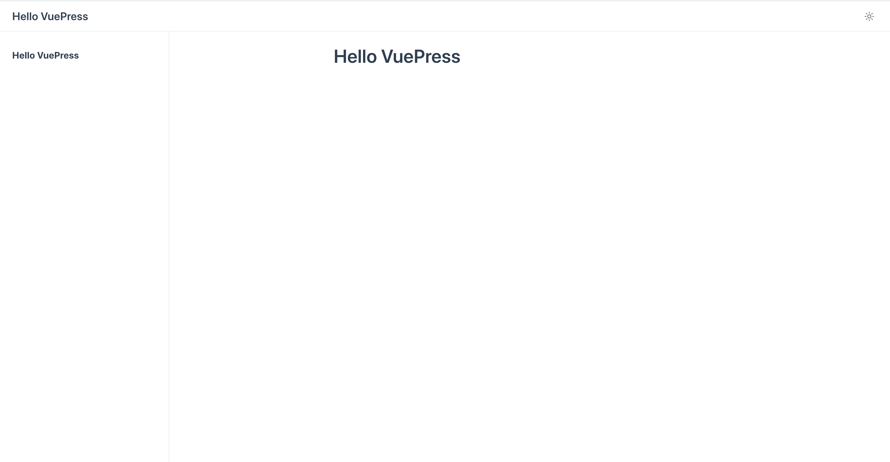
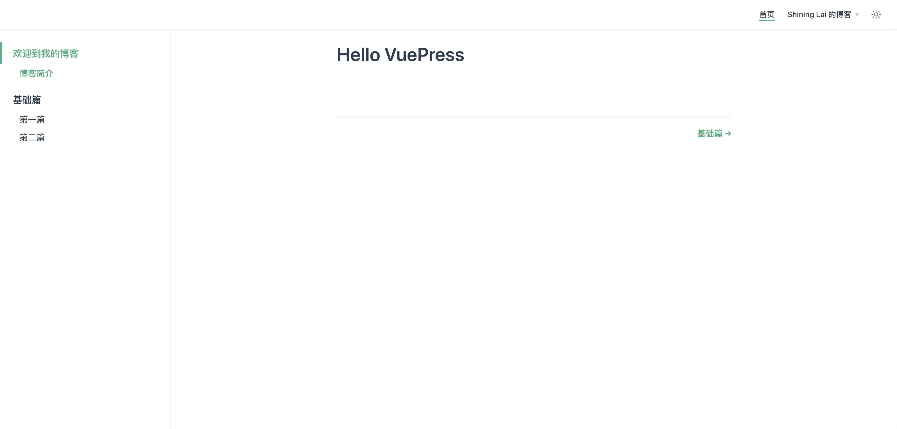
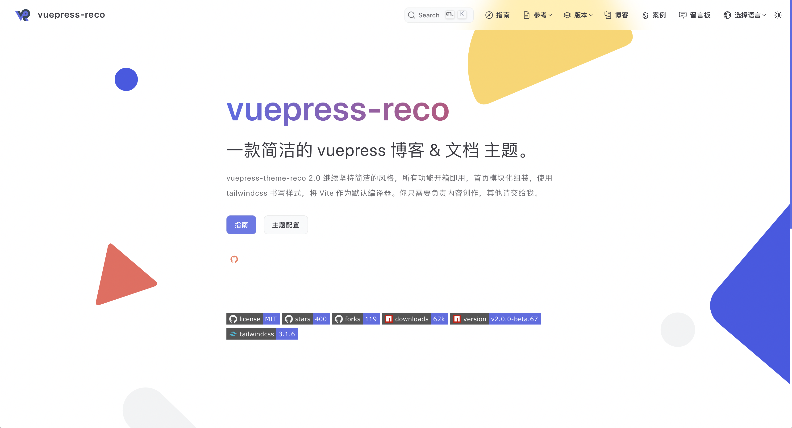
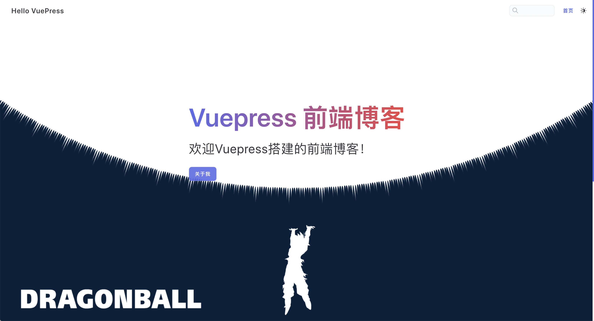
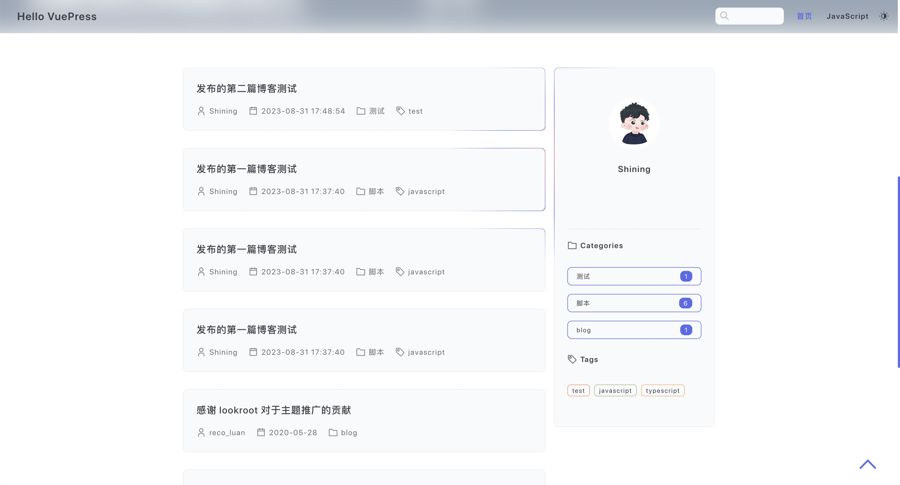
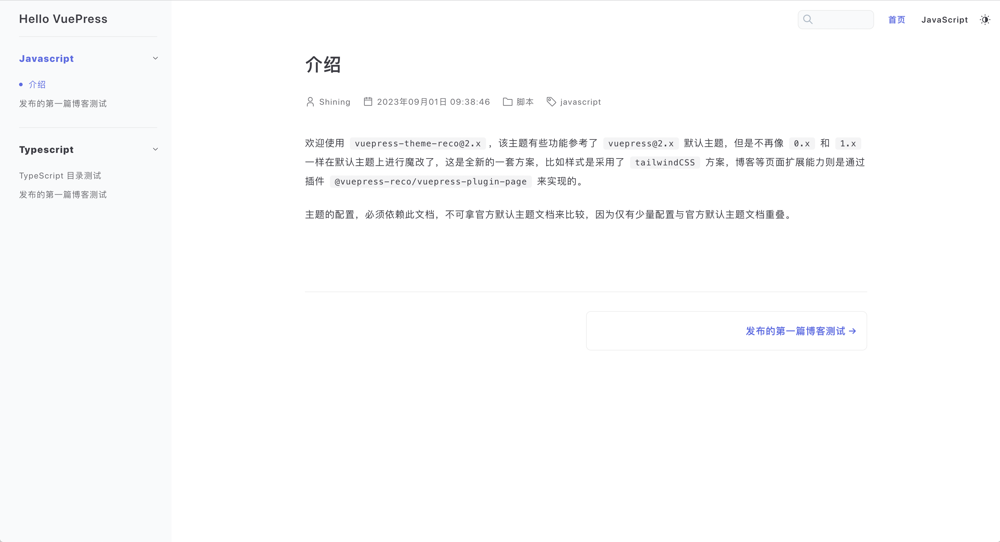

# **基于Vuepress搭建博客**

一篇关于使用vuepress搭建个人博客的学习记录，可能由于node版本、vuepress版本不同，而存在配置差异，请阅读者根据实际情况调整。
<!-- more -->

## 1. 前言

对于程序员来说，记录是很重要的一件事，无论是学习笔记、工作记录、账号密码等信息都需要常记录，俗话说“好记性不如烂笔头”，只是我们的“笔”换成了键盘，“本子”换成了线上云存储。

现在市场上可以用来做笔记的平台、软件、工具有很多，任君挑选，但是大部分只能记录了自己看，无法通过公网分享，或者只能通过平台生成的链接进行临时分享，而不是通过百度搜索。

如果要做到把自己的笔记通过公网可以搜索到，那么搭建个人博客是最佳选择，搭建个人博客不但可以作为个人记录，还可以通过公网分享，谁都可以访问，并且通过百度可以检索到（前提是通过服务器建站，配置域名解析）；同时，自己动手搭建博客也是一个很好的学习机会，不但可以学习博客项目的前端实现，还可以实现部署网站、服务器相关基础知识等，一次部署，多方面学习。

## 2. 技术选型

### 2.1 基础要求

以下几点前置基础要求，在此先行提出：

* 熟悉vue开发；

* 熟悉md文档语法；

* 良好的技术文档阅读能力；

### 2.2 技术栈

由于本人对vue较为熟悉，因此优先选择的是只要以vue为基础的博客框架即可。

### 2.3 选用框架

现在市场上的博客框架数不胜数，例如WordPress，Hexo，Pagic，VuePress等。

本次选用的框架为VuePress，Vuepress 是由 Vue 支持的静态网站生成工具，因为 Vue 上手起来很简单，所以 Vuepress 使用起来也不难。如果想快速搭建一个静态的博客网站来简单记录笔记或者文章，用 Vuepress 是个不错的选择，它对新手很友好。

官网文档地址：[Vuepress官网文档](https://vuepress.vuejs.org/zh/)

### 2.4 主题选用

在这里选用vuepress-reco主题作为示范：[vuepress-reco，一款简洁的vuepress博客文档主题](https://vuepress-theme-reco.recoluan.com/)

## 3. 起手搭建

### 3.1 项目初始化

```shell
# 1. 新建文件夹
mkdir vuepress-deme-1 && cd vuepress-deme-1

# 2. npm 初始化包管理器 package.json
npm init

# 3. 根据自己的实际需求进行配置

package name: (vuepress-deme-1)
version: (1.0.0)
description: vurepress搭建博客项目demo-1
entry point: (index.js)
test command:
git repository:
keywords:
author: shining98
license: (ISC)

# 4. 安装vuepress，建议安装 vuepress@next，否则需要node版本在16以下
npm install -D vuepress@next

# 5. 创建第一遍文档
mkdir docs && echo '# Hello VuePress' > docs/README.md
```

根据上方步骤完成后，可以看到项目的目录结构产生了变化

```vb
vuepress-deme-1
├─ docs
│  ├─ .vuepress
│  └─ README.md
├─ package-lock.json
└─ package.json
```

等待vuepress安装完成后，即可初步启动查看效果

```shell
npm run dev

✔ Initializing and preparing data - done in 72ms

  vite v4.4.9 dev server running at:

  ➜  Local:   http://localhost:8080/
  ➜  Network: http://10.10.31.180:8080/
```

启动后在浏览器访问，页面展示如下：



如图，vuepress项目已经启动成功，目前显示的是刚才mkdir创建的第一篇文档的内容，文档格式需要学习一下markdown语法。

接下来再完善一点其他的配置。

### 3.2 基础配置

接下来，还需要做一点其他的基础配置，使项目更加完善。

首先，在 docs/.vuepress 目录下新建文件：config.js，文件添加内容如下：

```javascript
module.exports = {
  title: 'Hello VuePress',
  description: 'Just playing around'
}
```

保存后查看效果，可以看到页面多了标题



再进一步配置，这次配置导航栏与侧边栏，在config.js中加入 themeConfig配置

```javascript
module.exports = {
  title: 'Hello VuePress',
  description: 'Just playing around',
  themeConfig: {
    nav: [
      { text: '首页', link: '/' },
      {
        text: 'Shining Lai的博客',
        items: [
          { text: 'Gitee', link: 'https://gitee.com/' },
          { text: 'Github', link: 'https://github.com/' }
        ]
      }
    ],
    sidebar: [
      {
        title: '欢迎到我的博客',
        path: '/',
        collapsable: false, // 是否折叠
        children: [{ title: '博客简介', path: '/' }]
      },
      {
        title: '基础篇',
        path: '/blogs/1',
        collapsable: true,
        children: [
          { title: '第一篇', path: '/blogs/1' },
          { title: '第二篇', path: '/blogs/2' }
        ]
      }
    ]
  }
}
```

如上，分别配置 nav 与 sidebar 后，可以得到如下效果：



到这里，如果对博客无较高的美观要求或复杂要求，则到这里就可以开始编写文档记录内容，如果感兴趣可以继续往下，挑选喜欢的主题并进行安装。

查找喜欢的主题：[vuepress社区主题](https://www.npmjs.com/search?q=keywords:vuepress-theme)

### 3.3 安装主题

我们开始安装自己喜欢的主题，在这里选了一款主题：**vuepress-reco** 作为安装示范。

官网：[vuepress-theme-reco](https://vuepress-theme-reco.recoluan.com/)



首先安装主题：

```shell
npm install vuepress-theme-reco --save-dev
```

待安装完成后，在config.js中进行使用

```javascript
import { recoTheme } from 'vuepress-theme-reco'
import { defineUserConfig } from 'vuepress'

export default defineUserConfig({
  title: 'Hello VuePress',
  head: [
    ['link', { rel: 'stylesheet', href: '/css/katex.min.css' }],
    ['link', { rel: 'stylesheet', href: '/css/github-markdown.min.css' }],
    [
      'meta',
      {
        name: 'description',
        content: 'vuepress 搭建的前端博客',
      },
    ],
  ],
  theme: recoTheme({
    theme: 'reco',
    author: 'Shining',
    authorAvatar: '/me.png',
    navbar: [
      { text: '首页', link: '/' },
    ],
  // ....
  })
})
```

然后，还需要根据官网文档规范进行主题配置，在docs目录下新建md文件：`README.md`，并写入如下配置：

```markdown
---
home: true
modules:
  # - Banner
  - BannerBrand
  - MdContent
  - Blog
  - Footer
# banner: # banner 模块的配置
#   heroText: Shining Blog
#   tagline: Enjoy when you can, and endure when you must.
#   heroImage: /me.png
#   # bgImage: dragonball.png
#   bgImageStyle:
#     height: 0
# filter: brightness(50%)
bannerBrand:
  bgImage: 'genkidan.jpg'
  title: Vuepress 前端博客
  description: 欢迎Vuepress搭建的前端博客！
  # tagline: 加载中...
  buttons:
    - { text: 关于我, link: './lxl/about.html' }
    # - { text: Default Style, link: '/docs/style-default-api/introduce', type: 'plain' }
  socialLinks:
    - { icon: 'Github', link: 'https://github.com/' }
    - { icon: 'Zhihu', link: 'https://www.zhihu.com/people/' }
    - { icon: 'Twitter', link: 'https://twitter.com/' }
blog:
  socialLinks:
    - { icon: 'Github', link: 'https://github.com/' }
    - { icon: 'Gitee', link: 'https://gitee.com/' }
    - { icon: 'Bilibli', link: 'https://bilibili.com/' }
footer:
  # record: xxxxxxxxxxx
  # recordLink: https://beian.miit.gov.cn/
  startYear: 2023
# isShowTitleInHome: true
# actionText: About
# actionLink: /views/other/about
---
```

以上配置每个配置项具体含义可以查看[reco-formatter配置](https://vuepress-theme-reco.recoluan.com/docs/theme/frontmatter-home.html)，根据自己需求与喜好进行相应的配置，随后可以得到页面效果如下：



### 3.4 文章展示

reco 主题实现了博客的功能，但是 vuepress 没有办法区分博客或是文档，导致文档也会出现在博客区域，所以主题对博客和文档的存放位置进行了约束，博客文章请放在 /blogs 文件夹中（强制），文档请放在 /docs 中（不强制）。

在blogs目录下新建文件夹或者文档，按照自己规划的目录结构来进行创建，注意当创建md文档时，需要在文档头部加入文档信息，以便识别标题和时间等，格式如下：

```markdown
---
title: 介绍
date: 2023年09月01日 09:38:46
categories:
  - 脚本
tags:
  - javascript
---

## 基础介绍

欢迎使用 `vuepress-theme-reco@2.x`，该主题有些功能参考了 `vuepress@2.x` 默认主题，但是不再像 `0.x` 和 `1.x` 一样在默认主题上进行魔改了，这是全新的一套方案，比如样式是采用了 `tailwindCSS` 方案，博客等页面扩展能力则是通过插件 `@vuepress-reco/vuepress-plugin-page` 来实现的。

主题的配置，必须依赖此文档，不可拿官方默认主题文档来比较，因为仅有少量配置与官方默认主题文档重叠。
```


创建后还需要在config.js中进行series的配置，语法格式如下：

```javascript
import { recoTheme } from 'vuepress-theme-reco'
import { defineUserConfig } from 'vuepress'

export default defineUserConfig({
  title: 'Hello VuePress',
  theme: recoTheme({
    theme: 'reco',
    author: 'Shining',
    authorAvatar: '/me.png',
    navbar: [
      { text: '首页', link: '/' },
      { text: 'JavaScript', link: '/blogs/javascript/' },
    ],
    series: {
      '/blogs/script/': [
        { text: 'Javascript', children: ['/blogs/script/javascript/introduce', '/blogs/script/javascript/1'] },
        { text: 'Typescript', children: ['/blogs/script/typescript/home', '/blogs/script/typescript/1'] }
      ]
    }
  })
})
```

如上进行配置后刷新页面，首先在首页可以看到如下效果：



可以看到文章可以显示在首页，右侧是作者信息以及文章的分类、标签等信息，点击文档查看详情，页面如下：



可以看到侧边栏可以正常显示，以及根据我们配置的分组格式进行了显示，右边主题为文章内容，具体的功能可以通过配置来分别实现，例如评论组件、点赞组件、预览量等，具体配置方法可以查看官方文档。

## 4. 总结

本文阐述了如何从0到1搭建前端博客项目的流程，由于篇幅有限，搭建过程遇到了很多坑，但是都是可以从网上检索到解决方案，因此不在文中过多阐述。搭建过程也是一个学习的过程，重要的不是项目跑起来了，而且在项目中学习到了什么。

博客的功能还远远不止以上描述的内容，更多细节和更多有趣的功能需要自行到官网查看文档，博客主题也多种多样，可以到npm社区搜索vuepress-theme查看更多主题，如果没有喜欢的主题，vuepress还支持自定义主题，开发一款属于自己的主题。

本文对于搭建博客项目的介绍就到这里，后续有时间会再阐述一下构建打包与发布上线的流程与实践。