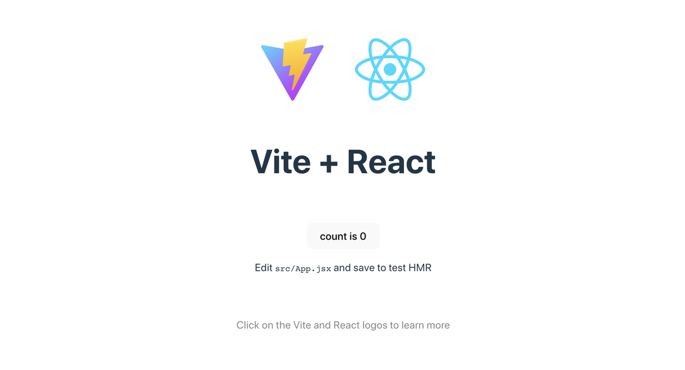

# **1. 项目的搭建与构建发布**

React学习第一篇，从搭建项目到构建、发布项目。
<!-- more -->

## **1. 搭建项目**

React项目的搭建方式有多种，在这里主要推荐两种：

### 1.1 create-react-app

这个是react 官方团队提供的脚手架工具 Create React App(cra)，代码命令需要确保电脑已经安装node(npm)，在想要创建项目的目录下打开终端，运行如下命令即可创建：

```bash
npx create-react-app my-react-app

# 默认为javascript模板，若要创建typescript模板，输入如下命令：
# npx create-react-app my-app --template typescript

cd my-react-app
```

以上命令完成后，在终端可看到如下提示，即为创建成功：


接着输入命令

```bash
cd my-react-app/
npm start
```

即可启动项目，自动打开页面，可看到：


### 1.2 Vite

使用Vite工具也能构建react脚手架项目，同样的确保电脑已经安装node(npm)，在想要搭建项目的目录下打开终端，输入如下命令：

```bash
# 创建vite项目
npm create vite
# 提示 Ok to proceed? (y) 回车即可
✔ Project name: vite-react-app
✔ Select a framework: › React
✔ Select a variant: › JavaScript

# 等待初始化完成后，再依次输入：
cd vite-react-app
npm install
# 这里要等待依赖安装完成
npm run dev
```

启动项目后，可以看到终端提示如下：

```bash
shiningdeMacBook-Pro:vite-react-app shining$ npm run dev

> vite-react-app@0.0.0 dev
> vite


  VITE v4.5.0  ready in 244 ms

  ➜  Local:   http://localhost:5173/
  ➜  Network: use --host to expose
  ➜  press h to show help
```

打开页面可以看到：



即为创建项目成功。

## 2. 项目配置

在这里主要描述用vite创建的react项目的配置，在开始描述之前先做好目录结构的规范化以及初始化，目录结构如下：

```nginx
vite-react-app
├─ public
│  └─ vite.svg
├─ src
│  ├─ assets          # 公共的静态资源
│  │  ├─ css          # 公共css样式
│  │  ├─ icon         # 静态icon资源
│  │  ├─ img          # 静态img资源
│  │  └─ react.svg
│  ├─ components      # 公共组件
│  ├─ config          # 公共配置
│  ├─ hooks           # 公共钩子函数
│  ├─ layout          # 项目公共布局
│  ├─ router          # 项目路由
│  ├─ service         # 封装http请求相关目录
│  ├─ store           # 状态管理文件目录
│  ├─ utils           # 工具函数目录
│  ├─ views           # 页面目录
│  ├─ App.css
│  ├─ App.jsx
│  ├─ index.css
│  └─ main.jsx
├─ README.md
├─ index.html
├─ package-lock.json
├─ package.json
└─ vite.config.js
```

规范化好项目的目录结构，方便进行全局的资源管理或组件管理，方便资源查找以及代码、功能的模块化管理。

### 2.1 代码格式化与代码校验

由于配置代码较长，建议参考网上配置。

### 2.2 配置“@”别名

```js
import { defineConfig } from 'vite';
import react from '@vitejs/plugin-react';
import path from 'path';

// https://vitejs.dev/config/
export default defineConfig({
  plugins: [react()],
  resolve: {
    alias: {
      '@': path.resolve(__dirname, './src')
    }
  }
});
```

### 2.3 配置sass

```bash
# 安装完插件即可使用，不需要在vite.config.js配置
npm install sass sass-resources-loader --save
```

测试：

```scss
// test.scss
.test-scss {
  font-size: 24px;

  .c-1 {
    color: red;

    .c-2 {
      background-color: black;
    }
  }
}
```

```jsx
// App.jsx
import './App.css'
import './test.scss'

function App() {
  return (
    <>
      <h1>Vite + React</h1>
      <div className="test-scss">
        <div className="c-1">
          <div className="c-2">
            测试scss
          </div>
        </div>
      </div>
    </>
  )
}

export default App
```


可以看到， 样式能够正常显示。

### 2.4 封装数据请求 - fetch

数据请求可以选择原生fetch或者第三方库Axios，在这里使用fetch进行配置说明，且做封装方便使用。

Fetch API 提供了一个 JavaScript 接口，用于访问和操纵 HTTP 管道的一些具体部分，例如请求和响应。它还提供了一个全局 fetch() 方法，该方法提供了一种简单，合理的方式来跨网络异步获取资源。

这种功能以前是使用 XMLHttpRequest 实现的。

Fetch 提供了一个更理想的替代方案，可以很容易地被其他技术使用，例如 Service Workers。

Fetch 还提供了专门的逻辑空间来定义其他与 HTTP 相关的概念，例如 CORS 和 HTTP 的扩展。

**为什么封装Fetch请求?**
  - 请求的地方代码更少。
  - 公共的错误统一一个地方添加即可。
  - 请求定制的错误还是请求自己也可以处理。
  - 扩展性好，添加功能只需要改一个地方。

总结起来一句话：简单，好用。下面开始封装：

```js
const checkStatus = res => {
  if (200 >= res.status < 300) {
    return res;
  }
  // message.error(`网络请求失败,${res.status}`);
  console.log('报错 error', `网络请求失败,${res.status}`);
  const error = new Error(res.statusText);
  error.response = error;
  throw error;
};

/**
 *  捕获成功登录过期状态码等
 * @param res
 * @returns {*}
 */
const judgeOkState = async res => {
  const cloneRes = await res.clone().json();

  //TODO:可以在这里管控全局请求
  if (!!cloneRes.code && cloneRes.code !== 200) {
    console.log('报错 error', `11${cloneRes.msg}${cloneRes.code}`);
  }

  return res;
};

/**
 * 捕获失败
 * @param error
 */
const handleError = error => {
  if (error instanceof TypeError) {
    console.log('报错 error', `网络请求失败啦！${error}`);
  }
  return {   //防止页面崩溃，因为每个接口都有判断res.code以及data
    code: -1,
    data: false,
  };
};

class http {
  /**
   *静态的fetch请求通用方法
   * @param url
   * @param options
   * @returns {Promise<unknown>}
   */
  static async staticFetch(url = '', options = {}) {

    const defaultOptions = {
      /*允许携带cookies*/
      credentials: 'include',
      /*允许跨域**/
      mode: 'cors',
      headers: {
        token: null,
        Authorization: null,
        // 当请求方法是POST，如果不指定content-type是其他类型的话，默认为如下，要求参数传递样式为 key1=value1&key2=value2，但实际场景以json为多
        // 'content-type': 'application/x-www-form-urlencoded',
      },
    };
    if (options.method === 'POST' || 'PUT') {
      defaultOptions.headers['Content-Type'] = 'application/json; charset=utf-8';
    }
    const newOptions = { ...defaultOptions, ...options };
    console.log('newOptions', newOptions);
    return fetch(url, newOptions)
      .then(checkStatus)
      .then(judgeOkState)
      .then(res => res.json())
      .catch(handleError);
  }

  /**
   *post请求方式
   * @param url
   * @returns {Promise<unknown>}
   */
  post(url, params = {}, option = {}) {
    const options = Object.assign({ method: 'POST' }, option);
    //一般我们常用场景用的是json，所以需要在headers加Content-Type类型
    options.body = JSON.stringify(params);

    //可以是上传键值对形式，也可以是文件，使用append创造键值对数据
    if (options.type === 'FormData' && options.body !== 'undefined') {
      let params = new FormData();
      for (let key of Object.keys(options.body)) {
        params.append(key, options.body[key]);
      }
      options.body = params;
    }
    return http.staticFetch(url, options); //类的静态方法只能通过类本身调用
  }

  /**
   * put方法
   * @param url
   * @returns {Promise<unknown>}
   */
  put(url, params = {}, option = {}) {
    const options = Object.assign({ method: 'PUT' }, option);
    options.body = JSON.stringify(params);
    return http.staticFetch(url, options); //类的静态方法只能通过类本身调用
  }

  /**
   * get请求方式
   * @param url
   * @param option
   */
  get(url, option = {}) {
    const options = Object.assign({ method: 'GET' }, option);
    return http.staticFetch(url, options);
  }
}

const requestFun = new http(); //new生成实例
export const { post, get, put } = requestFun;
export default requestFun;
```

## 3. 项目构建

项目进行工程化配置后，即可进入开发流程，后续还有提测、测试、回归流程，最后才是上线。

上线项目需要将当前项目代码进行构建编译，主要命令是`npm run build`，输入后即可进行自动打包编译，如下：

```bash
shiningdeMacBook-Pro:vite-react-app shining$ npm run build

> vite-react-app@0.0.0 build
> vite build

vite v4.5.0 building for production...
✓ 33 modules transformed.
dist/index.html                   0.45 kB │ gzip:  0.29 kB
dist/assets/index-26d2d345.css    1.52 kB │ gzip:  0.77 kB
dist/assets/index-63ac2d59.js   142.88 kB │ gzip: 45.88 kB
✓ built in 1.11s
shiningdeMacBook-Pro:vite-react-app shining$
```

如上最后出现built时长，即为构建完成，构建后的产物项目默认自动存放在在根目录下新建的文件夹dist中，如图：


## 4. 项目发布

构建完成后，需要将项目发布上线，其中需要的资源就是构建产物dist整个文件夹下的所有文件。
项目发布涉及服务器操作知识，在这里暂时不做阐述。
