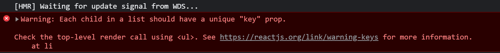

# **2. 语法基础**

React学习第二篇，学习基础语法，继续入门。
<!-- more -->

## 1. 动态样式

- **行内模式**

> src/views/basic-grammar-learn/dynamic-style/index.jsx

```jsx
const style = {
  color: 'red',
  'font-weight': 'bold'
}

function DynamicStyle() {
  return (
    <div className="component-dynamic-style">
      <span style={style}>这里是测试动态样式的组件</span>
    </div>
  )
}

export default DynamicStyle
```

> App.jsx

```jsx
import DynamicStyle from './views/basic-grammar-learn/dynamic-style'

function App() {
  return (
    <div>
      <DynamicStyle />
    </div>
  )
}

export default App
```

- **类名模式**

```scss
// src/views/basic-grammar-learn/dynamic-style/index.scss
.component-dynamic-style {
  .class-mode {
    color: blue;
    font-weight: bold;
  }
}
```

```jsx
// src/views/basic-grammar-learn/dynamic-style/index.jsx
import './index.scss'

const style = {
  color: 'red',
  'font-weight': 'bold'
}

function DynamicStyle() {
  return (
    <div className="component-dynamic-style">
      <div style={style}>这里是测试动态样式的组件 - 行内样式</div>
      <div className="class-mode">这里是测试动态样式的组件 - 类名模式</div>
    </div>
  )
}

export default DynamicStyle
```

## 2. jsx中使用JavaScript表达式

```jsx
const name = 'React'

<h1>你好，我在学习{name}</h1>
// 你好,我在学习React
```

可以使用的表达式：

- 字符串、数值、布尔值、null、undefined、object（ [] / {} ）

- 1 + 2、'abc'.split('')、['a', 'b'].join('-')

- fn()

特别注意

> if 语句 / switch-case 语句 / 变量声明语句，这些叫做语句，不是表达式，不能出现在 {} 中！

## 3. JSX列表渲染

前端在渲染页面数据时离不开重复的数组结构，比如订单列表，商品列表等，vue中用的是v-for指令，react这边如何实现呢？

**实现：使用数组的map方法**

```jsx
// 来个列表
const songs = [
  { id: 1, name: '痴心绝对' },
  { id: 2, name: '像我这样的人' },
  { id: 3, name: '南山南' }
]

function App() {
  return (
    <div className="App">
      <ul>
        {
          songs.map((item, index) => <li key={index}>{item.name}</li>)
        }
      </ul>
    </div>
  )
}

export default App
```

注意点：需要为遍历项添加 key 属性



> 1. key 在 HTML 结构中是看不到的，是 React 内部用来进行性能优化时使用
> 2. key 在当前列表中要唯一的字符串或者数值（String/Number）
> 3. 如果列表中有像 id 这种的唯一值，就用 id 来作为 key 值
> 4. 如果列表中没有像 id 这种的唯一值，就可以使用 index（下标）来作为 key 值

## 4. JSX注意事项

> 1. JSX必须有一个根节点，如果没有根节点，可以使用<></>（幽灵节点）替代
> 2. 所有标签必须形成闭合，成对闭合或者自闭合都可以
> 3. JSX中的语法更加贴近JS语法，属性名采用驼峰命名法  class -> className  for -> htmlFor
> 4. JSX支持多行（换行），如果需要换行，需使用() 包裹，防止bug出现