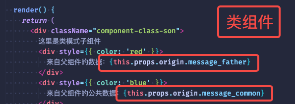
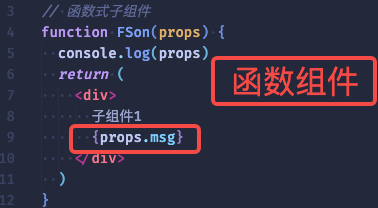

# **4. 三大属性**

React学习第四篇，学习React 三大属性：props, state, refs。
<!-- more -->

## 1. props

`props`就是属性的简写，是单个值，是在父组件中定义或已经在`state`中的值，并将这些值传递给其子组件。

`props`本身不可变，但可以通过触发`state`的变化，反过来改变`props`本身的值。

- 组件是封闭的，接收外部数据应该通过`props`来实现

- 函数组件通过参数`props`来接收数据，`props`是一个对象； 类组件通过`this.props`接收数据。

- 传递数据：在组件标签上添加属性

### 1.1 props的作用

- 作用：用于接收组件外部的数据

- 传递数据： 通过给组件标签添加属性

- 接收数据：函数组件通过 参数 `props`接收数据，类组件通过 `this.props`接收数据

### 1.2 props的特点

- 可以给组件传递任意类型的数据

- `props`是只读属性，不能对值进行修改

- 使用类组件时，如果写了构造函数，应该将`props`传递给`super()`,否则无法在构造函数中获取到`props`，其他的地方是可以拿到的

### 1.3 props的应用场景

#### 1.3.1 子组件调用父组件的方法

（1）子组件要拿到父组件的属性，需要通过`this.props`方法。

（2）同样地，如果子组件想要调用父组件的方法，只需父组件把要被调用的方法以属性的方式放在子组件上，子组件内部便可以通过“`this.props`.被调用的方法”这样的方式来获取父组件传过来的方法。

#### 1.3.2 父组件调用子组件的方法

在React中有个叫`ref`的属性。这个属性就像给组件起个引用名字一样，子组件被设置为`ref`之后（比如 ref=“xxx”）。父组件便可以通过this.refs.xxx来获取到子组件了。

在上文中，其实已经使用过props进行组件的传参了，可以简单回顾一下：
类组件：



函数组件：



## 2. state

### 2.1 什么是state

React把组件看成是一个状态机（State Machines）。

通过与用户的交互，实现不同状态，然后渲染 UI，让用户界面和数据保持一致。

组件的任何UI改变，都可以从State的变化中反映出来；State中的所有状态都用于反映UI的变化，不应有多余状态。


- state来自内部状态，是组件对象最重要的属性，其值是对象，可以包含多个数据

- 可以通过更新组件的state来更新对应的页面显示(重新进行组件渲染），不必操作DOM

- 当页面发生变化时，用state来记录页面变化

### 2.2 state变量定义规范

1. 可以通过props从父组件中获取的变量不应该做为组件State。

2. 这个变量如果在组件的整个生命周期中都保持不变就不应该作为组件State。


3. 通过其他状态（State）或者属性(Props)计算得到的变量不应该作为组件State。

4. 没有在组件的render方法中使用的变量不用于UI的渲染，那么这个变量不应该作为组件的State 。这种情况下，这个变量更适合定义为组件的一个普通属性。

### 2.3 state的使用方法

在函数组件与类组件中使用state的方式不太一样，需要注意使用上的区别，让我们先看看类组件的使用：

- **类组件**

```jsx
class ClassState extends React.Component {
  // 初始化state
  state = {
    count: 50
  }

  handleAdd = () => {
    // 修改state，使用 this.setState
    this.setState({
      count: this.state.count + 1
    })
  }
  handleSub = () => {
    // 修改state，使用 this.setState
    this.setState({
      count: this.state.count - 1
    })
  }

  render() {
    return (
      <>
        <div>这里是类组件，当前存在值：{this.state.count} </div>
        <button onClick={this.handleAdd}>增加</button>
        <button onClick={this.handleSub}>减少</button>
      </>
    )
  }
}
```

在类组件中，需要在class内部定义、初始化state对象，要改变state的值值时，需要用到this.setState来改变，不能直接赋值，直接赋值无法触发页面重新渲染。

另外，setState是异步的操作，也就是说使用setState时中间可能存在一定的延迟，如果刚好在这个延迟内对要改变的数据进行操作，那么可能会出错。

>【详细说明】
>
>调用setState，组件的state并不会立即改变，立马读取state会失败。
>
>因为setState是异步执行的，而且要把修改的状态放入一个队列中，React会优化真正的执行时机，并且React会出于性能原因，可能会将多次setState的状态修改合并成一次状态修改。
>
>需要注意的是，同样不能依赖当前的props计算下个state，因为props的更新也是异步的。
>
>推荐使用的方式是setState(fn函数)。

- **函数组件**

```jsx
function FunctionState() {
  let curCount = 50
  const [newCount, setCount] = useState(curCount)

  function handleAdd() {
    setCount(newCount + 1)
  }
  function handleSub() {
    setCount(newCount - 1)
  }

  return (
    <>
      <div>这里是函数组件，当前组件状态值：{newCount}</div>
      <button onClick={handleAdd}>增加</button>
      <button onClick={handleSub}>减少</button>
    </>
  )
}
```

对于函数组件（Function Component）来说，它没有 class 组件中的 `componentDidMount`、`componentDidUpdate` 等生命周期方法，也没有`State`，但这些可以通过 React Hook 实现。

**React Hook是什么？**

Hook 是一个特殊的参数，它是 React 16.8 中新增的特性，可以让我们在不编写 class 的情况下使用 State 以及其他的 React 特性。

```js
// 引入
import React, { useState, useEffect, useRef } from 'react';
```

在函数组件中使用 State 特性。

若使用对象做 State，useState 更新时会直接替换掉它的值，而不像 setState 一样把更新的字段合并进对象中。

推荐将 State 对象分成多个 State 变量。

useState的使用方式见上方例子。

> 更详细的hooks用法与解析在后面会有专门的篇幅来阐述。

## 3. refs

### 3.1 了解refs

Refs 提供了一种方式，允许我们访问 DOM 节点或在 render 方法中创建的 React 元素。

Ref转发是一项将ref自动通过组件传递到子组件的技巧。 通常用来获取DOM节点或者React元素实例的工具。在React中Refs提供了一种方式，允许用户访问dom节点或者在render方法中创建的React元素。

### 3.2 refs的使用场景

在某些情况下，我们需要在典型数据流之外强制修改子组件，被修改的子组件可能是一个 React 组件的实例，也可能是一个 DOM 元素，例如:

- 管理焦点，文本选择或媒体播放。

- 触发强制动画。

- 集成第三方 DOM 库。

### 3.3 refs的使用案例

需要用到的方法：`createRef` （>= React16.3）

一般在构造函数中将refs分配给实例属性，以供组件的其它方法中使用：

```jsx
class RefsCom extends React.Component {
  constructor(props) {
    super(props)
    this.refsComRef = React.createRef()
  }
  componentDidMount() {
    this.refsComRef.current.innerHTML = '通过refs修改了文案'
  }

  render() {
    return (
      <>
        <div ref={this.refsComRef}>学习refs</div>
      </>
    )
  }
}
```

在函数式组件中要使用ref，需要用到hooks的useRef：

```jsx
function FuncRef(props) {
  const inputRef = useRef()

  const onFocus = e => {
    console.log('focus', e)
    inputRef.current.focus()
  }

  return (
    <div>
      <input ref={inputRef} type='text' />
      <button onClick={onFocus}>聚焦</button>
    </div>
  )
}
```

以上是关于React中三大属性的学习，此部分是重中之重，需要掌握好这个基础，才能更好的理解、学习后面的内容，例如组件、高阶组件等。