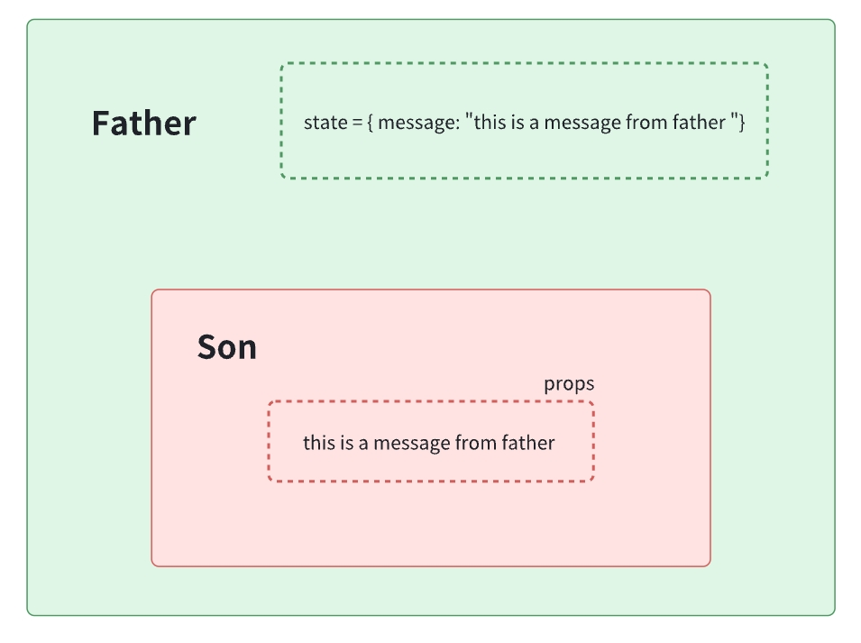
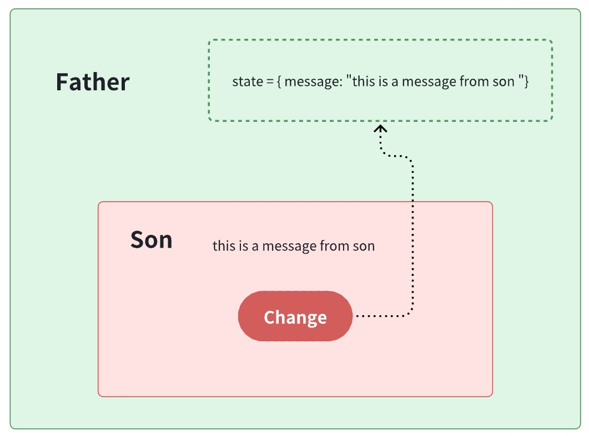
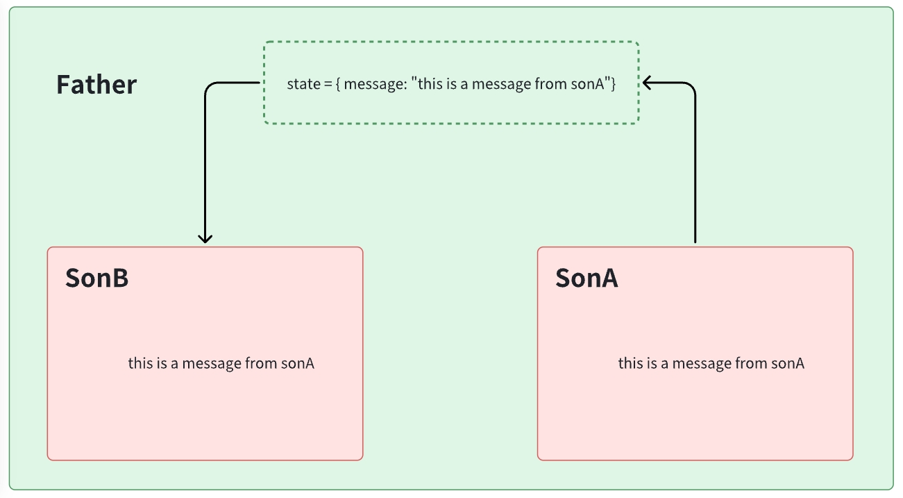
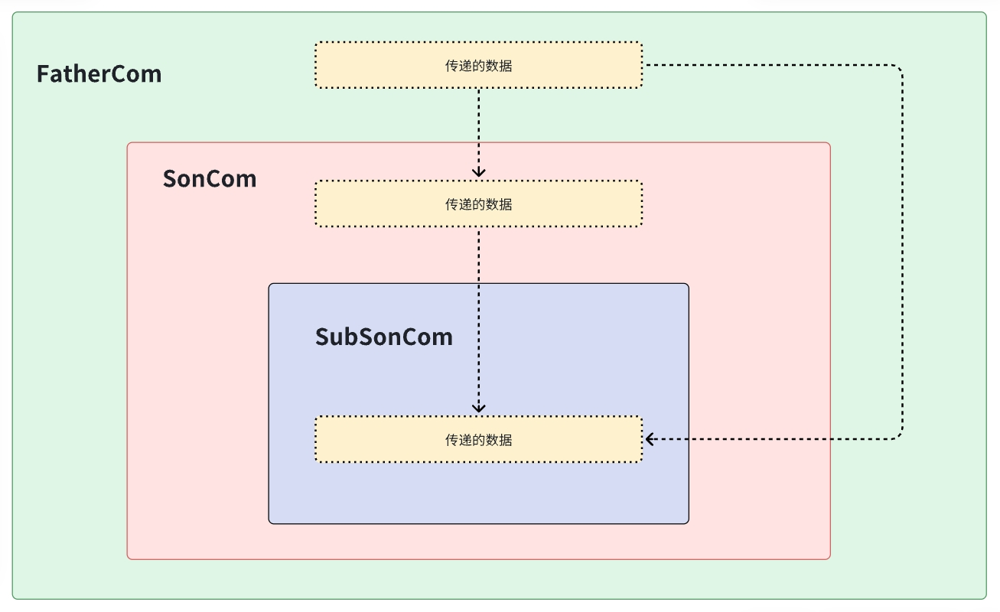

# **5. 组件通信**

React学习第五篇，学习React 组件间的通信，分别有：父子组件通信、兄弟组件通信、跨组件通信。
<!-- more -->

## 1. 组件通信的意义

组件是独立且封闭的单元，默认情况下组件只能使用自己的数据（state）。

组件化开发的过程中，完整的功能会拆分多个组件，在这个过程中不可避免的需要互相传递一些数据。

为了能让各组件之间可以进行互相沟通，数据传递，这个过程就是组件通信。

1. 父子关系 -  最重要的，props、state

2. 兄弟关系 -  自定义事件模式产生技术方法 eventBus  /  通过共同的父组件通信

3. 其它关系 -  第三方状态管理库：mobx / redux / zustand / recoil

## 2. 父子组件通信

### 2.1 父传子 - 实现步骤

1.  父组件提供要传递的数据  -  state
2.  给子组件标签添加属性值为 state中的数据
3.  子组件中通过 props 接收父组件中传过来的数据
    1. 类组件使用this.props获取props对象
    2. 函数式组件直接通过参数获取props对象

注意：这里补充拓展下state、props：

- props 是组件对外的接口，state 是组件对内的接口。

- 组件内可以引用其他组件，组件之间的引用形成了一个树状结构（组件树），如果下层组件需要使用上层组件的数据或方法，上层组件就可以通过下层组件的 props 属性进行传递，因此 props 是组件对外的接口。

- 组件除了使用上层组件传递的数据外，自身也可能需要维护管理数据，这就是组件对内的接口 state。

- 根据对外接口 props 和对内接口 state，组件计算出对应界面的UI。



### 2.2 父传子 - 代码实现

```jsx
import React from 'react'

// 函数式子组件
function FSon(props) {
  console.log(props)
  return (
    <div>
      子组件1
      {props.msg}
    </div>
  )
}

// 类子组件
class CSon extends React.Component {
  render() {
    return (
      <div>
        子组件2
        {this.props.msg}
      </div>
    )
  }
}
// 父组件
class App extends React.Component {
  state = {
    message: 'this is message'
  }
  render() {
    return (
      <div>
        <div>父组件</div>
        <FSon msg={this.state.message} />
        <CSon msg={this.state.message} />
      </div>
    )
  }
}

export default App
```

### 2.3 子传父 - 实现步骤

1. 父组件提供一个回调函数 - 用于接收数据
2. 将函数作为属性的值，传给子组件
3. 子组件通过props调用 回调函数
4. 将子组件中的数据作为参数传递给回调函数



### 2.4 子传父 - 代码实现

```jsx
import React from 'react'

// 子组件
function Son(props) {
  function handleClick() {
    // 调用父组件传递过来的回调函数 并注入参数
    props.changeMsg('this is newMessage')
  }
  return (
    <div>
      {props.msg}
      <button onClick={handleClick}>change</button>
    </div>
  )
}


class App extends React.Component {
  state = {
    message: 'this is message'
  }
  // 提供回调函数
  changeMessage = (newMsg) => {
    console.log('子组件传过来的数据:',newMsg)
    this.setState({
      message: newMsg
    })
  }
  render() {
    return (
      <div>
        <div>父组件</div>
        <Son
          msg={this.state.message}
          // 传递给子组件
          changeMsg={this.changeMessage}
        />
      </div>
    )
  }
}

export default App
```

## 3. 兄弟组件通信

**核心思路：** 通过状态提升机制，利用共同的父组件实现兄弟通信。



**实现步骤**

1. 将共享状态提升到最近的公共父组件中，由公共父组件管理这个状态
    - 提供共享状态
    - 提供操作共享状态的方法

2. 要接收数据状态的子组件通过 props 接收数据

3. 要传递数据状态的子组件通过props接收方法，调用方法传递数据

**代码实现**

```jsx
import React from 'react'

// 子组件A
function SonA(props) {
  return (
    <div>
      SonA
      {props.msg}
    </div>
  )
}
// 子组件B
function SonB(props) {
  return (
    <div>
      SonB
      <button onClick={() => props.changeMsg('new message')}>changeMsg</button>
    </div>
  )
}

// 父组件
class App extends React.Component {
  // 父组件提供状态数据
  state = {
    message: 'this is message'
  }
  // 父组件提供修改数据的方法
  changeMsg = (newMsg) => {
    this.setState({
      message: newMsg
    })
  }

  render() {
    return (
      <>
        {/* 接收数据的组件 */}
        <SonA msg={this.state.message} />
        {/* 修改数据的组件 */}
        <SonB changeMsg={this.changeMsg} />
      </>
    )
  }
}

export default App
```

## 4. 跨组件的通信




上图是一个react形成的嵌套组件树，如果我们想从App组件向任意一个下层组件传递数据，该怎么办呢？

目前我们能采取的方式就是一层一层的props往下传，显然很繁琐

那么，Context 提供了一个无需为每层组件手动添加 props，就能在组件树间进行数据传递的方法

**实现步骤**

1. 创建Context对象 导出 Provider 和 Consumer对象

```jsx
const { Provider, Consumer } = createContext()
```

2. 使用Provider包裹上层组件提供数据

```jsx
<Provider value={this.state.message}>
    {/* 根组件 */}
</Provider>
```

3. 需要用到数据的组件使用Consumer包裹获取数据

```jsx
<Consumer >
    {value => /* 基于 context 值进行渲染*/}
</Consumer>
```

**实现代码**

```jsx
import React, { createContext }  from 'react'

// 1. 创建Context对象
const { Provider, Consumer } = createContext()


// 3. 消费数据
function ComC() {
  return (
    <Consumer >
      {value => <div>{value}</div>}
    </Consumer>
  )
}

function ComA() {
  return (
    <ComC/>
  )
}

// 2. 提供数据
class App extends React.Component {
  state = {
    message: 'this is message'
  }
  render() {
    return (
      <Provider value={this.state.message}>
        <div className="app">
          <ComA />
        </div>
      </Provider>
    )
  }
}

export default App
```