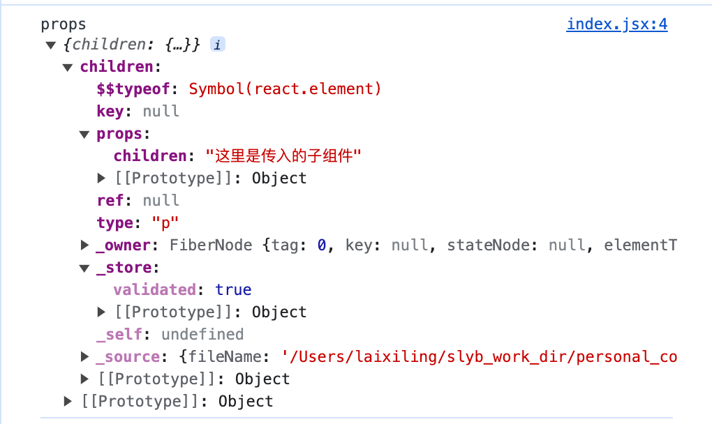
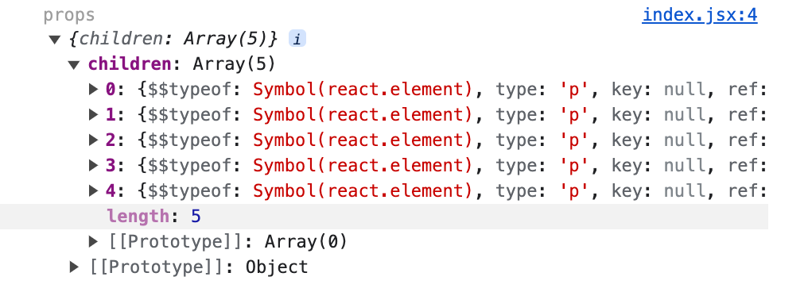
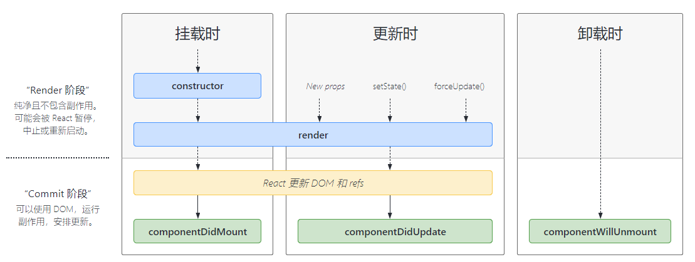
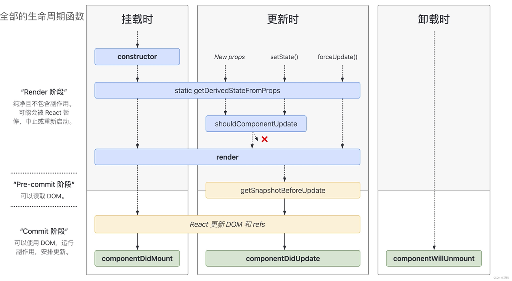
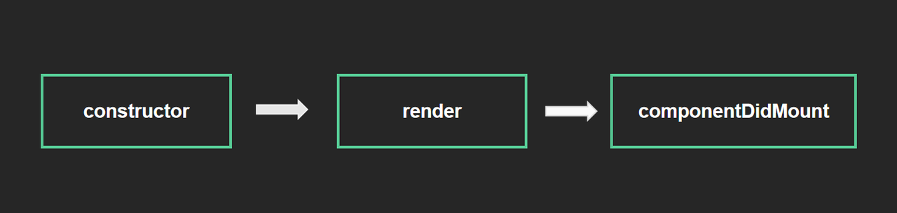

# **6. 高级组件**

React学习第六篇，学习React 高级组件，了解children属性、props校验以及生命周期。
<!-- more -->

## 1. children属性

**children 属性：** 表示组件标签的子节点。当组件标签有子节点时，props 就会有该属性。

```jsx
function PropsChildren(props) {
  console.log('props', props)

  return <div>组件的子节点：{props.children}</div>
}

function PropsFather() {
  return (
    <>
      <div>
        <PropsChildren>
          <p>这里是传入的子组件</p>
        </PropsChildren>
      </div>
    </>
  )
}
```

在子组件中打印出props，得到如下的数据：



children 属性与普通的props一样，可以是任意值（文本、React元素、组件，甚至是函数），只要在组件中写了任意内容，都会出现在props中children属性里。

同时，也可以放多个，其将以数组的形式存在。

```jsx
function PropsFather() {
  return (
    <>
      <div>
        <PropsChildren>
          <p>这里是传入的子组件</p>
          <p>这里是传入的子组件</p>
          <p>这里是传入的子组件</p>
          <p>这里是传入的子组件</p>
          <p>这里是传入的子组件</p>
        </PropsChildren>
      </div>
    </>
  )
}
```



## 2. props校验

### 2.1 使用场景

**问题：** 组件的创建者和使用者不是同一个人,如果传入的数据格式不对, 可能会导致组件内部报错,组件的使用者不知道明确的错误原因。

**解决办法：** 使用props校验 → 允许在创建组件的时候,就指定props的类型、格式等。

> 使用props校验作用: 捕获错误,给出明确的提示,增加组件的健壮性。

首先，需要先安装PropTypes

```bash
# 使用npm安装
npm install prop-types
```

在有需要使用的地方，把prop-types的包导入：

```jsx
// 在需要使用到的地方引入
import PropTypes from 'prop-types';

// 使用时，使用：[componentName].propTypes = {}给组件添加校验规则，即可使用其校验功能。

function ReceiptProp(props) {
  const arr = props.colors
  const colorList = arr.map((color, index) => <li key={index}>{color.name}</li>)

  return <ul>{colorList}</ul>
}

ReceiptProp.propTypes = {
  colors: PropTypes.array
}

class PropsCheck extends React.Component {
  constructor(props) {
    super(props)
  }

  state = {
    colors: [
      { name: 'red' },
      { name: 'green' },
      { name: 'purple' },
      { name: 'pink' }
    ]
  }

  render() {
    return (
      <>
        <div>
          高级组件
          <div>测试传参</div>
          <ReceiptProp colors={this.state.colors} />
          <PropsFather />
        </div>
      </>
    )
  }
}
```

### 2.2 规则说明

**props检验包含以下几种主要的、常见的类型：**

1. 常见类型：array、bool、func、number、object、string

2. react元素类型：element

3. 必填项 isRequired → PropTypes.array.isRequired

4. 特定结构的对象：shape({})

**配置方法如下：**

```js
// 添加props校验
App.propTypes = {
  a:PropTypes.number,
  fn:PropTypes.func.isRequired,
  tag:PropTypes.element,
  filters:PropTypes.shape({
    area:PropTypes.string,
    price:PropTypes.number
  })
}
```

### 2.3 默认参数

通过defaultProps可以给组件的props设置默认值，在未传入props的时候生效，使得不传入也要保证正常运行，防止页面因未获取值，但是在dom节点中使用，这样会由于错误的引用导致页面渲染出错、卡住。

- **函数组件**

在函数组件中，配置props默认值的方式如下：

```jsx
function ReceiptProp(props) {
  const arr = props.colors
  const colorList = arr.map((color, index) => <li key={index}>{color.name}</li>)

  return <ul>{colorList}</ul>
}
ReceiptProp.propTypes = {
  colors: PropTypes.array
}
ReceiptProp.defaultProps = {
  colors: [{ name: 'gray' }, { name: 'blue' }]
}
```

- **类组件**

类组件中配置props默认值需要使用类的静态属性来进行配置：static defaultProps = {}

```jsx
class PropsCheck extends React.Component {
  constructor(props) {
    super(props)
  }

  static defaultProps = {
    tempValue: '100',
    colors: [{ name: 'gray' }, { name: 'blue' }]
  }

  state = {}

  render() {
    return (
      <>
        <div>高级组件，{this.props.tempValue}</div>
      </>
    )
  }
}
```

## 3. 生命周期

**了解生命周期**

组件的生命周期是指一个组件从被创建到挂载到页面中运行起来，再到组件不用时卸载的过程，这是一种流行的设计理念。

注意，** 只有类组件才有生命周期（类组件 实例化  函数组件 不需要实例化），函数组件中用useEffect来代替生命周期函数的功能。

组件的生命周期可分成三个状态：

- Mounting(挂载)：已插入真实 DOM

- Updating(更新)：正在被重新渲染

- Unmounting(卸载)：已移出真实 DOM

**常用的生命周期**



**完整的生命周期**



**生命周期在不同阶段的执行**

- 挂载阶段



| 钩子 函数             | 触发时机                        | 作用                                                      |
|-------------------|-----------------------------|---------------------------------------------------------|
| constructor       | 创建组件时，最先执行，初始化的时候只执行一次      | 1. 初始化state 2. 创建 Ref 3. 使用 bind 解决 this 指向问题等          |
| render            | 每次组件渲染都会触发                  | 渲染UI（注意： 不能在里面调用setState() ）                            |
| componentDidMount | 组件挂载（完成DOM渲染）后执行，初始化的时候执行一次 | 1. 发送网络请求；2.DOM操作；3. 开启定时器；4. 订阅操作；5. 调用setState；...... |

- 更新阶段


| 钩子函数               | 触发时机           | 作用                                  |
|--------------------|----------------|-------------------------------------|
| render             | 每次组件渲染都会触发     | 渲染UI（与 挂载阶段 是同一个render）             |
| componentDidUpdate | 组件更新后（DOM渲染完毕） | DOM操作，可以获取到更新后的DOM内容，不要直接调用setState |


- 卸载阶段

| 钩子函数                 | 触发时机         | 作用                |
|----------------------|--------------|-------------------|
| componentWillUnmount | 组件卸载（从页面中消失） | 执行清理工作（比如：清理定时器等） |


```jsx
class ExampleComponent extends React.Component {
  // 用于初始化 state
  constructor(props) {
    super(props)
    this.state = { hasError: false }
  }

  // 用于替换 `componentWillReceiveProps` ，该函数会在初始化和 `update` 时被调用
  // 因为该函数是静态函数，所以取不到 `this`, 如果需要对比 `prevProps` 需要单独在 `state` 中维护
  // 它应返回一个对象来更新 state

  static getDerivedStateFromProps(nextProps, prevState) {
    console.log('nextProps', nextProps)
    console.log('prevState', prevState)

    return {}
  }

  // 判断是否需要更新组件，多用于组件性能优化
  shouldComponentUpdate(nextProps, nextState) {}

  // 组件挂载后调用
  // 可以在该函数中进行请求或者订阅
  componentDidMount() {}

  // 用于替换 componentWillUpdate ，该函数会在 update 后 DOM 更新前被调用
  // 用于读取最新的 DOM 数据。
  getSnapshotBeforeUpdate() {}

  // 组件即将销毁
  // 可以在此处移除订阅，定时器等等
  componentWillUnmount() {}

  // 组件销毁后调用
  componentDidUnMount() {}

  // 组件更新后调用
  componentDidUpdate() {}

  // 错误边界 - 渲染备用 UI
  // 更新 state 使下一次渲染能够显示降级后的 UI
  // 注意错误边界仅可以捕获其子组件的错误，它无法捕获其自身的错误
  static getDerivedStateFromError(error) {
    console.log('error', error)
    return { hasError: true }
  }

  // 错误边界 - 打印错误信息
  // 你同样可以将错误日志上报给服务器
  // 注意错误边界仅可以捕获其子组件的错误，它无法捕获其自身的错误
  componentDidCatch(error, info) {
    console.log(error, info)
  }

  // 渲染组件函数
  render() {}

  // 以下函数不建议使用
  // UNSAFE_componentWillMount() {}
  // UNSAFE_componentWillUpdate(nextProps, nextState) {}
  // 接收到新的props时调用
  // UNSAFE_componentWillReceiveProps(nextProps) {}

  render() {
    return (
      <>
        <div>组件生命周期测试</div>
      </>
    )
  }
}
```

在函数时组件中，没有生命周期的概念，但是我们可以借助hooks来模拟生命周期，如下：

```jsx
export default function FuncLife(props) {
  const [num1, changeNum1] = useState(0)
  const [num2, changeNum2] = useState(10)

  // 组合------------------------------------------------------

  // 场景1: 初始化加载
  useEffect(() => {
    console.log('初始化加载')
    console.log(num1, '???', props)
  }, [])

  //场景2: 任意数据更新,但是初始化不加载
  useEffect(() => {
    return () => {
      console.log('数据发生修改了')
    }
  })
  //场景3: 只有卸载时加载
  useEffect(() => {
    return () => {
      console.log('卸载才会调用')
    }
  }, [])
  //场景4: 某一数据发生改变,单独触发
  useEffect(() => {
    return () => {
      console.log('只有修改num1才会调用')
    }
  }, [num1])

  return (
    <div>
      <p>
        数值1:{num1}
        <button onClick={() => changeNum1(num1 + 1)}>修改数值1</button>
      </p>
      <p>
        数值2:{num2}
        <button onClick={() => changeNum2(num2 - 1)}>修改数值2</button>
      </p>
    </div>
  )
}
```

## 4. 阶段练习

完成一个案例，分别实现从：组件挂载，渲染，更新，卸载，不同阶段的生命周期的使用。

1. 挂载：在页面挂载时初始化组件数据，编写一个模拟http请求的场景函数，获取数据后将其渲染到组件中；

2. 渲染：在渲染页面时，给部分数据加上动画效果；

3. 更新：在数据更新时，重新触发动画效果；

4. 卸载：卸载组件时，将组件的定时器、变量等清空；