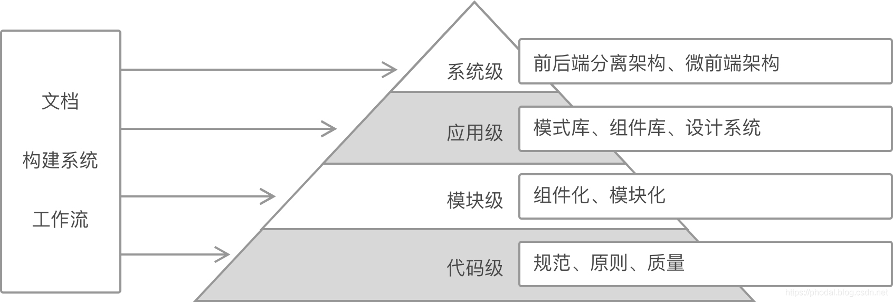
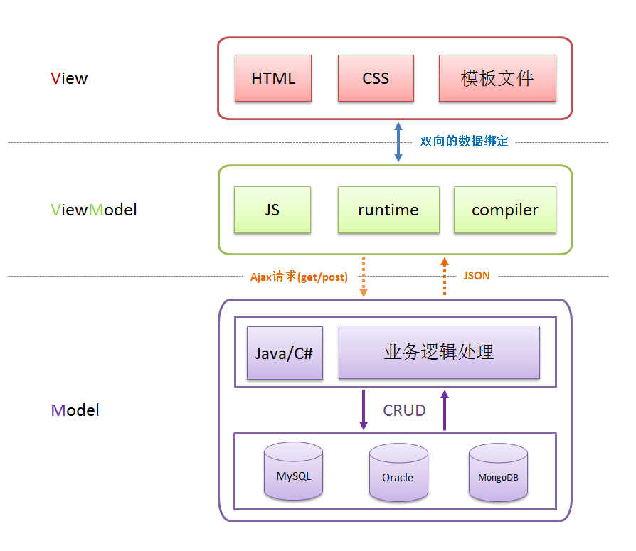
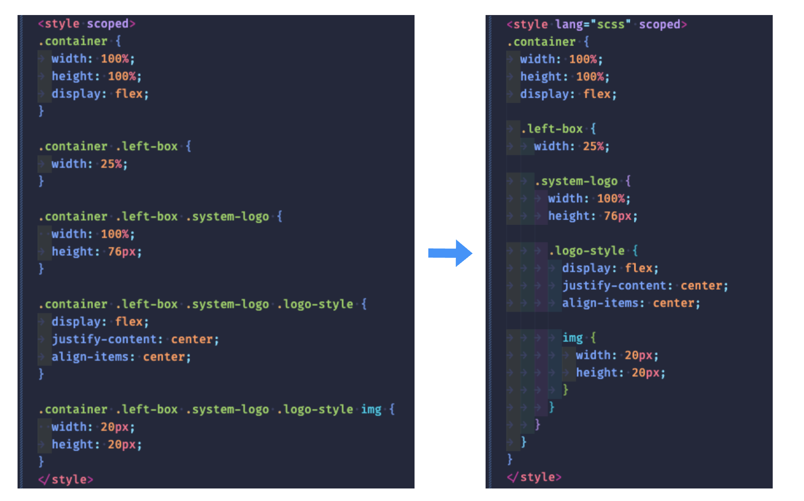
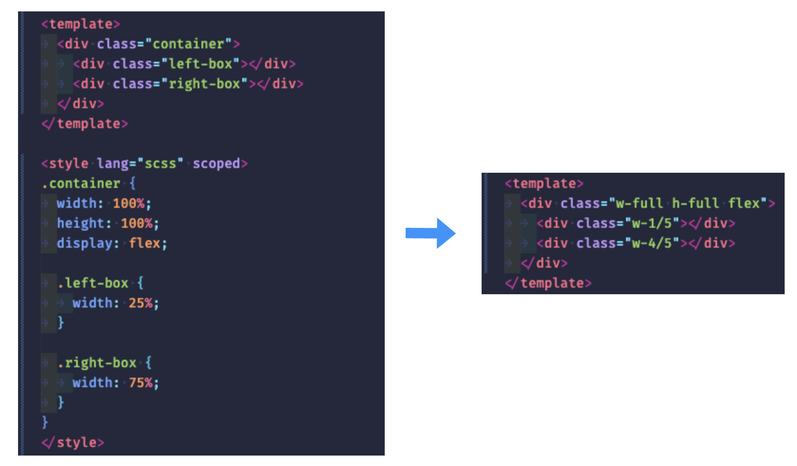
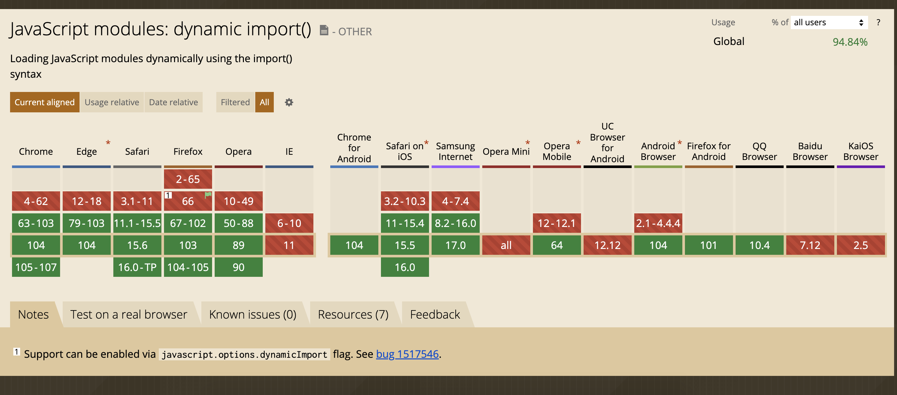
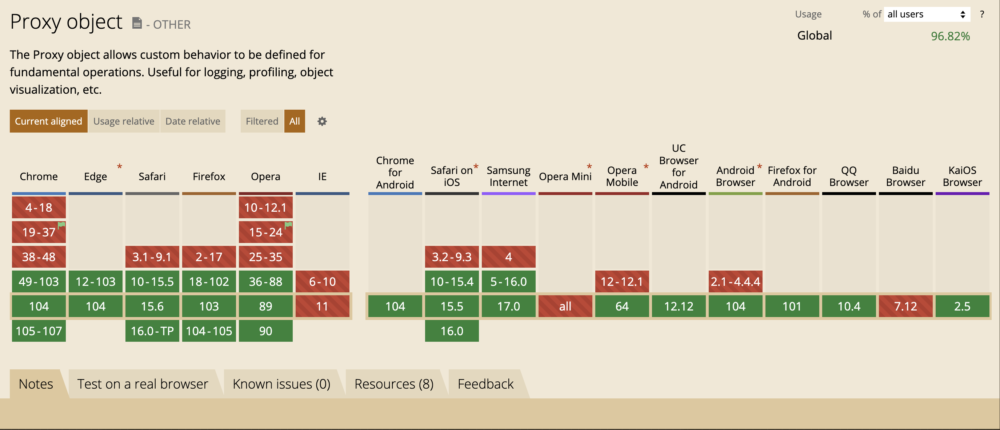
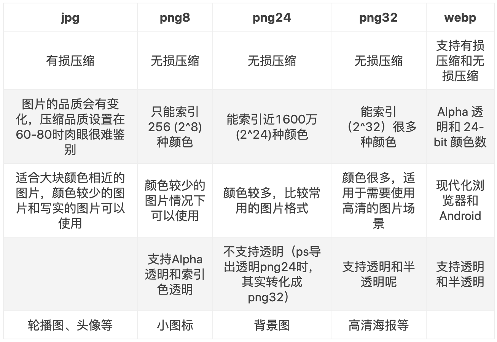
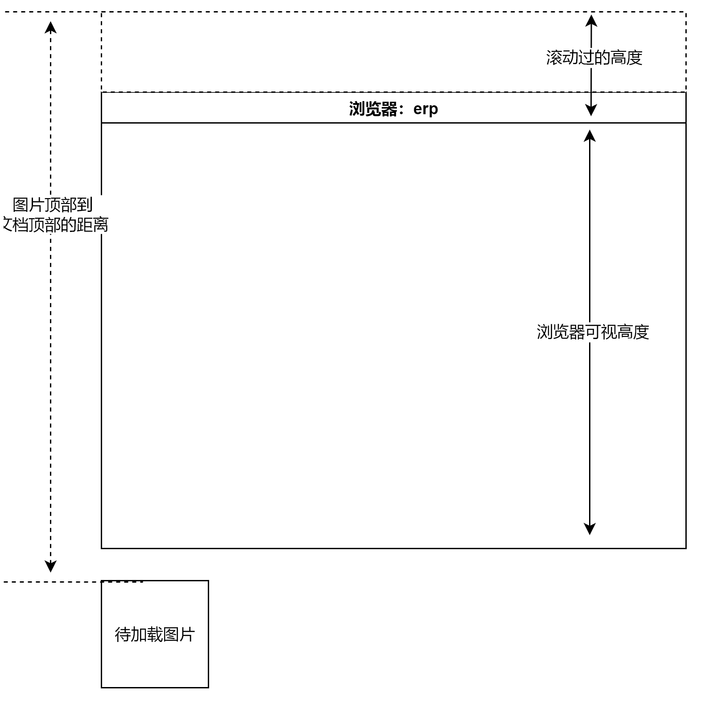

# **前端架构浅析**

一篇关于前端架构的思考与记录，存在不足与不严谨的地方，敬请指出与见谅，感谢。
<!-- more -->
## **前言**

&nbsp;&nbsp;&nbsp;&nbsp;&nbsp;&nbsp;&nbsp;&nbsp;如今，技术市场上 Web 前端技术变化日新月异，各种前端项目也越来越复杂。

&nbsp;&nbsp;&nbsp;&nbsp;&nbsp;&nbsp;&nbsp;&nbsp;因此，“前端架构”一次也逐渐被技术人员们提到台面上来，同时随着如今千变万化的迭代需求，架构技术的演化，不仅是架构师，也是我们每个开发人员都必须去关注“前端架构”这一问题。

## 一、前端架构理解

&nbsp;&nbsp;&nbsp;&nbsp;&nbsp;&nbsp;&nbsp;&nbsp;什么是前端架构？

&nbsp;&nbsp;&nbsp;&nbsp;&nbsp;&nbsp;&nbsp;&nbsp;其实与平时的架构理解是差不多的，只不过是把范围划在了前端。都是为了解决复杂问题，而设计了一套“技术结构”。

&nbsp;&nbsp;&nbsp;&nbsp;&nbsp;&nbsp;&nbsp;&nbsp;架构不是具体的某一种技术，而是一系列有层次的技术决策的集合，并且架构的设计是一个长期的过程。

&nbsp;&nbsp;&nbsp;&nbsp;&nbsp;&nbsp;&nbsp;&nbsp;就好比建楼房，架构师需要根据业主的需求以及现有的条件来进行大方向上的设计与决策，如：地基怎么打，打多深，用什么材料、技术，承重柱需要几根，分别放在哪里，需要什么材料，什么建筑技术等等等等...

&nbsp;&nbsp;&nbsp;&nbsp;&nbsp;&nbsp;&nbsp;&nbsp;代入前端中亦如此，根据系统需求，我们需要确定哪种架构模式，使用哪种技术，指定哪些规范，并持续跟进项目的构建、开发、优化等。

&nbsp;&nbsp;&nbsp;&nbsp;&nbsp;&nbsp;&nbsp;&nbsp;而后，随着业务需求的增多、软件会变得越来越庞大，越来越复杂。所以就会设计一套完整的架构设计、研发流程以及质量管理体系来保证整个研发过程。因此，总结起来一句话：前端架构是一系列工具与流程的集合，旨在提升代码质量，并实现高效可持续的工作流。

## 二、ERP 前端架构分析

&nbsp;&nbsp;&nbsp;&nbsp;&nbsp;&nbsp;&nbsp;&nbsp;**架构设计四层级：系统级，应用级，模块级，代码级**

&nbsp;&nbsp;&nbsp;&nbsp;&nbsp;&nbsp;&nbsp;&nbsp;**系统级：前后端分离；**

&nbsp;&nbsp;&nbsp;&nbsp;&nbsp;&nbsp;&nbsp;&nbsp;**应用级：Vue.js 框架，MVVM 模式，Vite 工具；**

&nbsp;&nbsp;&nbsp;&nbsp;&nbsp;&nbsp;&nbsp;&nbsp;**模块级：组件化开发，Vuex 状态管理；**

&nbsp;&nbsp;&nbsp;&nbsp;&nbsp;&nbsp;&nbsp;&nbsp;**代码级：开发流程，代码规范，代码优化。**

> 涉及敏感信息，故不贴出某企业自研发ERP架构图

### 1.  架构模式与技术/工具

&nbsp;&nbsp;&nbsp;&nbsp;&nbsp;&nbsp;&nbsp;&nbsp;系统开发模式：前后端分离，MVVM 模式； 
&nbsp;&nbsp;&nbsp;&nbsp;&nbsp;&nbsp;&nbsp;&nbsp;前端技术选型：Vue.js(3.2)，axios； 
&nbsp;&nbsp;&nbsp;&nbsp;&nbsp;&nbsp;&nbsp;&nbsp;主要辅助技术：Vite, Vue-Router, Vuex, Elementplus, Eslint, G2, Husky, Scss, TailwindCss； 
&nbsp;&nbsp;&nbsp;&nbsp;&nbsp;&nbsp;&nbsp;&nbsp;代码开发工具：Visual Studio Code； 
&nbsp;&nbsp;&nbsp;&nbsp;&nbsp;&nbsp;&nbsp;&nbsp;代码协作管理：Coding；

**工具/名词解释**

&nbsp;&nbsp;&nbsp;&nbsp;&nbsp;&nbsp;&nbsp;&nbsp;MVVM：vm 层（视图模型层）通过接口从后台 m 层（model 层）请求数据，vm 层继而和 v（view 层）实现数据的双向绑定。

&nbsp;&nbsp;&nbsp;&nbsp;&nbsp;&nbsp;&nbsp;&nbsp;Vue：是一套构建用户界面的渐进式框架。与其他重量级框架不同的是，Vue  采用自底向上增量开发的设计； 
&nbsp;&nbsp;&nbsp;&nbsp;&nbsp;&nbsp;&nbsp;&nbsp;Axios：用与发送 get、post 等请求的工具； 
&nbsp;&nbsp;&nbsp;&nbsp;&nbsp;&nbsp;&nbsp;&nbsp;Vite：用于构建 vue 项目的工具以及打包前端项目的工具，快速、及时、按需编译； 
&nbsp;&nbsp;&nbsp;&nbsp;&nbsp;&nbsp;&nbsp;&nbsp;Vue-Router：Vue 全家桶中的路由工具，通过它来进行页面的跳转； 
&nbsp;&nbsp;&nbsp;&nbsp;&nbsp;&nbsp;&nbsp;&nbsp;Vuex：一个专为 Vue 开发的状态管理模式，集中式地存储、管理应用的所有组件的状态；

&nbsp;&nbsp;&nbsp;&nbsp;&nbsp;&nbsp;&nbsp;&nbsp;ElementPlus：饿了么团队出品的一套美观的 UI 框架，提高开发效率； 
&nbsp;&nbsp;&nbsp;&nbsp;&nbsp;&nbsp;&nbsp;&nbsp;Eslint：代码检测、代码规范约束的工具； 
&nbsp;&nbsp;&nbsp;&nbsp;&nbsp;&nbsp;&nbsp;&nbsp;G2：基于 JavaScript 的图表渲染工具； 
&nbsp;&nbsp;&nbsp;&nbsp;&nbsp;&nbsp;&nbsp;&nbsp;Husky：当我们本地进行 git commit 或 git push 等操作前，能够执行其它一些操作，比如进行 ESLint 检查，如果不通过，就不允许 commit 或 push； 
&nbsp;&nbsp;&nbsp;&nbsp;&nbsp;&nbsp;&nbsp;&nbsp;Scss：样式预处理器，通过特定的写法，编译后形成正常的 css 文件，为 css 增加一些编程特性，完全兼容 css3，让 css 更加简洁、适应性更强，可读性更佳，更易于代码的维护等

&nbsp;&nbsp;&nbsp;&nbsp;&nbsp;&nbsp;&nbsp;&nbsp;Tailwind CSS：一个 CSS 样式库，它为我们提供了构建定制设计而无需使用自定义样式所需的所有构建块，在国外是一个比较热门的框架。

- tailwind css 举例：

### 2.  前端开发规范约定

&nbsp;&nbsp;&nbsp;&nbsp;&nbsp;&nbsp;&nbsp;&nbsp;前期技术、工具选型确定后，还需要协商好一致的规范，需要有统一的规范。

问：为什么需要规范？

- 降低新成员融入团队的成本,  同时也一定程度避免挖坑；
- 提高开发效率、团队协作效率,  降低沟通成本；
- 实现高度统一的代码风格，方便 review,  另外一方面可以提高项目的可维护性；
- 规范是实现自动化的基础；
- 规范是一个团队知识沉淀的直接输出，也通过规范使得代码彷佛“同出一源”；

&nbsp;&nbsp;&nbsp;&nbsp;&nbsp;&nbsp;&nbsp;&nbsp;我们的 ERP 系统通过使用 Eslint + Husky 来检查我们的代码规范以及代码提交规范，以此来提高代码质量以及规范性。

### 3.  项目的开发与流程

#### 3.1  项目开发

&nbsp;&nbsp;&nbsp;&nbsp;&nbsp;&nbsp;&nbsp;&nbsp;约定好规范，下一步便开始着手项目的开发。 
&nbsp;&nbsp;&nbsp;&nbsp;&nbsp;&nbsp;&nbsp;&nbsp;我们的 ERP 系统前端界面采用的是传统的后台管理系统，网络上也有很多开源的管理系统项目，基本也都比较符合我们系统功能需求，以及项目代码也比较成熟，因此我们的 ERP 系统直接从网络上拉取了基于 vue3+vite 的系统模板，在此基础上进行我们的自定义开发，防止重复造轮子以及多出不必要的时间成本。 
&nbsp;&nbsp;&nbsp;&nbsp;&nbsp;&nbsp;&nbsp;&nbsp;在开发时，需严格按照我们前期约定好的各种辅助工具以及前端开发规范进行前端项目的开发。 
&nbsp;&nbsp;&nbsp;&nbsp;&nbsp;&nbsp;&nbsp;&nbsp;并且利用好 Vue 的组件特性，采用“组件化”开发，提高代码复用性以及降低维护成本，又在一定方面提高了开发效率。

#### 3.2  项目流程

&nbsp;&nbsp;&nbsp;&nbsp;&nbsp;&nbsp;&nbsp;&nbsp;项目开发过程中，需要按照一定的流程进行进度推进，并实时监督，每个企业有属于自己内部的开发流程，根据实际情况跟着按照流程走，基本都可以走正循环，提高项目开发效率与效益。

### 4.  项目的跟进与优化

&nbsp;&nbsp;&nbsp;&nbsp;&nbsp;&nbsp;&nbsp;&nbsp;在项目不断推进的过程中，我们也需要不断跟进前端架构，以便对及时发现问题，解决问题。 
&nbsp;&nbsp;&nbsp;&nbsp;&nbsp;&nbsp;&nbsp;&nbsp;也为了在往后的过程中不断对前端进行优化。 
&nbsp;&nbsp;&nbsp;&nbsp;&nbsp;&nbsp;&nbsp;&nbsp;正如前面所说，架构的设计是一个长期的过程。

## 三、ERP 系统前端提升空间

### 1.  当前架构优缺点

&nbsp;&nbsp;&nbsp;&nbsp;&nbsp;&nbsp;&nbsp;&nbsp;当前 ERP 采用的主要技术与工具在技术市场上都较为新颖，具有一定的优越性与先进性，但任何事物都具有两面性，因此也存在一些局限性或缺点；

#### 1.1  优越性

&nbsp;&nbsp;&nbsp;&nbsp;对技术人员来说：

- 开发体验较好，在一定程度上提升开发效率；
- 开发工具朝着“轻便”的方向发展，简化了开发流程和操作步骤；
- 项目构建效率高，提高产出率；
- 项目性能提到大幅度提升；
- ...

&nbsp;&nbsp;&nbsp;&nbsp;对用户来说：

- 网站性能的提升，提高了用户体验；
- 网站生态越来越美观，更加吸引眼球；
- ...

#### 1.2  局限性/缺点

&nbsp;&nbsp;&nbsp;&nbsp;对技术人员来说：

- 新技术意味着学习成本的提高；
- 新技术不太稳定，较多坑没有前人踩过，需要时间和精力解决坑；
- 新技术兼容性较差，需要指定浏览器以及浏览器的版本；
- ...

&nbsp;&nbsp;&nbsp;&nbsp;对用户来说：

- 由于兼容性问题，可能需要用户更换不熟悉的浏览器；
- 有些 bug 可能开发人员以及测试人员也没发现，但是用户发现了，降低用户体验；
- ...

**语法、指令、组件等兼容性查询网站：**[**https://caniuse.com/**](https://caniuse.com/)

### 2.  局限性浅析

#### 2.1 “早莺争树，新燕啄泥”

&nbsp;&nbsp;&nbsp;&nbsp;&nbsp;&nbsp;&nbsp;&nbsp;前端技术的更新日新月异；前端框架的技术选型百家争鸣； 
&nbsp;&nbsp;&nbsp;&nbsp;&nbsp;&nbsp;&nbsp;&nbsp;视觉审美的潮流不断更替；可视化效果酷炫无比； 
&nbsp;&nbsp;&nbsp;&nbsp;&nbsp;&nbsp;&nbsp;&nbsp;用户的运营体系逐渐精细化、适老化、无障碍化，青少年人群的诉求浮出水面；
智能设备的升级和适配无穷无尽。 
&nbsp;&nbsp;&nbsp;&nbsp;&nbsp;&nbsp;&nbsp;&nbsp;所有的这一切，对前端领域和前端同学就一个要求：要折腾，爱折腾，反复折腾。 
&nbsp;&nbsp;&nbsp;&nbsp;&nbsp;&nbsp;&nbsp;&nbsp;新技术对于绝大部分技术人员还是有比较大的吸引力，大家都争相抢鲜使用，但这也意味着很多的新坑在等着技术人员去踩，来帮助这个新技术趋于稳定和成熟。 
&nbsp;&nbsp;&nbsp;&nbsp;&nbsp;&nbsp;&nbsp;&nbsp;新技术自然要学，而且要学得很『快』，目的了解它的本质，以更好的去做架构或优化。 
&nbsp;&nbsp;&nbsp;&nbsp;&nbsp;&nbsp;&nbsp;&nbsp;用不用是另一回事，这是一个综合判断的过程，是否能解业务问题，迁移成本，学习成本等。

##### 2.2 “海纳百川，有容乃大”

&nbsp;&nbsp;&nbsp;&nbsp;&nbsp;&nbsp;&nbsp;&nbsp;ERP 采用了比较新的前端技术，正如前面所说，新技术在稳定性、兼容性方面往往还有所不足，例如 Vite 构建工具的兼容性如下：

&nbsp;&nbsp;&nbsp;&nbsp;&nbsp;&nbsp;&nbsp;&nbsp;vue3 兼容性如下：

&nbsp;&nbsp;&nbsp;&nbsp;&nbsp;&nbsp;&nbsp;&nbsp;对于整体的框架不适配、不兼容，若官网有言明解决方案则根据官网来进行适配，若无则只能向用户声明浏览器类型以及版本； 
&nbsp;&nbsp;&nbsp;&nbsp;&nbsp;&nbsp;&nbsp;&nbsp;对于 js 脚本个别语法兼容性较差的，我们可以改写为兼容性较好的写法； 
&nbsp;&nbsp;&nbsp;&nbsp;&nbsp;&nbsp;&nbsp;&nbsp;对于 CSS 样式个别属性不兼容，我们需要加一些标识来达到兼容的效果，如： 

#### 3.  工程化配置与优化

&nbsp;&nbsp;&nbsp;&nbsp;&nbsp;&nbsp;&nbsp;&nbsp;前端架构设计完成并不意味着便完成了重要的工作，架构决定的是大方向，在具体实施、开发时我们开发人员还需要做一些核心工作来配合架构设计，例如工程化配置与工程优化。

##### 3.1  工程化配置

**概念：**

&nbsp;&nbsp;&nbsp;&nbsp;&nbsp;&nbsp;&nbsp;&nbsp;在较为大型、复杂的前端项目开发中，把前端开发所需的工具、技术、流程、经验等进行规范化、  标准化，最终落实到细节上，就是实现前端的"4  个现代化”:模块化、组件化、规范化、自动化。更广泛来说，一切能提升前端开发效率，提高前端应用质量的手段和工具都是前端工程化。

**四个“现代化”准则**

- 模块化（js  的模块化、css  的模块化、资源的模块化）
  - 对  js、css 的功能，对静态资源的类型做模块化拆分，比如当你用 node 写接口时，单独把 api 接口的相关代码抽出来写在一个 js 文件里
- 组件化（复用现有的  UI  结构、样式、行为）
  - 如页面中对话框、表单、表格、搜索栏等，都是可以直接拿来复用的组件
- 规范化（目录结构的划分、编码规范化、接口规范化、文档规范化、 Git  分支管理）
  - 在构建目录结构、编写代码、接口等所要遵循的一些规则
- 自动化（自动化构建、自动部署、自动化测试）
  - 像热部署、通过 git 自动发布我们新改动创建的代码等

**工程化流程：**

**初始化(init)** -> **开发(dev) ->  构建(build) ->  检查(test)** -> **发布(deploy)**

- init  阶段：项目初始化，init 阶段我们可以根据模板快速的生成项目仓库
- dev  阶段：本地开发阶段
- build  阶段：使用构建工具对项目进行打包，生成用于生成环境的产物
- test  阶段：部署项目到测试环境
- deploy  阶段：部署项目到正式环境

&nbsp;&nbsp;&nbsp;&nbsp;&nbsp;&nbsp;&nbsp;&nbsp;在我们当前的 ERP 系统中，针对工程化配置已经做到了 80%，还有一些细节方面没有做到，例如：自动化测试，自动化部署。 
&nbsp;&nbsp;&nbsp;&nbsp;&nbsp;&nbsp;&nbsp;&nbsp;对于自动化这方面，还需要我们开发人员进行相应的学习以及分析可行性、实行价值，若是可行性较高以及有相应的实行价值，后面或许可以落实。

##### 3.2  工程优化

&nbsp;&nbsp;&nbsp;&nbsp;&nbsp;&nbsp;&nbsp;&nbsp;贯穿整个项目过程中的核心行为还有优化。

&nbsp;&nbsp;&nbsp;&nbsp;&nbsp;&nbsp;&nbsp;&nbsp;项目优化其实是在深入了解各个方向，比如  http 工作机制、缓存机制、浏览器工作原理、工具链的优化策略、前端框架的原理之后总结出来的一个方案。

**项目优化空间**

- 项目依赖方面

  - 移除不必要的插件、依赖；
  - 使用频率较低的插件能否自己编写代码实现？
  - 一些依赖、库能否按需引入？
  - 部分库有无轻量级的取而代之？
  - ...

- 工程目录方面

  - 分类别创建文件夹以存放相关文件；
  - 文件夹命名应按照一定的规范；
  - 文件夹不要嵌套太深；
  - ...

- 静态资源方面

  - 图片资源能否压缩或选择其他格式（图 3.1）；
  - 各种媒体资源能否进行懒加载或预加载（图 3.2）；
  - 使用骨架屏提升用户体验；
  - ...

- 项目代码方面

  - 权衡 v-if 与 v-show 的使用；
  - 定时器、循环器的创建与销毁；
  - 删除不必要的变量，部分变量使用完毕手动销毁( let paramObj = null )；
  - 适当采用“防抖、节流”；
  - ...

- 资源请求优化
  - http 请求能否减少或合并？
  - 压缩传输数据资源，常见 http 压缩（gzip）；
  - 本地缓存；
  - ...

## 四、结束语

&nbsp;&nbsp;&nbsp;&nbsp;&nbsp;&nbsp;&nbsp;&nbsp;前端在互联网中作为与用户最靠近的“端”，是网站产品与用户沟通的窗口，随着网络的发展，网络用户们用网水平的提高，他们对于网站的美观、交互、性能等各方面要求也随之提高，这意味着前端开发人员面对的挑战也越来越大。

&nbsp;&nbsp;&nbsp;&nbsp;&nbsp;&nbsp;&nbsp;&nbsp;同时，前端技术以及前端工程化还在继续发展，随着新技术的出现和不断成熟，相信我们还会学习到更多有趣而实用的前端知识。

&nbsp;&nbsp;&nbsp;&nbsp;&nbsp;&nbsp;&nbsp;&nbsp;今天作出“前端架构”的分享，是我对这一个月学习的总结，我深知仍有很多不足，仍有许多需要继续学习的地方，如庄子言，“吾生也有涯，而知也无涯”，学习的道路上不能停止步伐，在接下来的日子里我会继续鞭策自己，工作学习两不误。
