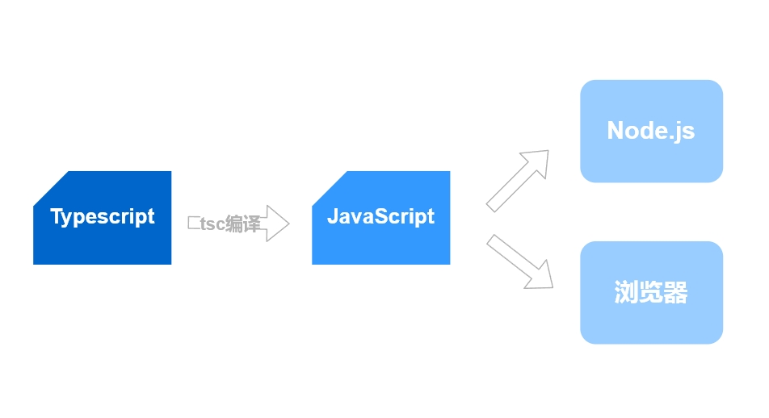
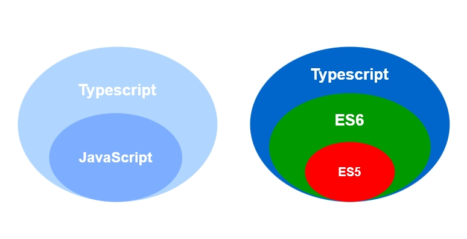
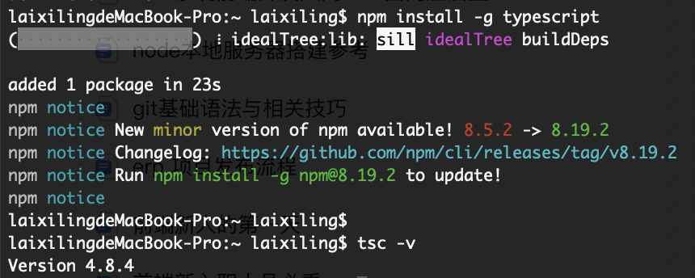
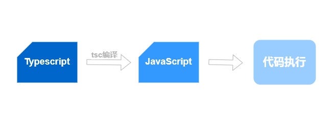
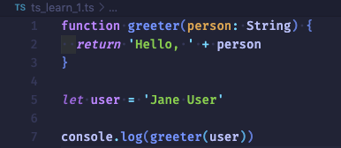
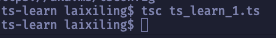
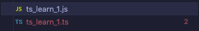
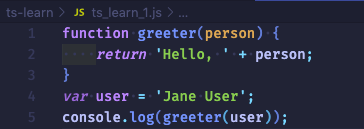
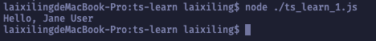

# **1. 入门篇**

Ts学习第一篇，入门篇。
<!-- more -->

## 前言

对于大部分前端开发人员来说，Vue是在熟悉不过的框架了，尤其是从Vue3.0开始，前端三大主流框架已经全部支持ts，可见ts的热度与其在未来可谓是大势所趋。因此，要跟上开发市场的技术主流，我们需要与时俱进，把学习ts提上日程，同时也是一个拓展自己技术面的方向。

俗话说得好：技多不压身。

## 1. 初识TypeScript

### 1.1 什么是Typescript？

TypeScript是一种由微软开发的开源、跨平台的编程语言。它是JavaScript的超集，最终会被编译为JavaScript代码，它是 JavaScript 的一个超集，主要提供了类型系统和对 ES6+ 的支持，它由 Microsoft 开发，代码开源于[GitHub (opens new window)](https://github.com/Microsoft/TypeScript)上。

TypeScript扩展了JavaScript的语法，所以任何现有的JavaScript程序可以运行在TypeScript环境中，是为大型应用的开发而设计，并且可以编译为JavaScript，编译出来的 JavaScript 可以运行在Node.js环境以及任何浏览器上。



### 1.2 Typescript的特性

TypeScript 是一种给 JavaScript 添加特性的语言扩展。增加的功能包括：类型批注和编译时类型检查、类型推断、类型擦除、接口、枚举、Mixin、泛型编程、名字空间、元组、Await。

以下功能是从 ECMA 2015 反向移植而来：

类、模块、lambda 函数的箭头语法、可选参数以及默认参数。

以下是TypeScript的主要特点：

*   跨平台：TypeScript 编译器可以安装在任何操作系统上，包括 Windows、macOS 和 Linux。
*   ES6特性：TypeScript 包含计划中的 ECMAScript 2015（ES6）的大部分特性，例如：箭头函数。
*   面向对象的语言：TypeScript 提供所有标准的 OOP 功能，如类、接口和模块。
*   静态类型检查：TypeScript 使用静态类型并帮助在编译时进行类检查。因此，你可以在编写代码时发现编译时错误，而无需运行脚本。
*   可选的静态类型：如果你习惯了 JavaScript 的动态类型，TypeScript 还允许可选的静态类型。
*   DOM操作：可以使用 Typescript 来操作 DOM 以添加或者删除客户端网页元素。

### 1.3 Typescript与JavaScript的区别与联系

TypeScript 是 JavaScript 的超集，扩展了 JavaScript 的语法，因此现有的 JavaScript 代码可与 TypeScript 一起工作无需任何修改，TypeScript 通过类型注解提供编译时的静态类型检查。

TypeScript 可处理已有的 JavaScript 代码，并只对其中的 TypeScript 代码进行编译。



+ **JavaScript**

*   轻量级的解释性脚本语言，基于对象的语言，不支持其它面向对象语言所具有的继承和重载功能；
*   JS 中没有的“类”概念；
*   JS 只依赖于浏览器，与操作系统的因素无关。因此 JS 是一种跨平台的语言；
*   适用相对较小的编码项目，更灵活。

+ **TypeScript**

*   JS 的超集,包含了 JS 的所有元素，并扩展了 JS 的语法，也是脚本语言；
*   TS 引入了 “类”概念；
*   JS 代码可以在无需任何修改的情况下与 TS 一同工作，同时可以使用编译器将 TS 代码编译成纯 JS，TS 通过类型注解提供编译时的静态类型检查；
*   为大型应用之开发而设计,适用大型编码项目开发。

## 2. 安装TypeScript

对TypeScript有一个初步的认识之后，我们先来安装它，由于ts运行在Node.js环境，因此在安装ts之前需要确保主机环境已经安装Node.js。

Ts主要通过npm/cnpm/pnpm/yarn 包下载（Node.js包管理器）安装，安装命令如下：

```shell
#npm安装
npm install -g typescript

#cnpm安装
cnpm install -g typescript

#pnpm安装
pnpm install -g typescript

#yarn安装
yarn global add typescript
```

提示安装完成后需要验证是否安装成功，输入命令：

```shell
tsc -v		# 期望输出：Version x.x.x
```

如果命令行结果输出版本号，则表示ts已经安装成功，可以开始上手编写ts程序。

实测安装过程如下图：



## 3. 编写第一个TS程序

### 3.1 Ts代码的编写与转换

TypeScript 的运行环境是Node.js或者浏览器，但是它们并不直接支持TypeScript，而是首先要将TypeScript代码编译成javaScript代码，才能在Node.js或者浏览器中运行。所以运行一段TypeScript代码的流程如下：



*   转换过程，利用 tsc 文件名.ts 执行转换 ,例如：tsc .\ts\_learn\_1.ts





转换结果：





*   执行过程，利用 node 执行js文件输出结果，例如：node .\ts\_learn\_1.js



至此，第一个ts程序的编写与运行已经完成了，但是目前还感受不到ts与js编写上的区别，下面通过完善上面的demo来感受一下ts。

### 3.2 完善第一个TS程序

#### 3.2.1 准备工作

在开始完善之前先做一下准备工作，如按照前面的方式来编写代码， 每次编写都要手动编译，并且在原地生成js程序，不仅效率低下，并且当后面文件多了则不好维护。

因此，我们需要先配置编译后的js文件存放目录已经自动编辑ts文件。

**a. 生成配置文件**

```shell
# 生成tsconfig.json配置文件
tsc --init
```

**b. 配置输出目录**

打开配置文件，新增配置：

```shell
# 配置js输出目录
"outDir": "./complied-js"
```

**c. 设置自动编译**

vscode窗口顶部导航中依次点击：

"终端" -> "运行任务" -> "typescript" -> "tsc 监视 - tsconfig.json"

配置完成之后，每次更新ts代码文件，自动编译生成js文件并存放到配置好的目录中。

#### 3.2.2 完成第一个ts程序

+ **类型注解**

TypeScript 工具带来的一个高级功能，就是类型注解，它是一种轻量级的为函数或变量添加约束的方式。

例如我们的程序，在这里给 greeter 函数的参数添加 : string 类型注解，即希望 greeter 函数接收一个字符串参数。如下：

```typescript
function greeter(person: String) {
  return 'Hello, ' + person
}
```

然后尝试把 greeter 的调用改成传入一个数组：

```typescript
let user = [1, 2, 3]

console.log(greeter(user))
```

我们会看到在函数传参时提示了一个错误：

```typescript
let user: number[]
// 类型“number[]”的参数不能赋给类型“String”的参数
```

类似地，尝试删除 greeter 调用的所有参数， ts 会告诉你使用了非期望个数的参数调用了这个函数。 在这两种情况中，ts提供了静态的代码分析，它可以分析代码结构和提供的类型注解。

要注意的是尽管有错误，ts\_learn\_1.js 文件还是被创建了。 就算我们的代码里有错误，但仍然可以使用 TypeScript。而在这种情况下，ts 会警告我们代码可能不会按预期执行。

+ **接口**

接下来使用接口来描述一个拥有 firstName 和 lastName 字段的对象，在 ts 里，只在两个类型内部的结构兼容，那么这两个类型就是兼容的。 这就允许我们在实现接口时候只要保证包含了接口要求的结构就可以，而不必明确地使用 implements 语句。

```typescript
interface Person {
  firstName: string
  lastName: string
}

function greeter(person: Person) {
  return 'Hello, ' + person.firstName + ' ' + person.lastName
}

let user = {
  firstName: 'Shining',
  lastName: 'Lai'
}

console.log(greeter(user))
```

+ **类**

最后，再使用类来改写这个例子。 TypeScript 支持 JavaScript 的新特性，比如支持基于类的面向对象编程。

通过创建一个 User 类，它带有一个构造函数和一些公共字段。因为类的字段包含了接口所需要的字段，所以他们能很好的兼容。

还要注意的是，在类的声明上会注明所有的成员变量，这样比较一目了然。

```typescript
class User {
  fullName: string
  firstName: string
  lastName: string

  constructor(firstName: string, lastName: string) {
    this.firstName = firstName
    this.lastName = lastName
    this.fullName = firstName + ' ' + lastName
  }
}

...

let user = new User('Shining', 'Lai')

...

/**
* 输出结果：
*	Hello, Shining Lai
*/
```

重新生成js文件，可以看到 TypeScript 里的类只是一个语法糖，本质上还是 JavaScript 函数的实现。

## 4. 总结

以上从安装ts，到开发ts代码前的配置工作，再到手写小demo实践，使我们对ts有了一个基础的认识。

对于使用ts，最直观的开发体会就是有一定的门槛，js是绝对的基础，对于es6的各种特性也需要一定的熟练程度才可以在开发ts时更加得心应手，同时，对于js的各种基础一定需要加强学习，才能降低学习成本。

接下来需要再学习一下ts的一些基础语法。