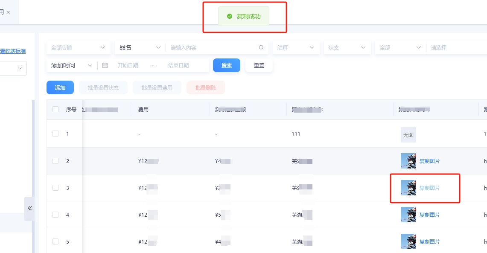

# **一键复制图片功能的实现**

应某部门用户的需求期望，需要个一键复制图片的功能按钮，在此记录其实现与应用。
<!-- more -->

## 1. 前言与需求背景

于2023年3月3日上午，由对接部同事提出期望需求：线下费用需要支持一键复制图片。

由于复制图片与复制文本技术上有所区别，对于复制图片浏览器要求比较严格，需要考虑的细节点比较多，需要进行资料收集与学习。

## 2. 技术分析

### 2.1 插件实现

若是考虑用第三方插件库实现该功能，可以使用市面上现有插件：clipboard.js。

使用该插件，需要安装指定的语法与格式，即可调用其封装好的方法，即可实现对图片的复制、文本的复制。

安装方法 1:  使用 npm

```shell
npm install clipboard --save
```

安装方法 2:  使用外链

```javascript
<script src="https://cdn.jsdelivr.net/npm/clipboard@2.0.6/dist/clipboard.min.js"></script>
```

使用方法：

```html
<input id="foo" value="https://github.com/zenorocha/clipboard.js.git" />

<!-- Trigger -->
<button class="btn" data-clipboard-target="#foo">
  
</button>

<textarea id="bar">Mussum ipsum cacilds...</textarea>

<!-- Trigger -->
<button class="btn" data-clipboard-action="cut" data-clipboard-target="#bar">
  Cut to clipboard
</button>

<button
  class="btn"
  data-clipboard-text="Just because you can doesn't mean you should — clipboard.js"
>
  Copy to clipboard
</button>

<script>
  var clipboard = new ClipboardJS('.btn')

  clipboard.on('success', function (e) {
    console.info('Action:', e.action)
    console.info('Text:', e.text)
    console.info('Trigger:', e.trigger)

    e.clearSelection()
  })

  clipboard.on('error', function (e) {
    console.error('Action:', e.action)
    console.error('Trigger:', e.trigger)
  })
</script>
```

其原理是使用了 document.execCommand 方法实现的复制拷贝，该方法同时存在优点和不足：

- **优点**

兼容性好，操作简单

- **缺点**

  - 只能将选中的内容复制到剪贴板，无法向剪贴板任意写入内容

  - 它是同步操作，如果复制/粘贴大量数据，页面会出现卡顿。有些浏览器还会跳出提示框，要求用户许可，这时在用户做出选择前，页面会失去响应

  - 该 api 即将废弃，故不推荐此技术方案来实现。


同时，由于随着项目功能的完善和页面的增加，项目体积会越来越大，因此对于第三方库的使用需要谨慎，能不用就不用，尽量自己用 js 实现。

### 2.2 原生 js 实现

通过 3 月 4 号-5 号周末休息时间进行了技术调研和学习，发现可以使用**Navigator.clipboard**来实现图片的复制功能，并通过编写 demo 测试可用。


该 api 还支持 Promise，支持向剪切板中写入文件、图片等，可以说是比较强大并且适用于本需求的方法。

让我们再看看它的兼容性：


对于绝大部分浏览器要求基本是 2018 以上的版本，Edge 要求 2020 以上的版本，所以对于开发者来说，需要做好相应的兼容性开发，考虑好兼容条件；对于用户来说，尽量不要使用版本过低的浏览器。

此外，使用此方法还有一定的限制：考虑到安全性问题，必须是 https 或者本地服务器如 localhost 才可以使用，http 是无法使用的。

综上，本次“复制图片”需求便使用此 api 进行开发。

## 3. 技术实践

### 3.1 api 的基本使用

通常来说，使用该 api 进行复制文本的场景较多，复制文本的逻辑也较为简单，代码如下：

```javascript
function copy2clipboard(text) {
  navigator.clipboard.writeText(text).then(
    function () {
      console.log('success')
    },
    function (e) {
      console.log(e)
      console.log('fail')
    }
  )
}
```

该 api 会有成功或失败的回调函数，可在回调函数里面处理一些业务逻辑或操作反馈。

### 3.2 进阶用法：复制图片、文件

该 api 支持复制图片、文件，但是需要将文件转为 blob 文件流，比较常用的基本用法如下：

```javascript
function setHtmlToClipboard(text) {
  navigator.permissions
    .query({ name: 'clipboard-write' })
    .then(async result => {
      if (result.state === 'granted') {
        // 复制一段文本
        // var blob = new Blob(['<p>... paragraph ...</p>'], { type: 'text/plain' });
        // var item = new ClipboardItem({ 'text/plain': blob });
        const imgURL = 'https://dummyimage.com/300.png'
        const data = await fetch(imgURL)
        const blob = await data.blob()
        var item = new ClipboardItem({
          [blob.type]: blob
        })
        navigator.clipboard.write([item]).then(
          function () {
            console.log('Copied to clipboard successfully!')
          },
          function (error) {
            console.error('unable to write to clipboard. Error:')
            console.log(error)
          }
        )
      } else {
        console.log('clipboard-permissoin not granted: ' + result)
      }
    })
}
```

具体场景、具体使用方法还需根据实际需求场景来，例如在本次需求开发中，实现复制图片的业务逻辑应该如下：

```text
1. 获取要复制的 dom 节点；
2. 创建 canvas 对象、image 对象；
3. 设置 image 属性；
4. image 加载事件 onload；
5. onload 事件中设置 canvas 的属性；
6. 图片地址转化 blob，写入剪切板。
```

具体代码如下：

```javascript
// 将图片写入到剪切板上
const clipboardImg = async url => {
  try {
    const data = await fetch(url)
    const blob = await data.blob()

    console.log('navigator.clipboard', navigator.clipboard)

    await navigator.clipboard.write([
      new window.ClipboardItem({
        [blob.type]: blob
      })
    ])
    ElMessage.success('复制成功')

    return true
  } catch (err) {
    console.log('err', err)
    if (!navigator.clipboard) {
      ElMessage.warning('由于浏览器限制无法直接复制，请手动复制图片')
    }

    ElMessage.warning('复制失败，请手动复制图片')

    return false
  }
}

// 实例化对象、设置属性
export async function copyImage(className, imgUrl = '') {
  // console.log('imgUrl', imgUrl)
  const targetDom = document.getElementsByClassName(className)
  // console.log('targetDom', targetDom[0].src || imgUrl, targetDom)
  // 创建一个画板
  const canvas = document.createElement('canvas')
  const image = new Image()
  // 解决图片跨越问题
  image.setAttribute('crossOrigin', 'Anonymous')
  image.src = targetDom[0].src || imgUrl
  // console.log('image', image)
  image.onload = async () => {
    // img加载完成事件
    //设置画板宽度
    canvas.width = image.width
    //设置画板高度
    canvas.height = image.height
    //加载img到画板
    canvas.getContext('2d').drawImage(image, 0, 0)

    // 转换图片为dataURL，格式为png
    let url = canvas.toDataURL('image/png', 1)
    // console.log('开始复制')
    // 调用复制方法
    clipboardImg(url)
  }
}
```

其中需要注意的点：图片跨域问题。

在开发过程中，一开始直接使用会出现“Access Origin”错误，此为浏览器同源策略引起的安全性问题，详细原因如下：

```text
1. 通过\加载的图片，浏览器默认情况下会将其缓存起来。

2. 当我们从  JS  的代码中创建的  \  再去访问同一个图片时，浏览器就不会再发起新的请求，而是直接访问缓存的图片。但是由于  JS  中的  \  设置了  crossorigin，也就意味着它将要以  CORS  的方式请求，但缓存中的图片显然不是的，所以浏览器直接就拒绝了。连网络请求都没有发起。

3. 在  Chrome  的调试器中，在  network  面板中，我们勾选了  disable cache  选项，验证了问题确实如第  2  点所述，浏览器这时发起了请求并且  JS  的  \  也能正常请求到图片。
```

但是我们知道，实际上肯定不能让用户这样操作来实现需求，因此需要我们开发人员在代码层面解决。

既然是跨域问题导致的，那么我们可以尝试去配置跨域的相关配置信息，例如，在实例化 image 对象时，可以先设置对象的 crossOrigin 属性：

```javascript
image.setAttribute('crossOrigin', 'Anonymous')
```

关于 crossOrigin 属性的详细介绍，可以查看：[HTML：crossOrigin 属性](https://developer.mozilla.org/zh-CN/docs/Web/HTML/Attributes/crossorigin)

设置好了之后，再进行一次尝试，可以看到再次报错：


这次又是为什么呢？通过长时间的排查和查阅各种资料，70%的资料都说是跨域没配置好，但是前面我们已经设置了 crossOrigin 属性，为什么还是出现这个问题呢？

最后才发现漏了一个，我们这里只配置了新实例化的 image 对象的跨域，但是渲染图片本身的图片 dom 节点没有配置跨域信息，我们在渲染 img 的地方配置上 crossOrigin 属性之后，发现竟然成功了。

注意：目前 navigator.clipboard.write  仅支持写入格式为“png”的图片，因此，在  canvas.toDataURL('image/png', 1)  仅可以设置为 png 格式。

在使用时，还需要先判断一下当前浏览器是否支持复制，判断方法是判断  navigator.clipboard  是否存在。

**实施效果**

最终，在整个线下费用引进了复制图片功能，效果如下：



试一下在不同平台的粘贴效果：


同样地，在钉钉文档、office 文档中都可以粘贴成功。