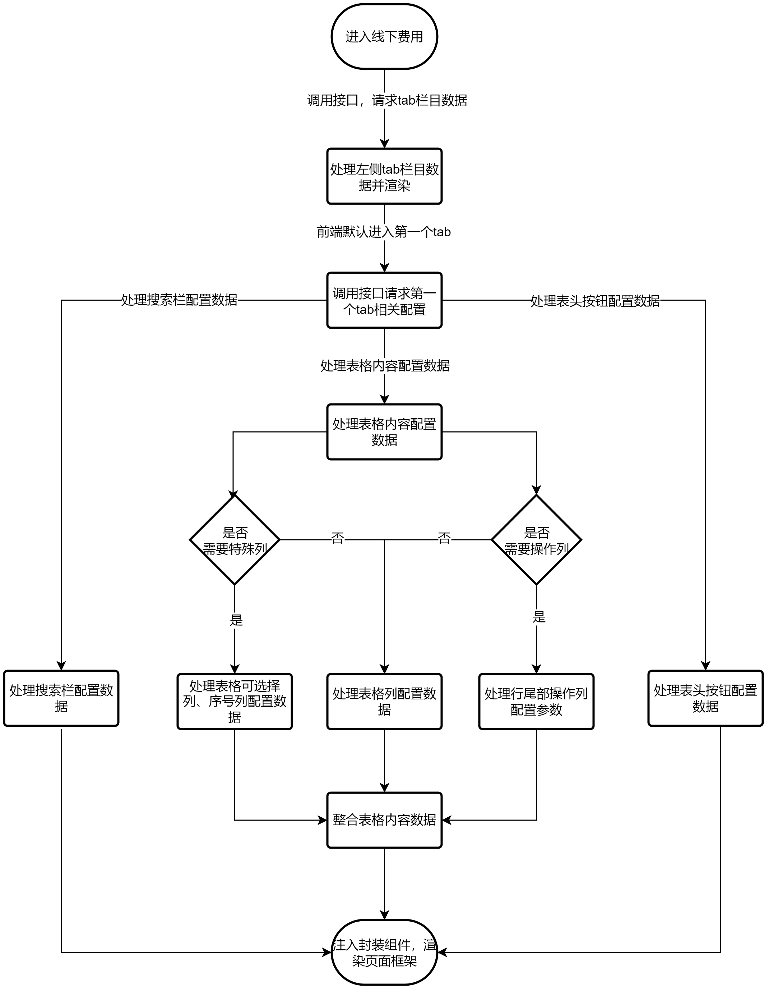
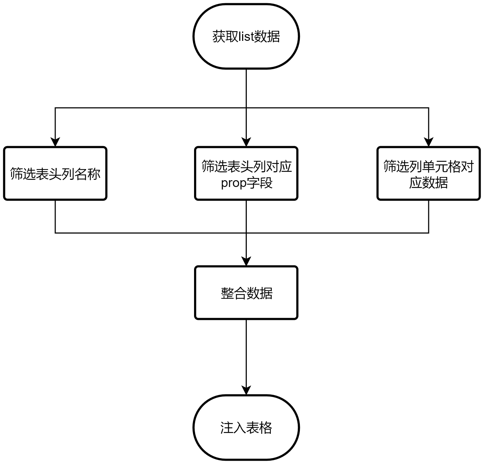

# **ERP系统可配置化页面模块**

在本项目20221114版本的迭代需求中，有这么一个模块，其中包含几十个小模块，每个模块共性极大，都是普通的列表页，在团队内部技术评审中决定做成可配置化模式开发，在此记录前端技术方案。
<!-- more -->

## 1. 逻辑梳理

### **页面组件逻辑、相似逻辑分析**

**a. 左侧tab栏目**

目前仅有7个tab，其中5个相似性较高，分别是：代买礼品卡、链接查邮箱、

当前方案定为：

鼠标点击tab，右侧显示对应的组件内容；

tab内容由后端返回，前端进行处理

**b. 表格搜索栏**

不同的tab模块分别有不同的搜索栏控件，其中部分控件涉及api调用，如“下拉”控件、“下拉-下拉”控件、“下拉-输入框”控件等，这部分可由前端把组件进行归整，并为每个组件定义一个唯一key，需要后端配合，返回该tab模块需要的搜索栏控件，前端根据后端返回的数据进行匹配并生成配置json，再将此json用于封装好的表格组件来渲染搜索栏。

**c. 表头按钮**

不同的tab模块可能有不同的表头按钮，并且每个不同的按钮有不同的行为，同时还涉及按钮的可用、禁用状态转换、根据用户权限进行显示或隐藏等，目前通过寻找共性，并根据项目封装好的组件逻辑，需要后端返回特性的部分字段，前端再进行统一处理，转化为组件可用的数据结构，并由前端根据不同的tab模块需求编写不同的方法。

**d. 表格内容**

主要区别在于表格的行是否可选、是否显示“序号”列、表头内容、列取值的字段、行尾部是否由操作按钮组，同时还需要考虑往常的需求，例如列的宽度、表格左右滚动时列是否固定、单元格内容过多时是否显示省略号并通过鼠标悬浮展示内容等。

按照后端已经定义好的结构，返回后前端需要进行处理，转化为符合组件渲染的数据结构，再将数据注入组件以渲染内容。

**e. 行操作按钮**

行操作按钮涉及逻辑：

在表格中的宽度、是否固定右侧、按钮文字、按钮个数、按钮权限控制（显示或隐藏）、按钮状态控制（显示或隐藏）、按钮唯一key（前端用，触发特定的方法，处理特定的需求）

此处有疑惑，关于新操作按钮配置信息，要以单独返回的形式还是跟着表格内容一起返回。其区别在于：

  + 1. 单独返回形式

前端进行简单的数据格式调整，并注入表格组件，需要前端自定义配置由于特殊状态而需要的显示或隐藏；

  + 2. 随表格内容返回形式

前端进行遍历处理，将每一行的数据抽出来再进行整合、调整至符合组件使用的数据格式，再注入表格组件，但不需要前端配置显示或隐藏。

建议：单独返回形式，由前端控制，即可复用现有组件逻辑

**f. 其他配置**

如：表格部分控件显示隐藏、tab各模块是否缓存等

附图：

tab模块页面框架渲染流程



tab模块列表数据渲染流程



## 2. 数据格式需求与处理

+ **整体配置数据格式大致如下**

```javascript
export const tableHeader = {
  name: '代买礼品卡',
  type: 'gift_card',
  is_select: 1,
  scheme: [
    {
      name: '店铺', // 列的文字
      type: 'store',  // 参数类型
      field_name: 'dianpu', // 列的对应后端的字段
      fe_cfg: {
        width: '60', // 列的宽度
        scene: ['list', 'add', 'edit', 'set_status', 'set_fee'], // 列的场景，列表、添加弹窗、设置状态/费用
        // add_table、edit_table、set_status_table、set_fee_table 分别代表在添加弹窗、编辑弹窗、设置状态/费用弹窗中是否需要该列，如不返回则代表对应的弹窗中不需要这个列
        add_table: { // 在添加弹窗的表中的配置
          header_btn: 1, // 该列是否需要表头按钮， 1: 需要，0: 不需要
          solt: 'select' // 单元格需要的控件
        },
        edit_table: { // 在添加弹窗的表中的配置
          header_btn: 1, // 该列是否需要表头按钮
          solt: 'select' // 单元格需要的控件
        },
        set_status_table: { // 在添加弹窗的表中的配置
          header_btn: 0 // 该列是否需要表头按钮
        },
        set_fee_table: {
          header_btn: 0
        },
        clamp: 0
      }
    },
    {
      name: '站点',
      type: 'product',
      field_name: 'pinming',
      fe_cfg: {
        scene: ['add', 'edit', 'set_status', 'set_fee'],
        // ....
        clamp: 0
      }
    },
    // ....
  ],
  fe_cfg: {
    // list_table、add_table、edit_table、set_status_table、set_fee_table
    // 分别表示在列表、添加弹窗、编辑弹窗、设置状态/费用弹窗等不同类型场景中是否需要搜索栏、表头按钮、表尾按钮列等的配置信息
    // 若不返回某个场景的对象配置信息，则表示不需要多余的配置
    list_table: {
      // 前端用于匹配哪些搜索控件
      search_components: ['store_search', 'product_info_search', 'user_search', 'time_search'],
      // 前端表头按钮，用于创建、批量操作等。
      batch_btns_components: [
        {
          text: '添加', // 按钮名称
          type: 'primary', // 按钮类型，样式相关
          code: '6034', // 按钮的权限编号，需要根据实际权限进行配置
          key: 'add', // 按钮的唯一表示，前端用
          disabled: 'add' // 按钮是否禁用的匹配方法值，前端用
        },
        // ....
      ],
      // 前端表格尾部按钮列，用于单行编辑、设置状态/费用、删除等操作
      row_btns_components: [
        {
          text: '编辑', // 按钮名字
          code: '6035', // 按钮权限编码
          key: 'edit' // 按扭的唯一key，用于触发、匹配某个方法
        },
        // ....
      ]
    },
    add_table: {
      row_btns_components: [
        {
          text: '移除',
          code: '',
          key: 'remove'
        }
      ]
    }
  }
}
```

+ **列表内容的数据格式，前端一般配置内容如下：**

```javascript
    const columns: Array<object> = [
      // 第一种：比较特殊的类型，如第一列为可勾选的列或者行数序号的列
      {
        type: 'selection', // <非必需>表示第一列为可勾选的列
        fixed: true, // <建议必需>表示固定该列
        width: 34 // <建议必需>列的宽度
      },
      {
    		type: 'index', // <建议必需>表示该列为行的序号列
    		label: '序号', // <建议必需>该列的表头文案
    		fixed: true, // <建议必需>该列是否固定
    		width: '60' // <建议必需>列的宽度
    	},

      // 第二种：普通类型
    	{
    		label: 'gift card 金额(金额<50)',  // <必需>表头的文字
    		prop: 'card-fee',  // <必需>与后端返回的数据匹配的key
        fixed: true // <非必需>true 或者 right，表示是否固定列，即列表列数过多时可以左右滚动，true默认固定左边，right 表示固定右边。
    		clamp: true,  // <非必需>内容过多时是否省略号并鼠标悬浮时弹窗显示，true: 展示 / false: 不展示
    		minWidth: 160,  // <非必需>列最小宽度
        format: () => {} // <非必需>列内容是否需要格式化，例如“状态”，后端返回的是数字，前端需要根据数字代表的含义去转化为文字再渲染，由于后端配置化，前端灵活性降低，建议后端处理好再返回。
    	},
      {
        // ...
      }
    ]
```

### 2.1 获取数据

| 地址                    | 功能             |
| ----------------------- | ---------------- |
| /offline/common/scheme/ | 线下费用配置信息 |
| /offline/common/list/   | 线下费用列表     |

### 2.2 处理数据

```javascript
// 筛选不同tab模块需要的搜索控件
const matchSearchBar = () => {
  for (const item of tableHeaderConfig.value?.fe_cfg ?? []) {
    for (const t_key in enumKeys) {
      if (item?.table_name == t_key) {
        if (item?.search_components && item?.search_components.length != 0) {
          enumTableConfig[enumKeys[t_key]].matchSearchBar = searchBar.filter((v: Record<string, any>) =>
            item?.search_components.includes(v.match_key)
          )
        }
      }
    }
  }
}

// 处理表格表头的按钮配置
const matchBatchBtns = () => {
  for (const item of tableHeaderConfig.value?.fe_cfg ?? []) {
    for (const t_key in enumKeys) {
      if (item?.table_name == t_key) {
        if (item?.batch_btns_components && item?.batch_btns_components.length != 0) {
          enumTableConfig[enumKeys[t_key]].matchBatchBtns.btns = item?.batch_btns_components
        }
      }
    }
  }
}

// 处理表格的行尾操作按钮列
const matchColumn = () => {
  const specialColumn: Record<string, any>[] = [
    { type: 'selection', fixed: true, width: '34' },
    { type: 'index', label: '序号', fixed: true, width: '50' }
  ]

  for (const item of tableHeaderConfig.value?.fe_cfg ?? []) {
    if (['set_status_table', 'set_fee_table'].includes(item?.table_name)) {
      enumDialogConfig[enumBatchKeys[item?.table_name]].matchColumn = item?.sort_fields
    } else {
      for (const t_key in enumKeys) {
        if (item?.table_name == t_key) {
          if (item?.sort_fields) {
            enumTableConfig[enumKeys[t_key]].matchColumn.push(...specialColumn)
            item?.sort_fields?.forEach((element: Record<string, any>) => {
              enumTableConfig[enumKeys[t_key]].matchColumn.push({
                label: element.name,
                prop: element.field_name,
                // fixed: element?.fe_cfg?.fixed == 1 ? true : element?.fe_cfg?.fixed == 'right' ? 'right' : false,
                fixed: [false, true, 'right'][element?.fe_cfg?.fixed] ?? false,
                width: element?.fe_cfg?.width * 1 == 0 ? '120' : element?.fe_cfg?.width + '',
                minWidth: element?.fe_cfg?.min_width + '' || '50',
                clamp: element?.fe_cfg?.clamp == 1 ? true : false
              })
            })
          }

          if (item?.table_name != 'list_table' && item?.row_btns_components) {
            enumTableConfig[enumKeys[t_key]].matchColumn.push({
              type: 'btn',
              label: '操作',
              width: item?.row_btns_components?.length > 1 ? '120px' : '60px',
              fixed: 'right',
              btns: item?.row_btns_components?.map((v: Record<string, any>) => {
                return { code: v.code ?? '', key: v.key, text: v.text, showFun: () => true }
              })
            })
          }

          if ((item?.tag ?? 0) & 16) {
            enumTableConfig[enumKeys[t_key]].matchColumn.shift()
          }
        }
      }
    }
  }
}
```

### 2.3 渲染数据

```javascript
// 处理表格请求后拿到的数据
const dealAfterData = (data: Record<string, any>, field: Record<string, any>): Record<string, any> => {
  if (data?.offline_list) {
    const deals = data?.offline_list.map((element: Record<string, any>) => {
      const deal: Record<string, any> = {}
      deal.id = element?.id
      element.data.forEach((v: Record<string, any>) => {
        const enumTypeVal: Record<string, any> = {
          store: {
            id: v?.field_value?.store_val?.id,
            name: v?.field_value?.store_val?.name,
            country_name: v?.field_value?.store_val?.country_name,
            country_code: v?.field_value?.store_val?.country_code
          },
          product: {
            id: v?.field_value?.product_val?.id,
            name: v?.field_value?.product_val?.name,
            sku: v?.field_value?.product_val?.sku
          },
          fee: {
            val: v?.field_value?.fee_val?.fee,
            fee: v?.field_value?.fee_val?.fee_ori,
            currency_code: v?.field_value?.fee_val?.curreny_code
          },
          func2: {
            val: v?.field_value?.fee_val?.fee,
            fee: v?.field_value?.fee_val?.fee_ori,
            currency_code: v?.field_value?.fee_val?.curreny_code
          },
          status: {
            id: v?.field_value?.int_val == 0 ? '' : v?.field_value?.int_val + '',
            val: v?.field_value?.string_val ?? '-'
          },
          // fee: v?.field_value?.fee_val?.fee,
          user: { id: v?.field_value?.user_val?.id, nickname: v?.field_value?.user_val?.nickname },
          str: v?.field_value?.string_val,
          email: v?.field_value?.string_val,
          link: v?.field_value?.string_val,
          asin: v?.field_value?.string_val,
          order_num: v?.field_value?.string_val,
          remark: v?.field_value?.string_val
        }

        if (v?.type == 'str' && stringSlotColumn.value.indexOf(v?.field_name) == -1) {
          stringSlotColumn.value.push(v?.field_name)
        }

        if (v?.type == 'status' && statusSlotColumn.value.indexOf(v?.field_name) == -1) {
          statusSlotColumn.value.push(v?.field_name)
        }

        deal[v.field_name] = enumTypeVal[v.type] || v?.field_value?.string_val || '-'
      })

      if (element?.row_btns_components) {
        deal.fe_row_btns = element?.row_btns_components
      }
      return deal
    })

    return deals
  }

  return []
}
```

## 3. 页面弹窗匹配

通过后端返回的配置信息，前端进行处理后，每个按钮都有属于自己的唯一key，通过不同的tab模块、不同的按钮唯一key匹配执行不同的方法，在各自的方法里去定义打开不同的弹窗。

在本次需求中，根据弹窗内容、操作逻辑进行分类，共有x种弹窗，分别是：

+ 表格类：
  + 添加，单行编辑/设置状态/费用/订单
+ 表单类：
  + 批量设置状态/费用

其中，表格类弹窗的表格配置信息由线下费用列表（/offline/common/list/）接口获取的数据中筛选得出，并注入到表格组件中以渲染弹窗内容和数据。

前端将其分类并编写好共性逻辑，通过不同tab模块、不同按钮key来匹配打开不同的弹窗，并可能根据不同需求显示不同的弹窗内容、弹窗中控件操作逻辑等。

## 4. 页面操作方法

模块中按钮由于需求不同会有不同的方法逻辑，需要前端自行编写对应的方法名称、逻辑、操作数据来源等，而触发方法则由按钮的唯一key进行匹配对应的方法，并执行。