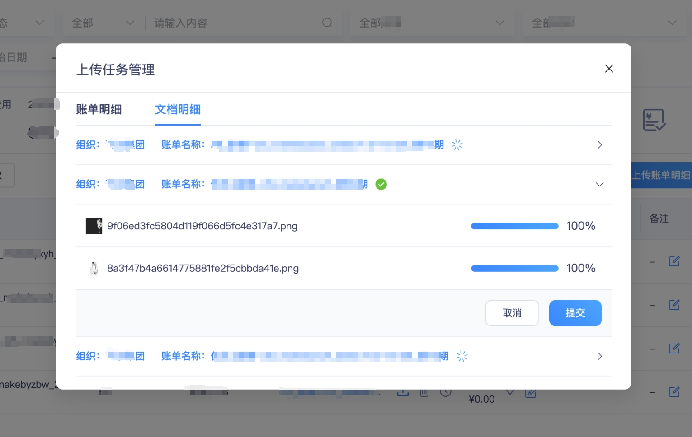

# **任务挂起与多任务管理技术方案**

在ERP系统研发的文件上传中，可能存在：用户上传文件较大，上传时间较长；需要同时在不同模块上传文件，这两种情况，因此需要研发任务挂起以及多任务并行管理功能，在此记录技术方案。
<!-- more -->

## 1. 需求分析

在【应收需求 - 一期】中，涉及文件上传，并且用户上传过程中文件普遍较大，而上传速度有限，可能存在上传阻塞的情况，因此，提出以下需求：

* 上传过程中不阻塞用户操作，用户可以持续上传文件，等待过程时可以进行其他操作；
* 用户可以随时重新打开弹窗查看任务状态以及修改部分提交的信息；
* 多种类型上传任务互不干涉；
* 若用户停留在其他页面，则需要做全局提示弹窗，并超时自动提交数据。

从以上总结分析的需求点，每个点都需要特定的功能来支持，从技术角度来梳理每个需求点需要的功能如下：

* 上传任务挂起
* 上传实时进度
* 多上传任务区分
* 全局弹窗提示与计数器触发提交方法
* 全局数据缓存与管理

## 2 技术方案

本次需求涉及最重要的是做好数据缓存。通过数据缓存，来随时获取相关数据并渲染，从而避免弹窗关闭、页面切换导致的数据重置的情况，从而达到任务挂起以及多任务管理的需求目标。

其次，关于全局弹窗提示，由于用户可能在等待上传的过程中切换了其他页面，需要一个弹窗提醒用户任务进度，提供跳转、倒计时、自动提交、手动提交的功能。

### 2.1 数据缓存管理

首先，对需要做数据缓存管理的功能模块做好梳理：

```vb
1. 页面模块1
  1.1 任务类型1
    a. { ...(后端字段) }
  1.2 任务类型2
    a. key（任务id）
      i. { ...(后端字段) }
    b. key（任务id）
      i. { ...(后端字段) }
    c. ......
2. 页面模块2
  2.1 任务类型1
    a. key（任务id）
      i. { ...(后端字段) }
    b. key（任务id）
      i. { ...(后端字段) }
    c. ......
```

数据缓存管理工具为项目中正在使用的pinia数据管理插件，具体用法可查看往期代码。

需要在stores中新建文件用于编写对账管理的数据缓存结构与方法。

### 2.2 全局弹窗提示

本次全局弹窗不适用平时常用的ElMessage消息组件，更换为：Notification组件。

由于平时ElMessage消息适用于短时间停留后消失的场景，在本次需求中消息提示弹窗还要插入其他控件如按钮，倒计时等，故使用notification消息提示组件，来支持本次需求场景，先看看两个组件的区别：

ElMessage消息提示：


Notification消息提示：


普通的notification并不直接适用，需要进行适当的增加功能，该组件没有插槽可用，但提供了另一种自定义内容的方法：超文本标记语言【h( )】，该方法可以在message属性中插入自定义节点、样式、方法，“h( )”vue提供的一个渲染函数，通过指定的语法规范编写结构，通过该函数自动转换为虚拟节点VNode，在渲染到页面。

有关渲染函数的介绍：[渲染函数 & JSX](https://cn.vuejs.org/guide/extras/render-function.html#creating-vnodes)

这里来一个简单的上手案例：

```javascript
import { h } from 'vue'

const vnode = h(
  'div', // type
  { id: 'foo', class: 'bar' }, // props
  [
    /* children */
    h('p',{class:'isCreate'},'新增成功!'),
    h('p',{class:'isCreate'},'是否自定义HTML?')),
    h('div',{class:'personnel-btn'},
    [
      h('el-button',{
        on:{
        click:this.toCreate
        }
      },'确定'),
      h('el-button',{
        on:{
          click:this.userClose
        }
      },'取消')
    ]
  ]
)
```

以上展示了自定义插入按钮、方法的案例，在本次需求中还需要插入自定义倒计时，需要在某个位置插入某个可识别的类型或id，以便通过获取dom节点修改倒计时显示。

倒计时结束后，再调用与后端对接的指定接口，传送用户上传的文件信息到后端，后端做处理与保存。

### 2.3 上传任务管理弹窗

+ **弹窗 显示/隐藏 控制按钮**

页面中需要做响应式判断是否存在上传任务列表。包括未完成、已完成的任务，只要存在，即显示“上传任务管理”，供用户打开挂起弹窗。

需要在页面定义响应式变量，监听指定的数据依赖，依赖改变都需要触发该变量更新，控制按钮的显示或隐藏，可定义为computed计算属性。

+ **弹窗 内容与展示**

需单独再开发一个dialogs组件，来展示当前对账管理中存在的上传任务以及任务进度等。

由于没有UI设计稿，故可以自由发挥，但需要确保风格与系统保持一致，内容简单明了，交互优雅美观。

由于存在不同的任务类别：账单明细，文档明细，故考虑使用tabs栏目来切换不同的类型展示不同的上传任务类型列表，并且用户可在此界面取消、提交任务。

以上是本次需求主要技术方案，总体结构设计与方案制定好之后我们可以开始实施。

## 3. 方案实施与效果

### 3.1 数据缓存

+ **a. 定义缓存的数据结构**

定义好state数据缓存结构，其中：payee、payer为主要存储的内容，default为默认的数据内容，用于重置存储内容，其他的字段按照后端需求格式来即可：

```javascript
state: (): State => ({
  name: '对账管理上传文件任务记录',
  payee: {
    billDetailForm: {
      date: '2023',
      remark: '',
      upload_reports: []
    },
    slDocumentDetailForm: {
      upload_reports: [],
      ref_id: '',
      currentTaskConfig: {}
    },
    slDocumentDetailMap: {},
    factoryDetailForm: {
      upload_reports: [],
      ref_id: '',
      currentTaskConfig: {}
    },
    factoryDetailMap: {}
  },
  payer: {
    factoryDetailForm: {
      upload_reports: [],
      ref_id: '',
      currentTaskConfig: {}
    },
    factoryDetailMap: {}
  }
})
```

+ **b. 定义数据缓存的相关方法**

此次仅需要两个方法：更新数据与重置数据：

* 更新数据：当上传文件变动的时候，需要触发更新数据；
* 重置数据：当用户取消、提交成功后，需要触发重置数据。

需要传递的参数大致有：@type: 类型，@data: 替换的数据， @route: 触发的路由

```javascript
actions: {
  update_form(payload: Record<string, any>) {
    const { type, data } = payload

    if (type == 'billDetail') {
      this[`${payload.route}`][`${payload.type}Form`] = { ...payload?.data }
      return true
    }

    this[`${payload.route}`][`${payload.type}Map`][data?.ref_id] = { ...payload?.data }
  },
  reset_form(payload: Record<string, any>) {
    const { route, type, data } = payload

    // 上传完成 或 取消上传，则清空改弹窗，数据还原为最初的结构。
    this[`${route}`][`${type}Form`] = {
      ...this?.default?.[`${route}`][`${type}Form`]
    }

    if (data?.ref_id) {
      delete this[`${route}`][`${type}Map`]?.[data?.ref_id]
    }
  }
}
```

+ **c. 在组件中的使用**

上传组件初始化(刚打开)时，需要判断是否已经存在上传任务，存在的话需要把现有的任务渲染到组件：

```javascript
onMounted(() => {
  if (props?.type == 'billDetail') {
    let targetStore = storeFinancial?.[props?.route]?.[props?.type + 'Form']
    formParam[props.type] = targetStore

    if (targetStore?.upload_reports?.length != 0) {
      observeUpload()
      nextTick(() => {
        uploadRef.value.refUpload.uploadFiles = targetStore?.upload_reports
      })
    }
  }

  if (props?.type != 'billDetail') {
    let targetStore = storeFinancial?.[props?.route]?.[props?.type + 'Map']?.[props?.data?.id] || {
      ...storeFinancial?.[props?.route]?.[props?.type + 'Form']
    }

    formParam[props.type] = targetStore
    formParam[props.type].ref_id = props?.data?.id
    let { currentTaskConfig } = targetStore

    if (currentTaskConfig?.id) {
      ElMessage.warning('存在未确认的上传任务，请先确认')
      formParam[props.type].currentTaskConfig = currentTaskConfig
    } else {
      formParam[props.type].currentTaskConfig = props?.data
    }

    if (targetStore?.upload_reports?.length != 0) {
      observeUpload()
      nextTick(() => {
        uploadRef.value.refUpload.uploadFiles = targetStore?.upload_reports
      })
    }
  }
})
```

在上传组件中，需要调用文件上传的file-change回调函数，当上传的文件发生变动时触发指定更新数据的方法：

```javascript
import { useFinancialFilesStore } from '@/stores/financialFilesRecord'

const storeFinancial: Record<string, any> = useFinancialFilesStore()

const fileChange = (list: Record<string, any>) => {
  // ......其他代码
  storeFinancial.update_form({
    route: props?.route,
    type: props?.type,
    data: { ...formParam[props?.type], upload_reports: list }
  })
  // ......其他代码
}
```

当用户取消或者上传任务结束并确认提交后，触发重置数据的方法：

```javascript
const onCancel = () => {
  // ......其他代码
    storeFinancial.reset_form({
      route: props?.route,
      type: props?.type,
      data: formParam[props.type] || {}
    })
  // ......其他代码
}
```

### 3.2 全局弹窗提示

首先，需要自定义好弹窗的HTML内容：

```javascript
ElNotification({
  title: '文件上传任务提示',
  type: 'success',
  dangerouslyUseHTMLString: true,
  customClass: 'reconcilia-notification',
  message: h('div', { class: ' leading-5' }, [
    h('span', { class: 'inline' }, '对账管理中文件上传任务已完成，请在5分钟内'),
    h(
      'span',
      {
        class: 'text-primary cursor-pointer underline'
      },
      '前往'
    ),
    h('span', { class: 'inline' }, '确认上传信息，超时将自动提交'),
    h('span', { class: 'reverse-time text-primary' }, `(--:--)`),
    h('div', { class: 'confirm-btn' }, '提交')
  ]),
  offset: 100,
  duration: 0
})
```

这里还需要将notification作为一个实例保存起来，方便后续根据情况调用实例的close方法，来关闭notification弹窗，并编写关闭、倒计时的方法，写到实例中：

```javascript
// 消息通知计时器相关
const reverse = reactive({
  timer: null,
  count: 0,
  reverseTime: '',
  notice: null
})

reverse.notice = ElNotification({
  // ...其他代码
  message: h('div', { ... } [
    // ...
    h(
      'span',
      {
        class: 'text-primary cursor-pointer underline',
        onClick: goReconciliation
      },
        '前往'
    ),
    // ...
    h('div', { class: 'confirm-btn', onClick: onConfirm }, '提交'),
    // ...
    onClose() {
      clear(reverse)
      reverse.notice = null
    }
  ])
})
```

自定义弹窗内容到这里就定义完了，具体的方法逻辑可以前往组件内部查看具体代码逻辑实现，让我们看看最终效果：


### 3.3 上传任务管理弹窗

首先，定义一个按钮，用于控制上传任务管理弹窗显示或隐藏的按钮；

引入上传任务管理弹窗组件，用于展示内容；

定义一个计算属性的变量，判断是否存在上传任务，用于控制“上传任务管理”按钮的显示或隐藏；

```vue
<template>
 <!--- ....其他代码 -->
  <el-button v-if="showTaskDialog" type="primary" plain @click="actionButton('all', 'taskManage')">
    上传任务管理
  </el-button>

  <define-upload-task-dialog
    v-if="dialogConfig.task.visual"
    :route="'payee'"
    @close="(dialogStatus) => closeDialog({ dialogStatus }, 'task')"
  />

 <!--- ....其他代码 -->
</template>

<script setup lang="ts">
// ......
import { useFinancialFilesStore } from '@/stores/financialFilesRecord'

const storeFinancial: Record<string, any> = useFinancialFilesStore()
const showTaskDialog = computed(() => {
  const { billDetailForm, slDocumentDetailMap } = storeFinancial?.payee

  return !!billDetailForm?.upload_reports?.length || !!Object.keys(slDocumentDetailMap)?.length
})

// ......
</script>
```

而任务弹窗展示样式最终编写效果如下：



具体template代码以及业务代码由于过多，在这里不贴出代码，详情可打开源代码文件查看阅读。

## 4. 总结

【任务挂起与多任务并行管理】需求已经完成，且满足基本的应用场景，真正做到解放用户操作，提高使用体验以及提升交互优化，这是我自己的一次挑战和尝试，但我也知道还存在不足以及优化空间，后续会持续跟进与优化，把控所有细节以及提高代码的健壮性。