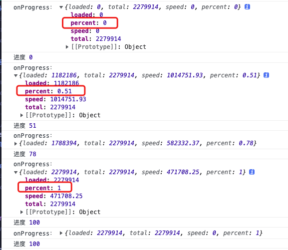
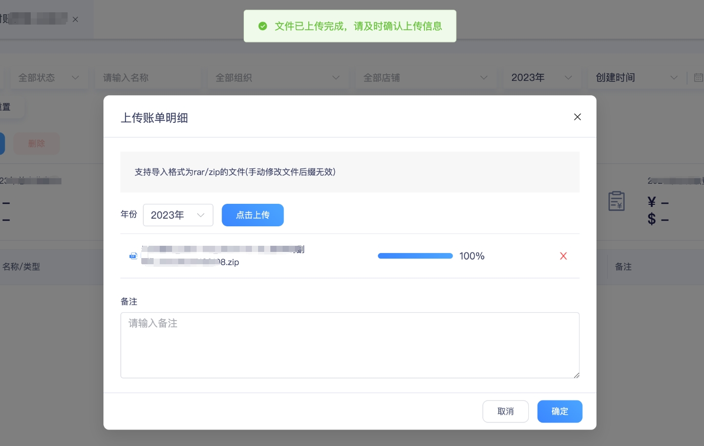

# **结合腾讯云COS获取上传进度**

在ERP系统研发的文件上传中，结合腾讯云实时获取上传进度，并渲染进度条，增强用户上传进度感知与提升用户体验。
<!-- more -->

## 1. 需求背景

在【20230103 - 应收费用】迭代版本中，因为涉及财务与工厂的对账，需要支持较多的文档、压缩包、图片等多种格式的文件，需要前端开发上传相关的功能以支持财务-工厂的业务需求。

其中，还考虑到由于文件过大，上传耗费时间较长，若是依旧按照往常的逻辑，上传过程为全屏loading，就会阻塞用户操作，并且无法看到上传进度，从用户角度来看此交互十分不友好，故在此版本中需要给出一定的技术支持方案以改善这种情况。

## 2. 需求分析

从需求背景以及与财务部的沟通的结果分析，本期需要开发的交互功能较多。

* 需要不阻塞用户操作，用户可以持续上传文件，等待过程可以进行其他操作；
* 用户可以随时重新打开弹窗查看任务状态以及修改部分提交的信息；
* 多种类型上传任务互不干涉；
* 若用户停留在其他页面，则需要做全局提示弹窗，并超时自动提交数据。

从以上总结分析的需求点，每个点都需要特定的功能来支持，从技术角度来梳理每个需求点需要的功能如下：

+ 上传任务挂起
+ 上传实时进度
+ 多上传任务区分
+ 全局弹窗提示与计数器触发提交方法
+ 全局数据缓存与管理

在本文档中，主要针对最重要的上传实时进度进行技术阐述，其他的点后续再补充。

## 3. 技术方案

在我们的ERP系统中，使用了腾讯云OSS云存储来统一管理系统文件的保存，大致流程是：

> 前端上传至腾讯云 -> 上传成功，腾讯云返回文件key -> 前端获取key，通过后端接口以及约定的数据格式、字段发送给后端 -> 后端保存 -> 下次可以请求指定的下载接口

在此流程中，本次方案主要针对前端上传文件至腾讯云过程中实时获取进度并渲染的问题。

+ **腾讯云文档：[腾讯云存储SDK文档](https://www.tencentcloud.com/zh/document/product/436/43861#.E9.AB.98.E7.BA.A7.E6.8E.A5.E5.8F.A3.EF.BC.88.E6.8E.A8.E8.8D.90.EF.BC.89)**

```javascript
cos.uploadFile({
    Bucket: 'examplebucket-1250000000', /* 填入您自己的存储桶，必须字段 */
    Region: 'COS_REGION',  /* 存储桶所在地域，例如ap-beijing，必须字段 */
    Key: '1.jpg',  /* 存储在桶里的对象键（例如1.jpg，a/b/test.txt），必须字段 */
    Body: fileObject, /* 必须，上传文件对象，可以是input[type="file"]标签选择本地文件后得到的file对象 */
    SliceSize: 1024 * 1024 * 5,     /* 触发分块上传的阈值，超过5MB使用分块上传，非必须 */
    onTaskReady: function(taskId) {                   /* 非必须 */
        console.log(taskId);
    },
    onProgress: function (progressData) {           /* 非必须 */
        console.log(JSON.stringify(progressData));
    },
    onFileFinish: function (err, data, options) {   /* 非必须 */
      console.log(options.Key + '上传' + (err ? '失败' : '完成'));
    },
}, function(err, data) {
    console.log(err || data);
});
```

onProgress函数的相关参数说明表格如下：

| 参数名                  | 参数描述                                                | 类型     | 必填 |
| ----------------------- | ------------------------------------------------------- | -------- | ---- |
| onProgress              | 上传文件的进度回调函数，回调参数为进度对象 progressData | Function | 否   |
| \- progressData.loaded  | 已经上传的文件部分大小，以字节（Bytes）为单位           | Number   | 否   |
| \- progressData.total   | 整个文件的大小，以字节（Bytes）为单位                   | Number   | 否   |
| \- progressData.speed   | 文件的上传速度，以字节/秒（Bytes/s）为单位              | Number   | 否   |
| \- progressData.percent | 文件的上传百分比，以小数形式呈现，例如，上传50%即为0.5  | Number   | 否   |

通过查阅腾讯云文档，发现其cos对象有onProgress的回调函数，在触发上传时，打印该函数自带的参数，可得到：



其中，可以看到percent即为上传百分比，进度每改变一次，腾讯云就触发一次回调函数，故我们也可以通过这个来获取实时进度，做好相应的格式处理后进行响应式渲染，这样实时进度条即可实现。

但是还有一个问题，就是如何在该回调函数外部获取腾讯云返回的这些进度相关的数据呢？

尝试了传入一个对象，利用对象为“引用类型”，共用一个存储地址的原理来实现数据关联，但是失败了，原因暂时不明，似乎在回调过程中数据失去了关联，因此排除该方法。

最后尝试了利用闭包函数的原理，传入一个回调函数到腾讯云的onProgress函数中，每次执行该函数时就把onProgress函数得到的参数传给回调函数，由回调函数带回获得的参数，而在传入回调函数的源头处，即可得到progressData对象。

## 4. 方案落地

### 4.1 编写回调函数

```javascript
const getProgress = (config, rawFile) => {
  let percent = parseInt(config.percent * 10000) / 100
  file.percentage = percent

  let uploadFilesCompleted = !fileList.value?.some((item) => item.percentage != 100)
  uploadFilesCompleted && emit('notice', true)
}
```

首先，config参数为云函数返回的上传信息，将其中的percent处理成百分比的形式，再把该参数和值赋给对应的文件，这里fileList为上传组件绑定的文件列表。
uploadFilesCompleted，判断fileList是否已经上传完成，如果上传完成了则触发父组件的方法，在父组件中可以做响应的提示等。

### 4.2 数据响应与进度条


由于fileList为ref响应式数据，故当数据变动时，视图也会对应改变，可利用此特性来编写进度条样式。

```html
<div
  class="upload-progress px-1 flex items-center justify-between flex-1 max-w-[160px] min-w-25 overflow-hidden"
>
  <span class="block w-[70%] h-2 bg-[#ebeef5] rounded-2xl overflow-hidden">
    <span
      class="block w-full h-2 rounded-2xl bg-[#3a86ff]"
      style="`transform: translateX(${-100 + file.percentage}%);transition: transform .28s ease-in-out`"
    ></span>
  </span>
  {{ `${file.percentage || 0}%` }}
</div>
```

### 4.3 最终效果



## 5. 总结

经过一番资料检索与不断地思考钻研，方案顺利落实，功能运行也正常，经得起实践与考验，但是仍然存在不足：

腾讯云回调函数有时候会触发两次，这就会导致前端连续了两次提醒，从用户角度来说比较容易造成误解，这个后续需要思考一个解决方法，目前思路是记录是否已经成功并提醒过，若是记录存在则不再提醒。