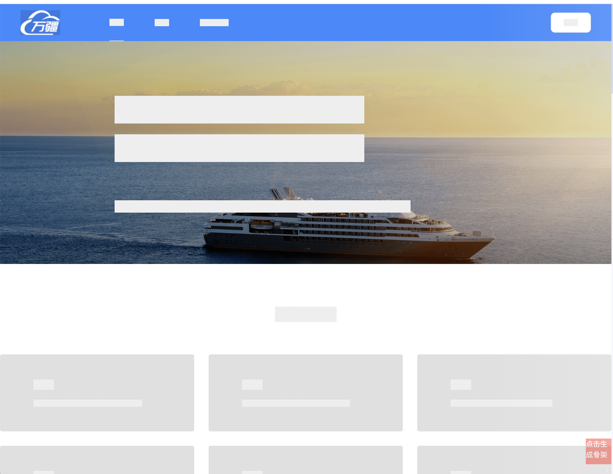
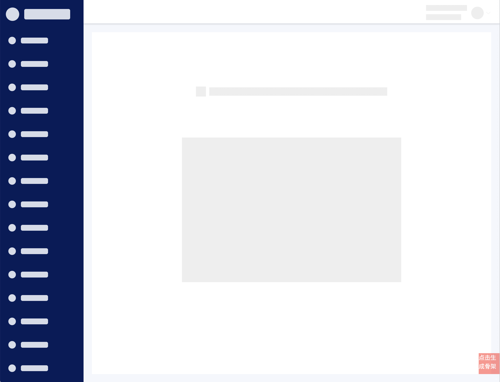

# **web骨架屏半自动化技术方案**

记录一下关于项目中半自动生成页面骨架屏的技术方案与实践，采用第三方插件，参考网络其他大佬经验来进行实践。
<!-- more -->
## 前言

现在的前端开发领域，都是前后端分离，前端框架主流的都是 SPA，MPA；这就意味着，页面渲染以及等待的白屏时间，成为我们需要解决的问题点；而且大项目，这个问题尤为突出。

vite 可以实现按需加载，减少我们首屏需要加载的代码体积；再配合上 CDN 以及一些静态代码（框架，组件库等等...）缓存技术，可以很好地缓解这个加载渲染的时间过长的问题。

但即便如此，首屏的加载依然还是存在这个加载以及渲染的等待时间问题，这时候，利用骨架屏便可以起到一个占位的作用，用户看到后就能知道此处有内容正在加载，在一定程度上起到提升用户体验的作用。

## 1. 了解骨架屏

骨架屏(Skeleton Screen)是指在页面数据加载完成前，先给用户展示出页面的大致结构（灰色占位图），在拿到接口数据后渲染出实际页面内容然后替换掉，本质上是界面加载过程中的过渡效果。

假如能在加载前把网页的大概轮廓预先显示，接着再逐渐加载真正内容，这样既降低了用户的焦灼情绪，又能使界面加载过程变得自然通畅，不会造成网页长时间白屏或者闪烁。

Skeleton Screen 能给人一种页面内容“已经渲染出一部分”的感觉，相较于传统的 loading 效果，在一定程度上可提升用户体验。

## 2. 市场主流技术

### 2.1 常规方案

使用图片、svg 或者手动编写骨架屏代码：使用 HTML + CSS 的方式，我们可以很快的完成骨架屏效果，但是面对视觉设计的改版以及需求的更迭，我们对骨架屏的跟进修改会非常被动，这种机械化重复劳作的方式此时未免显得有些机动性不足；

### 2.2 SSR预渲染方案

通过预渲染手动书写的代码生成相应的骨架屏：该方案做得比较成熟的是 vue-skeleton-webpack-plugin，通过 vueSSR 结合 webpack 在构建时渲染写好的 vue 骨架屏组件，将预渲染生成的 DOM 节点和相关样式插入到最终输出的 html 中。

该方案的前提同样是编写相应页面的骨架屏组件，然后预渲染生成骨架屏所需的 DOM 节点，但由于该方案与 vue 相关技术直接关联，在当今前端框架三分天下的大环境下，我们可能需要一个更加灵活、可控的方案；

### 2.3 自动生成骨架屏

饿了么内部的生成骨架页面的工具：该方案通过一个 webpack 插件 page-skeleton-webpack-plugin 的方式与项目开发无缝集成，属于在自动生成骨架屏方面做得非常强大的了，并且可以启动 UI 界面专门调整骨架屏，但是在面对复杂的页面也会有不尽如人意的地方，而且生成的骨架屏节点是基于页面本身的结构和 CSS，存在嵌套比较深的情况，体积不会太小，并且只支持 history 模式。

## 3. 确定骨架屏方案

由于我们的ERP系统采用的构建工具是vite，因此需要在符合vite工作原理的基础上确定骨架屏方案。

上述三种方案中，首先排除第一种方案，其灵活性过低，维护成本过高，且有可能反而造成项目整体体积增大、性能降低；

第二种方案亦排除，定制化程度较低，开发成本、维护成本都较高，对于项目代码侵入程度也较高；

第三种方案可行性较高，但是由于我们的ERP项目使用的构建工具为vite，因此饿了么内部的骨架页面不适用于我们的项目，并且其存在较高的局限性。

通过网上检索各种不同的方案，并结合自身项目实际情况，最终选定可行性较高的方案为：vie自动化生成并注入骨架屏。

## 4. 方案实施

### 4.1 技术选定

> 插件：vite-plugin-auto-skeleton
>
> 地址：[https://github.com/tangxiangmin/vite-plugin-auto-skeleton](https://github.com/tangxiangmin/vite-plugin-auto-skeleton)

### 4.2 技术原理

该技术是通过直接操作真实页面的DOM节点，生成骨架屏内容并保存在本地，并手动定义好一个特定的标识，再调用编译工具的钩子函数，在Vue插件解析SFC之前，通过状态控制以及将特定的标识来将其替换成真实的骨架屏代码。

点击触发器，自动将当前页面转换成骨架屏，

通过HTTP将骨架屏代码发送到插件接口，通过fs写入本地文件./src/skeleton/content.json中，然后自动重启vite server，

页面内组件的占位符会通过SkeletonPlaceholderPlugin替换对应占位符的骨架屏代码，loading生效时展示骨架屏。

首屏渲染页面时，通过location.pathname插入当前路径对应的骨架屏代码，直接看见骨架屏代码，

所有骨架屏依赖的当前样式通过cssSkeletonGroupPlugin解析，通过分组选择器输出在css文件，不再依赖scopeid。

指定特定逻辑或时间段，改变状态隐藏骨架屏代码，显示真实的内容即可。

操作DOM节点生成网页骨架屏的方案可以参考：[使用Chrome扩展程序生成网页骨架屏](https://www.shymean.com/article/%E4%BD%BF%E7%94%A8Chrome%E6%89%A9%E5%B1%95%E7%A8%8B%E5%BA%8F%E7%94%9F%E6%88%90%E7%BD%91%E9%A1%B5%E9%AA%A8%E6%9E%B6%E5%B1%8F)

**a. 原理实现流程：**

* 在开发环境下，通过手动触发某个开关，开始生成某个页面对应的骨架屏内容
* 将页面按节点类型拆分成不同区块
* 支持自定义节点类型、忽略或隐藏节点
* 最后导出的是一段HTML代码，复用原始页面的结构和CSS布局代码

**b. 技术代码实现**

生成骨架屏代码的核心API只有一个：

```javascript
const {name, content} = renderSkeleton(sel, defaultConfig)

export function renderSkeleton(sel: string, config: SkeletonConfig) {
  let $root = $(sel).eq(0)
  $root.addClass("sk")

  preset(config)
  preorder($root)

  const name = $root.attr('data-skeleton-root')
  const content = $root.prop("outerHTML")

  return {
    name: `__SKELETON_${name}_CONTENT__`,
    content: content
  }
}
```

该API需要传入一个入口节点，输出转换后的骨架屏代码。

事前需要在页面注入一个按钮，用来调用renderSkeleton方法，而其调用时机由开发者自由控制。

```javascript
// 注入触发renderSkeleton的按钮：
const createTrigger = () => {
  const div: HTMLDivElement = document.createElement('div')
  div.setAttribute('style', 'position:fixed;right:0;bottom:20px;width:50px;height:50px;background:red;')
  div.addEventListener('click', function () {
    renderSkeleton('[data-skeleton-root]')
  })
  document.body.appendChild(div)
}

if(process.end.NODE_ENV ==='development'){
  createTrigger()
}
```

替换骨架屏代码

```javascript
const filename = './src/skeleton/content.json'

function SkeletonPlaceholderPlugin() {
  return {
    name: 'skeleton-placeholder-plugin',
    enforce: 'pre',
    transform(src, id) {
      if (/\.vue$/.test(id)) {
        const {content} = fs.readJsonSync(filename)
        // 约定对应的骨架屏占位符
        let code = src.replace(/__SKELETON_(.*?)_CONTENT__/igm, function (match) {
          return content
        })

        return {
          code,
        }
      }
      return src
    },
  } as Plugin
}
```

保存骨架屏代码

```javascript
function SkeletonApiPlugin() {
  async function saveSkeletonContent(name, content) {
    await fs.ensureFile(filename)
    const file = await fs.readJson(filename)
    file[name] = {
      content,
    }
    await fs.writeJson(filename, file)
  }

  return {
    name: 'skeleton-api-plugin',
    configureServer(server) {
      server.middlewares.use(bodyParser())
      server.middlewares.use('/update_skeleton', async (req, res, next) => {
        const {name, content, pathname} = req.body
        await saveSkeletonContent(name, content, pathname)
        // 骨架屏代码更新之后，重启服务
        server.restart()
        res.end('success')
      })
    },
  }
}
```

调用接口上传骨架屏代码

```javascript
async function sendContent(body: any) {
  const response = await fetch('/update_skeleton', {
    method: 'POST',
    headers: {
      'Content-Type': 'application/json'
    },
    body: JSON.stringify(body)
  })
  const data = await response.text()
}

const __renderSkeleton = async function () {
  const {name, content} = renderSkeleton(".card-list", {})

  await sendContent({
    name,
    content
  })
}
```

**c. 操作简要流程**

*   开发者在某个时候手动调用`\_\_renderSkeleton`，就会自动生成当前页面的骨架屏
*   将骨架屏代码发送给vite接口，更新本地`skeleton/content.json`中的骨架屏代码，
*   vite重启服务后，重新触发`pre`队列中的`skeleton-content-component`插件，替换骨架屏占位符，注入骨架屏代码，完成整个骨架屏的插入流程。

整个过程中，开发者只需要完成下面两步操作即可

*   声明骨架屏在业务代码中的占位符
*   点击按钮，触发生成骨架屏代码

### 4.3 项目配置

**a. 功能代码并入项目**

src目录下新建skeleton目录，该目录下有如下工程结构：

```vb
skeleton
├─ client
│  └─ index.ts
├─ plugins
│  ├─ cssSkeletonGroupPlugin.ts
│  └─ vitePlugin.ts
├─ skeleton
│  ├─ constant.ts
│  ├─ skeleton.ts
│  └─ strategy.ts
├─ style
│  └─ skeleton.scss
└─ content.json
```

**b. 初始化插件**

* 在vite.config.js文件中配置如下

```javascript
import { SkeletonPlaceholderPlugin, SkeletonApiPlugin } from '../src/plugins/vitePlugin' // 1

export default defineConfig({
  plugins: [
    SkeletonPlaceholderPlugin(), // 2
    vue(),
    SkeletonApiPlugin() // 3
  ],
  build: {
    cssCodeSplit: false // 4
  }
})
```

* 项目文件补充占位符

```html
<!-- 在index.html中，用于生成首页骨架屏 -->
<div id="app">__SKELETON_CONTENT__</div>

<!-- 在组件内部中 -->
<!--其中占位符格式为`__SKELETON_${data-skeleton-root}_CONTENT__`-->
<div v-if="loading">__SKELETON_APP_CONTENT__</div>
<div class="card-list" data-skeleton-root="APP" data-skeleton-type="list"></div>
```

* 在main.js文件中

```javascript
import '../../src/style/skeleton.scss'
import { initInject } from '../../src/inject'

// ...其他内容

// 开发环境下才注入
if (import.meta.env.DEV) {
  setTimeout(initInject)
}
```

**c. 插件/第三方库/依赖 的选择与安装**

由于涉及dom节点操作、文件操作、样式转译等，故需要安装额外的插件、库来支持骨架屏功能。

```json
"@types/jquery": "3.5.14",
"body-parser": "1.20.0",
"fs-extra": "10.1.0",
"jquery": "3.6.1",
"postcss": "8.4.16",
```

```shell
# 依赖安装
npm install @types/jquery@3.5.14
npm install body-parsery@1.20.0
npm install fs-extra@10.1.0
npm install jquery@3.6.1
npm install postcss@8.4.16
```

**d. 启动项目**

```shell
# 终端输入命令：
npm run dev
```

### 4.4 补充说明

需要进行的手动工作包括

*   配置插件
*   定义组件的骨架屏占位符，以及骨架屏入口data-skeleton-root="APP"
*   必要时在标签上声明data-skeleton-type，定制骨架屏节点
*   整个项目比较依赖vite插件开发知识，也参考了vite、@vitejs/plugin-vue、@vue/compile-sfc等源码的实现细节。

### 4.5 查看效果





### 4.6 测试结果

测试结果不尽人意，通过排查其原因，发现是由于使用了封装好的第三方组件库，导致生成的骨架屏dom节点还原度过低

## 5. 总结

+ **优点**

通过自动生成骨架屏代码的方式大大降低了人工编写骨架屏代码的人力成本，也降低了维护成本

+ **不足**

该方案对于第三方组件库适用性较低，导致页面还原度较低。