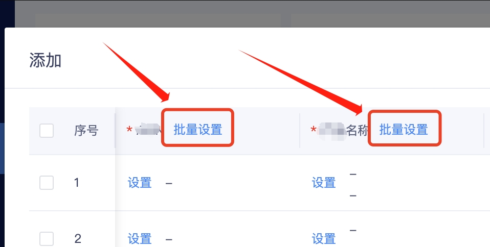
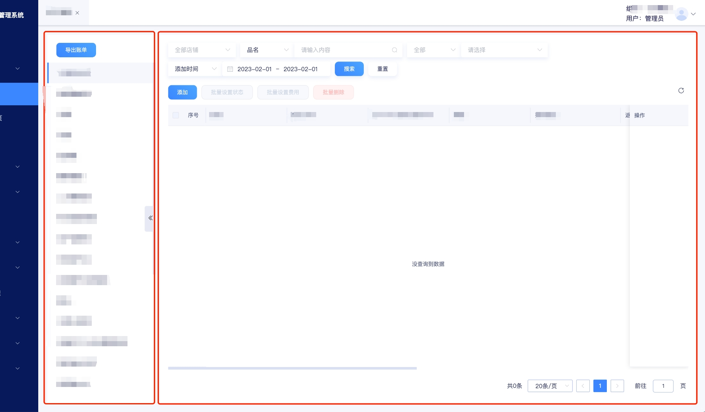

# **可配置化页面模块梳理与总结**

公司ERP系统迭代研发中，20231114迭代版本的前端开发梳理与总结。
<!-- more -->
## **前言**

在20231114迭代版本版本中，根据产品经理提出的规划以及原型设计，该版本中涉及几十个列表模板，且其中的大部分功能、交互一致，为了减少前端的重复工作以及重复代码过多，团队内部技术评审提出前端可配置化，来达到前端页面配置统一由后端返回而直接生成页面的效果。

## 1. 需求梳理

### 1.1 业务逻辑需求

#### **1.1.1 通用 tab**

在此部分中，每个 tab 的 UI 共性、功能交互共性都极高。

从结构布局看，总体可分为四部分组成：搜索栏、表头按钮、表格、行操作按钮组，从功能交互上看，都是简单的数据渲染、添加新记录、单行或批量的信息编辑、设置、删除。每个部分细分一下业务与逻辑，如下：

- **搜索栏**

根据需求，对于列表显示的内容的需要提供搜索功能，而需要搜索的核心内容有：店铺、产品信息、人员、时间，其中产品信息部分略有不同，部分需要搜索 SKU、品名，其他多加一个搜索 ASIN。

- **表头按钮**

表格内容数据增删改，并且需要有批量业务处理的需求，因此需要提供批量设置的按钮，故表头需要四个按钮：添加，批量设置费用，批量设置状态，批量删除。

除了添加，其他的按钮都需要通过选择列表数据后才可以点击，否则为禁用状态，点击后都以弹窗的形式展示。

- **内容表格**

展示每个费用 tab 的主要内容，且带有分页器。并且，每个 tab 需要显示的字段有区别，部分特殊单元格需要额外的功能如：复制、链接跳转、弹窗交互、图片显示与放大等，具体可查看需求文档并与产品经理沟通。

需求文档合集：[ERP系统可配置化页面模块](../proposal/offline-page-configurable.md)

- **行操作按钮组**

每个 tab 都有：编辑，设置订单，设置费用，设置状态，删除，部分还有设置订单功能，但核心交互一致，其中需要注意，功能按钮部分交互需要根据选中行数据是否进行过其他操作、或当前登陆用户是否具有编辑的权限等，具体可查看文档或与产品经理沟通。

#### **1.1.2 非通用 tab**

此部分 tab 功能比较复杂，交互上有区别，因此不列为通用 tab，如本期的：非通用 tab-1，非通用 tab-2。
建议分开单独开发，避免单个组件功能过于复杂，导致后期维护成本高，也可能出现 bug 难以排查的现象。
tab 的结构布局、功能交互与通用 tab 大同小异。

- **非通用 tab-1**
非通用 tab-1 涉及订单的合并拆分，业务逻辑比较繁琐复杂，功能性也比较强，具体需求可以查看非通用 tab-1的需求文档：《2022.11.14-可配置化页面-**需求》（涉及项目业务需求隐私，暂不公开）

- **非通用 tab-2**

非通用 tab-2 与 非通用 tab-1 类似，虽然不涉及订单合并拆分，但一个记录会有多个订单，需要规整对齐，业务逻辑的复杂程度次于非通用 tab-1，功能性弱于非通用 tab-1，具体需求可以查看需求文档：《2022.11.14-可配置化页面-***需求》（涉及项目业务需求隐私，暂不公开）

### 1.2 前端开发需求

#### **1.2.1 界面需求**

考虑 tab 后期会有多达 30 多个，需要考虑把该 tab 导航列表放在哪个位置较为合理，通过前端小组某师兄的建议，在该模块页面下再开辟一个侧边栏，为 tabs 的导航栏供选择不同的 tab，关联右边的页面内容，显示该tab 的具体信息，整体结构布局如下：

[可配置化模块总布局](./assets/offline-replay/可配置化模块总布局.png)

具体页面 UI 效果参考蓝湖。

页面需要的组件在 ERP 系统中大部分有以往开发好的可以直接用，若有特殊需求可以自己单独再开发组件以支持页面功能。

#### **1.2.2 功能需求**

- **展示**

作为页面最基础的功能，数据渲染，根据产品需求文档，不同的 tab 需要显示不同的字段数据供用户查看；

- **搜索**

每个 tab 都需要提供搜索的功能，供用户快速查找需要的数据，页面需要的搜索组件查看需求文档，或与产品经理沟通；

- **添加**

用户有添加新记录的需求，故需要提供添加新数据的功能，一次性可以添加多条数据，同时还需要包含“批量设置”的功能；



- **编辑**

用户添加数据后，未进行响应的设置操作前，可以对该数据进行修改，故需要编辑的功能，仅支持单行编辑；

- **单条/批量设置**

每个费用 tab 有设置订单、设置费用、设置状态、设置链接等功能，可以对单条记录或多条记录进行对应的数据设置，单条记录设置时除了部分必要的表单控件，还需要展示该条记录的基础信息；

设置时以弹窗的形式展示并提供表单控件供用户进行设置；

- **单条/批量删除**

对于 tab 的记录，未进行设置操作前，可以对记录进行删除操作；

#### **1.2.3 其他需求**

## 2. 技术方案

### 2.1 前端技术方案

- **预渲染 - 骨架屏**

在本模块中，考虑到一次性请求接口数量较多，且有时数据较大、或因为网络问题可能会导致页面出现空白屏的情况，建议给页面注入骨架屏来代替白屏，在一定程度上提升用户体验。

- **组件渲染 - 匹配筛选**

前端对“可配置化”模块需要用到的不同组件、下拉选项、参数等都抽离出来，并给定一个标识符用于识别筛选，进入模块的某一个 tab 时发送 http 请求，由后端返回该 tab 的配置数据信息，从数据中提取指定的配置字段，其中包含着一个或多个标识符，前端通过标识符匹配筛选对应的组件，最后组成页面的整体结构。

部分组件需要提供数组对象数据，如下拉框、表格的列配置信息等，也由后端返回后，前端对数据进行处理再注入对应的组件，使其完整。

- **功能按钮 - 方法匹配**

每个按钮都需要执行某个方法，其中涉及按钮的功能(名称)、传参数据等，需要从总体规划好，制定科学合理的传参数据结构，甚至可能有出现  “按钮-  方法”  为   多对一的情况，因此在方法内部还需要做好各种逻辑分支规划。

如，打开弹窗的方法，可能对应的是打开设置产品、设置 asin、设置图片等的弹窗，因此需要做好传参规划，通过参数判定打开的是什么弹窗，如果涉及传参，还需要判断该参数是否 undefined 等边缘情况，防止由于数据不合法导致页面报错而空白屏。

- **其他**

本模块涉及弹窗较多，一次性渲染较多的 dom 节点对性能消耗较大，可能出现页面打开缓慢，执行延迟，不流畅等情况，对于用户来说使用体验十分差，故需要考虑好页面的优化，从一开始就要考虑好全局。

当时在进行开发前，也拟定了一个技术方案，具体可以参考：[ERP系统可配置化页面模块](../proposal/offline-page-configurable.md)

注意：其中后端返回的数据结构并没有按照文档中的返回，具体请查看实际返回数据。

### 2.2 后端技术方案

> 后端没有文档，仅有接口与字段参考：【可配置化 - 后端接口与字段】（涉及团队隐私，暂不公开）

## 3. 方案实施

### 3.1 前期准备

前端根据需求与技术方法所述，从把准备工作做好，再将整体到局部，先把页面总体结构写好。

#### **3.1.1 前置工作**

页面前期工作，建议顺序为：规划目录结构、创建文件、组件初始化、路由注册。

规划目录结构式，由外向内，创建文件夹、文件，模块公用组件置于模块文件夹子级，私有组件置于 tab 文件夹子级......

整体目录结构如下：

```vb
offlineExpenses
├─ components
│  ├─ SetAsin
│  │  ├─ api.js
│  │  ├─ config.js
│  │  └─ index.vue
│  ├─ exportFile
│  │  ├─ api.js
│  │  ├─ config.js
│  │  └─ index.vue
│  ├─ formComponents
│  │  ├─ api.ts
│  │  ├─ input-select.vue
│  │  ├─ input.vue
│  │  └─ select.vue
│  ├─ selectListingDialog
│  │  └─ index.vue
│  ├─ selectProductDialog
│  │  ├─ config.js
│  │  ├─ index.vue
│  │  └─ matchProductApi.js
│  ├─ setAttrDialog
│  │  ├─ config.ts
│  │  └─ index.vue
│  ├─ setFeeDialog
│  │  └─ index.vue
│  ├─ setImgDialog
│  │  ├─ config.ts
│  │  └─ index.vue
│  ├─ setStatusDialog
│  │  └─ index.vue
│  ├─ matchTableComponents.ts
│  └─ mock.js
├─ fitting
│  ├─ components
│  │  ├─ SetFee
│  │  │  ├─ api.ts
│  │  │  ├─ config.js
│  │  │  └─ index.vue
│  │  ├─ SetFieldRow
│  │  │  ├─ api.ts
│  │  │  ├─ config.js
│  │  │  ├─ index.vue
│  │  │  ├─ useAction.js
│  │  │  └─ useMod.js
│  │  ├─ SetStatus
│  │  │  ├─ api.ts
│  │  │  ├─ config.js
│  │  │  └─ index.vue
│  │  ├─ addFitting
│  │  │  ├─ component
│  │  │  │  └─ commonSet
│  │  │  │     ├─ api.js
│  │  │  │     ├─ config.js
│  │  │  │     └─ index.vue
│  │  │  ├─ api.ts
│  │  │  ├─ config.js
│  │  │  ├─ index.vue
│  │  │  ├─ useAction.js
│  │  │  └─ useMod.js
│  │  └─ deleteRow
│  │     ├─ api.ts
│  │     └─ index.vue
│  ├─ api.ts
│  ├─ config.ts
│  ├─ index.vue
│  ├─ interface.ts
│  ├─ useAction.ts
│  └─ useMod.ts
├─ giftCard
│  ├─ components
│  │  ├─ addDialog
│  │  │  ├─ index.vue
│  │  │  └─ useAction.ts
│  │  ├─ batchSetDialog
│  │  │  └─ index.vue
│  │  └─ editSetDialog
│  │     ├─ index.vue
│  │     └─ useAction.ts
│  ├─ api.ts
│  ├─ index.vue
│  ├─ interface.ts
│  ├─ useAction.ts
│  └─ useMod.ts
├─ measure
│  ├─ components
│  │  ├─ SetFee
│  │  │  ├─ api.ts
│  │  │  ├─ config.js
│  │  │  └─ index.vue
│  │  ├─ SetFieldRow
│  │  │  ├─ api.ts
│  │  │  ├─ config.js
│  │  │  ├─ index.vue
│  │  │  ├─ useAction.js
│  │  │  └─ useMod.js
│  │  ├─ SetStatus
│  │  │  ├─ api.ts
│  │  │  ├─ config.js
│  │  │  └─ index.vue
│  │  ├─ addMeasure
│  │  │  ├─ component
│  │  │  │  └─ commonSet
│  │  │  │     ├─ api.js
│  │  │  │     ├─ config.js
│  │  │  │     └─ index.vue
│  │  │  ├─ api.ts
│  │  │  ├─ config.js
│  │  │  ├─ index.vue
│  │  │  ├─ useAction.js
│  │  │  └─ useMod.js
│  │  └─ deleteRow
│  │     ├─ api.ts
│  │     └─ index.vue
│  ├─ api.ts
│  ├─ config.ts
│  ├─ index.vue
│  ├─ interface.ts
│  ├─ useAction.ts
│  ├─ useExpend.ts
│  └─ useMod.ts
├─ api.js
├─ config.ts
├─ index.vue
├─ useAction.ts
└─ useMod.ts
```

创建文件时，页面主文件、组件主入口文件都为`index.vue`，配置文件、接口请求文件、ts 接口文件等都分开放好，具体文件名称与规范根据团队要求进行规范即可。

组件初始化时，vue 文件初始化如下：`（仅作参考）`

```vue
<template>
  <div class=""></div>
</template>

<script setup lang="ts"></script>

<style lang="scss" scoped></style>
```

api 接口请求文件初始化如下：`（仅作参考）`

```typescript
import apiUrl from '@/config/apiUrl'
import { get, post } from '@/utils/http'

export function getOfflineListAPI(data: Record<string, any> = {}) {
  return get({
    url: 'xxxxx', // 'xxxxx' 实际需要的接口地址参数
    data,
    bfLoading: false
  })
}

// ......
```

config 配置文件初始化如下：`（仅作参考）`

```typescript
export default {
  const config = {
    // ......
  }

  retrun {
    config
  }
}
```

方法函数文件初始化如下：`（仅作参考）`

```typescript
import { ref } from 'vue'

export function useAction() {
  const handleAdd = () => {}

  // ....

  return {
    handleAdd
    // ....
  }
}
```

涉及后端接口调用文件初始化如下：`（仅作参考）`

```typescript
import { ref } from 'vue'

export function useMod() {
  const submitForm = (param: Record<string, any> = {}) => {
    // ....
  }

  // ....

  return {
    submitForm
    // ....
  }
}
```

路由注册时，参考以往的路由注册代码即可。

注意：路由的 name 必须唯一，不能与以往的重复。


#### **3.1.2 页面结构**

如前面方案所述，页面结构定为左右结构，左侧为 tab 导航栏列表，但是并不为其注册路由，而是以“树”组件，每个 tab 为一个树节点，通过选择树节点来为右侧渲染不同的列表内容。

左侧导航栏 template 代码如下：（仅贴出部分核心代码）

```vue
<template>
  <div class="page-offline-expense">
    <aside>
      <div v-if="!isHidden" class="tree-part">
        <!-- 导出账单按钮 -->
        <el-button
          v-permission="10002"
          type="primary"
          class="export-file"
          @click="exportFile"
          >导出账单</el-button
        >
        <!-- 树结构 -->
        <el-tree
          ref="treeRef"
          key="treeRef"
          class="filter-tree"
          :data="requestGroupList"
          :current-node-key="currentNode.id"
          :props="defaultProps"
          :highlight-current="true"
          :node-key="'id'"
          default-expand-all
          @node-click="nodeClick"
        >
          <!-- :data="groupList" -->
          <template #default="{ node }">
            <div class="custom-tree-node flex justify-between w-full">
              <div>{{ node.label }}</div>
            </div>
          </template>
        </el-tree>
      </div>

      <!-- 左侧导航栏收起按钮 -->
      <div v-if="isHidden" :class="{ 'narrow-part': isHidden }"></div>
      <div class="tree-hidden" @click="isHidden = !isHidden">
        <el-icon v-if="isHidden"><DArrowRight /></el-icon>
        <el-icon v-else><DArrowLeft /></el-icon>
      </div>
    </aside>
    <main>
      <!-- 导出账单按钮 -->
      <KeepAlive :max="6">
        <component :is="currentComponent" :node="currentNode"></component>
      </KeepAlive>
    </main>

    <!-- 导出账单弹窗 -->
    <export-file-component
      v-if="showExportDialog"
      @close="closeDialog"
    ></export-file-component>
  </div>
</template>
```

开发后，页面结构效果如下：




#### **3.1.3 组件/参数抽离**

本系统的通用组件中，表格组件已经连同搜索栏、表头按钮、行尾部操作按钮、分页器一起封装在内，在平时的使用过程中只需要加入一些参数配置即可渲染成功，故在此模块中，要做到可配置化，只需要把相应的参数由后端返回，前端做二次处理，注入表格组件中即可成功渲染。

在此之前，需要把表格组件再做一次抽离，把搜索栏参数抽离出来，方便做数据处理。

在 offlineExpense -> components  目录下创建“matchTableComponent.ts”文件：

```typescript
import { Ref, reactive } from 'vue'
import { getAmazonShopListAPI } from '@/api/common.js'
import Api from '../giftCard/api'
import useShortcutsTime from '@/hooks/useShortcutsTime'

export default function useMatch() {
  const timeState = useShortcutsTime()
  const { fmt, shortcuts } = timeState

  const searchBar: Array<object> = reactive([
    {
      match_key: 'store_search',
      field: 'store_ids',
      components: 'el-select',
      placeholder: '全部xx',
      filterable: true,
      multiple: true,
      'collapse-tags': true,
      width: '150px',
      value: '',
      api: getAmazonShopListAPI,
      defaultValue: '',
      listAlias: 'store_info'
    },
    {
      match_key: 'product_info_search',
      field: 'val',
      fieldSelect: 'field',
      valueSelect: '',
      components: 'select-input',
      sWidth: '120px',
      select: {
        filterable: true
      },
      options: [
        { label: '品名', value: 'product_name' },
        { label: 'SKU', value: 'sku' }
      ]
    },
    {
      match_key: 'product_info_with_asin_search',
      field: 'val',
      fieldSelect: 'field',
      valueSelect: '',
      components: 'select-input',
      sWidth: '120px',
      select: {
        filterable: true
      },
      options: [
        { label: '品名', value: 'product_name' },
        { label: 'SKU', value: 'sku' },
        { label: 'ASIN', value: 'asin' }
      ]
    },
    {
      match_key: 'user_search',
      field: 'user_val',
      fieldSelect: 'user_field',
      components: 'select-select',
      select: {
        clearable: true,
        options: [
          { label: '负责人', value: 'responsor_uids' },
          { label: '推广人', value: 'promoter_uids' }
        ]
      },
      width: 200,
      multiple: true,
      collapseTags: true,
      listAlias: 'user_info',
      labelAlias: 'nickname',
      api: Api.getUserList
    },
    {
      match_key: 'time_search',
      startField: 'time_start',
      endField: 'time_end',
      fieldSelect: 'time_type',
      valueSelect: '',
      defaultSelect: '',
      components: 'select-date',
      date: {
        'value-format': fmt,
        shortcuts
      },
      select: {
        placeholder: '时间类型',
        options: [
          { label: '添加时间', value: '1' },
          { label: '更新时间', value: '2' }
        ]
      }
    }
  ])

  const getSearchBar = (enumKey: string[], node?: Record<string, any>) => {
    return searchBar.filter((v: Record<string, any>) =>
      enumKey.includes(v.match_key)
    )
  }

  return {
    searchBar,
    getSearchBar
  }
}
```

在每次切换 tab 时，都会调用“getSearchBar”方法，根据后端返回的“search_components”字段中的数组来匹配该 tab 需要的搜索栏控件和参数，前端进行二次处理完毕后，注入表格组件即可。

### 3.2 方案实施

前期工作准备已完成，开始请求接口处理数据、渲染数据视图。

可配置化涉及接口表格：

| 接口名称     | 接口地址                   | 备注                 |
| ------------ | -------------------------- | -------------------- |
| 获取类型列表 | /offline/common/type/list/ | \[get\]              |
| 获取类型配置 | /offline/common/scheme/    | \[get\]              |
| 获取列表数据 | /offline/common/list/      | \[get\]              |
| 添加列表数据 | /offline/common/add/       | \[post\]支持批量添加 |
| 编辑列表数据 | /offline/common/edit/      | \[post\]             |
| 列表数据删除 | /offline/common/delete/    | \[post\]支持批量     |

表 3-2-1  可配置化接口集合

#### **3.2.1 树节点请求与处理**

首先是树节点的请求，通过请求“获取类型列表”，拿到列表数据，该列表数据处理成符合树组件的节点数据结构，随后注入树组件即可。

请求接口后返回数据如下：


【注意】考虑接口返回延迟、无数据等情况，需要做容错处理，例如配置树结构的默认节点、假数据节点、提示错误等。

#### **3.2.2 表格配置请求与处理**

处理好节点数据后，默认选中第一个节点，这时需要请求节点表格配置信息，根据“获取类型配置”接口要求，传递指定的 type 参数，获取该 tab 的配置信息，配置信息包括：

多个列表，各个列表的搜索栏、表头按钮、表头配置；

数据请求返回结果如下：


接口返回数据解读：

```json
{
  scheme_info: {
    fe_cfg: [ // 配置信息
      {
        table_name: 'list_table', // 表格名称
        tag: 1, // 预留字段，暂时无用
        // 表头按钮配置
        batch_btns_components: [
          // ....
        ],
        // 行尾部操作按钮，已废弃，暂时不用
        row_btns_components: [
          // ....
        ],
        // 搜索栏参数
        search_components: [
          // ....
        ],
        // 表头字段配置
        sort_fields: [
          {
            "field_name": "xxxx", // 列的prop，唯一字段
            "type": "xxxx", // 数据类型，匹配数据用
            "name": "xxxx", // 列的label，标签，用户看
            "validate_reg": "", // 正则匹配字段，预留字段
            "options": null, // 下拉选项
            "format": "", // 是否需要格式化
            // 其他配置
            "fe_cfg": {
              "type": "", // 类型
              "width": 180, // 列宽度
              "min_width": 0, // 列最低宽度
              "fixed": 0, // 是否固定列
              "clamp": 0, // 是否文本溢出时悬浮框提示
              "format": "" // 是否需要格式化
            }
          }
          // ....
        ],
      },
      {
        // ....
      }
    ]
    name: "xxxxxx", // 节点名称
    type: "xxxxxx" // 节点类型字段
  }

}
```

获取数据后，需要对其进行二次处理，再注入表格，处理的格式根据表格组件封装的格式要求分别对搜索栏、表头按钮、表格列可进行如下数据处理：（仅贴出部分核心代码）

```typescript
// 筛选不同tab模块需要的搜索控件
const matchSearchBar = () => {
  for (const item of tableHeaderConfig.value?.fe_cfg ?? []) {
    for (const t_key in enumKeys) {
      if (item?.table_name == t_key) {
        if (item?.search_components && item?.search_components.length != 0) {
          enumTableConfig[enumKeys[t_key]].matchSearchBar = getSearchBar(
            item?.search_components,
            currencyNode.value
          )
        }
      }
    }
  }
}

// 处理表格表头的按钮配置
const matchBatchBtns = () => {
  for (const item of tableHeaderConfig.value?.fe_cfg ?? []) {
    for (const t_key in enumKeys) {
      if (item?.table_name == t_key) {
        if (
          item?.batch_btns_components &&
          item?.batch_btns_components.length != 0
        ) {
          enumTableConfig[enumKeys[t_key]].matchBatchBtns.btns =
            item?.batch_btns_components
        }
      }
    }
  }
}

// 处理表格的列
const matchColumn = () => {
  const specialColumn: Record<string, any>[] = [
    { type: 'selection', fixed: true, width: '34' },
    { type: 'index', label: '序号', fixed: true, width: '50' }
  ]

  for (const item of tableHeaderConfig.value?.fe_cfg ?? []) {
    if (['set_status_table', 'set_fee_table'].includes(item?.table_name)) {
      enumDialogConfig[enumBatchKeys[item?.table_name]].matchColumn =
        item?.sort_fields
    } else {
      for (const t_key in enumKeys) {
        if (item?.table_name == t_key) {
          if (item?.sort_fields) {
            enumTableConfig[enumKeys[t_key]].sortField = item?.sort_fields
            enumTableConfig[enumKeys[t_key]].matchColumn.push(...specialColumn)
            item?.sort_fields?.forEach((element: Record<string, any>) => {
              enumTableConfig[enumKeys[t_key]].matchColumn.push({
                label: element.name,
                prop: element.field_name,
                fixed: [false, true, 'right'][element?.fe_cfg?.fixed] ?? false,
                width:
                  element?.fe_cfg?.width * 1 == 0
                    ? '120'
                    : element?.fe_cfg?.width + '',
                minWidth: element?.fe_cfg?.min_width + '' || '50',
                clamp: element?.fe_cfg?.clamp == 1 ? true : false
              })
            })
          }

          if (item?.table_name != 'list_table' && item?.row_btns_components) {
            enumTableConfig[enumKeys[t_key]].matchColumn.push({
              type: 'btn',
              label: '操作',
              width: item?.row_btns_components?.length > 1 ? '120px' : '60px',
              fixed: 'right',
              btns: item?.row_btns_components?.map((v: Record<string, any>) => {
                return {
                  code: v.code ?? '',
                  key: v.key,
                  text: v.text,
                  showFun: () => true
                }
              })
            })
          }

          if ((item?.tag ?? 0) & 16) {
            enumTableConfig[enumKeys[t_key]].matchColumn.shift()
          }
        }
      }
    }
  }
}
```

行末操作按钮由于也做配置化，因此随着列表内容一致由后端返回，这部分后面讲解。

以上数据处理后，可以注入表格组件进行渲染页面结构。

#### **3.2.3 列表内容请求与处理**

页面整体组件渲染成功后，可以开始请求数据进行处理与渲染，通过请求“获取列表数据”接口后获取返回的数据，根据表格列配置中的 field_name 做匹配，筛选该列的数据做对应的渲染。

列表接口请求后返回结果如下：


接口返回数据解读：

```json
{
  "offline_list": [
    {
      "id": "xxxxxxx", // 行id
      "add_time": "2023-01-12 16:59:19", // 创建时间
      "update_time": "-", // 更新时间
      // 创建人
      "creator_user": {
        // ....
      },
      // 更新人
      "update_user": {
        // ....
      },
      // 单元格数据
      "data": [
        {
          "field_name": "xxxxx", // 单元格prop，唯一
          "type": "store", // 数据类型
          // 单元格数据
          "field_value": {
            "string_val": "xxx", // 店铺id
            // store详细数据
            "store_val": {
              "id": "xxx",
              "name": "xxxxx",
              "status": 0,
              "country_name": "xxxx",
              "country_code": "xxxx",
              "authorized_users": null,
              "operator_users": null,
              "time_zone": "xxxxxxx",
              "currency_symbol": "xxxx",
              "add_time": "xxxxxx",
              "update_time": "xxxxxxx",
              "entity_id": "1"
            }
          }
        },
        {
          // ....
        }
      ],
      // 行尾部操作按钮组配置
      "row_btns_components": [
        // ....
      ]
    }
  ]
}
```

获取数据后，需要对其进行二次处理，再注入表格，处理的格式根据表格组件封装的格式要求，使用“after-data”函数处理后再注入表格，处理代码过长，此处不贴出代码，具体可查看：`/offlineExpenses/giftCard/useAction.ts`文件中的“dealAfterData”方法查看详细处理方法。

行尾部操作按钮由于是后端返回，故需要单独处理，采用插槽的方式，再将该部分抽离为组件，注入插槽，以达到配置化的目的与效果。

#### **3.2.4 按钮方法匹配与处理**

页面包含表头按钮、行尾部操作按钮，因此需要编写方法函数为这些按钮绑定事件，根据不同的按钮，给定不同的 key，根据 key 匹配执行指定的方法，过程涉及传参问题，具体传参需要考虑不同的 tab 以及不同的场景。

所有的函数、方法都需要前端手动写好，这个无法配置化，例如：添加、编辑（设置为同一个方法）、删除、打开弹窗、数据校验、权限判定...等多个方法，根据实际需求进行定制开发，此部分逻辑性较强，功能较为繁琐，因此不贴出代码，具体代码可以参考可配置化模块前端代码。

#### **3.2.5 其他**

权限判断，特殊字段校验，弹窗组件封装，表单控件封装，表单控件输入限制。

### **3.3 实施效果**

页面渲染正常，功能运行正常，交互效果有卡顿，性能方面有待优化、提升。

代码也较多，优雅度较低，后续有时间需要进一步优化、整理代码。

## **4. 实现结果**

该模块已上线，具体效果可查看 dev 环境或线上环境。

线上环境：`暂不公开`

测试环境：`暂不公开`

## **5. 总结**

可配置化模块是整个 ERP 系统中使用了较为新颖的开发模式，运用了“低代码”开发思维
