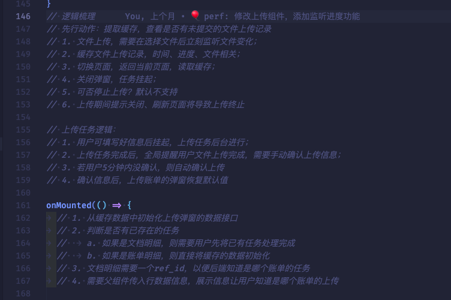
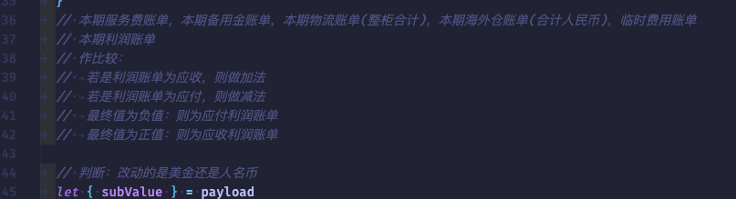

# **ERP上传任务管理研发复盘**

在ERP系统研发的文件上传中，可能存在：用户上传文件较大，上传时间较长；需要同时在不同模块上传文件，这两种情况，因此需要研发任务挂起以及多任务并行功能，在此记录技术方案。
<!-- more -->

## 1. 需求背景

主要涉及迭代版本：20230103-应收需求、20230303-财务应收需求二期。

在这两个版本中，由于涉及任务上传，并且用户上传的文件可能较大，如果按照往常的逻辑，上传文件的交互逻辑是用户上传文件时，会弹出全局loading的交互，直到用户的文件上传至腾讯云完成后，才会关闭全局loading，此时用户才能继续上传下一个文件。

这样的交互流程、逻辑中，有比较明显的不足：
  a. 阻塞用户上传操作、跳转其他页面操作；
  b. 上传文件过程中，只有loading弹窗，用户无法知道准确进度；
  c. 上传完成后没有比较明显或交互较为优雅美观的方式；

针对以上需求背景，需要改进至以下效果：
  a. 上传任务支持挂起，延长数据生命周期；
  b. 绘制文件上传实时进度，方便用户查看上传状态；
  c. 文件上传完成需要做一定的交互反馈

针对以上需求背景与分析，在开发之前需要做好技术分析。

## 2. 技术分析

### 2.1 上传任务挂起

上传任务挂起这一部分，最重要的技术是做好缓存数据结构的设计以及缓存数据的管理。

由于存在不同类型任务，后端需要的字段结构也有所区别，故只能将各自区分开，并且需要备份数据结构的默认值，方便对非原始数据进行数据重置的操作。

同时，需要考虑多场景对数据进行管理，例如：

+ 页面初始化

页面初始化时，需要在节点挂载前进行缓存数据的读取，检测是否已经存在任务，包括上传进行中、上传完成未确认的任务，同时也需要区分，例如在财务管理中，需要区分是应收方还是应付方，是账单明细还是文档明细。
如果存在任务，则需要将已存在的任务进行渲染恢复，包括文件信息以及进度。

+ 上传任务发生改变

当页面中上传任务出现变动时，需要及时调用数据缓存更新的方法，对缓存的数据进行更新保存，方便下次及时提取数据。
新增任务时，还需要调用腾讯云的回调函数来获取实时进度，以制作进度条并实时更新，供用户识别当前任务状态。
删除任务时，需要调用数据缓存的重置方法，将指定的数据结构重置到默认状态。

+ 页面刷新/关闭时


由于在本模块中设置的数据缓存生命周期为：数据产生 -> 浏览器页面刷新/关闭。为了防止用户有时候忘记任务还未提交就刷新、关闭页面，因此在上传任务数据产生时就添加监听浏览器关闭、刷新的方法，提醒用户存在未确认的数据。

### 2.2 任务实时进度

由于需要做到不阻塞用户操作，同时又需要可观地让用户得到状态反馈，因此需要有一个实时上传状态反馈，让用户理解当前进度，且只有进度为完成时才能提交数据到后台保存。

本系统中结合的是腾讯云存储的上传，因此实时进度仍需要从腾讯云来获取，才能得到比较准备的状态反馈如：大小、进度、速度等。

实时获取上传进度的实现可参考：[《结合腾讯云实时获取上传进度》](../proposal/oss-upload-progress.md)

### 2.3 任务消息反馈

用户文件上传完成后，需要一个消息提示用户任务已经完成，从而用户不需要在原有页面或组件等待文件上传完成才离开，即使停留在其他页面也能有及时的、反馈较好的消息提示，较大程度地提升用户的交互体验和操作体验。

因此，从ElementPlus组件库中，挑选了其中的Notification组件来提供消息提示，并且可以自定义dom节点内容，虽然ElMessage组件也可以，但是由于位置较为居中，若是添加按钮等其他的控件，对于用户来说可能会阻挡用户的一些信息，影响页面的数据、内容展示。

同时，还需要将消息提示组件实例化，可以添加方法来手动控制弹窗的显示或隐藏；同时还需要有倒计时功能，实现任务的自动提交，解决用户存在任务长时间未提交导致忘记的场景；还提供跳转功能，用户可快捷点击“前往”二字跳转到任务存在的页面，使用计时器即可实现这个需求。

## 3. 思考与实践

### 3.1 缓存数据的数据结构如何设计？

+ **整体先行**

首先，多个页面存在上传任务，每个页面存在不同类型的上传任务，并且每种类型后端需要的字段有所区别，故可以考虑第一步：以页面路由名称为key，其次以类型为key，最后若是一个类型存在多个任务，可取某一唯一key作为索引值，以对象形式存储该类型、某个指定的任务字段和数据内容。

例如，在本次需求中，应收方、应付方都存在上传任务，应收方存在两种不同类型的上传任务，每个任务的字段有所区别，故设计的数据结构如下：

```javascript
payee: {
  billDetailForm: {},
  slDocumentDetailForm: {},
  slDocumentDetailMap: {},
  factoryDetailForm: {},
  factoryDetailMap: {}
},
payer: {
  factoryDetailForm: {},
  factoryDetailMap: {}
}
```

+ **细节把控**

在路由设计中，“payee”代表应收方，“payer”代表应付方，因此应收方的上传任务汇总于“payee”对象，“payer”则为应付方。

在应收方中，存在两种类型的上传任务：账单明细，补充明细，而前者只能同时存在一个任务，后者可同时存在多个任务，故以“billDetailForm”作为账单明细的数据对象，slDocumentDetailForm作为文档明细的任务字段，slDocumentDetailMap作为补充明细的任务数据存储对象，对象的key为存在上传任务的记录id，为唯一值。

将后端需要的字段补充进数据对象，同时，还需要设计一个“default”作为各个类型数据的初始状态，方便对缓存数据进行恢复和重置。

```javascript
payee: {
  billDetailForm: {
    date: '2023',
    remark: '',
    upload_reports: []
  },
  slDocumentDetailForm: {
    upload_reports: [],
      ref_id: '',
      currentTaskConfig: {}
    },
    slDocumentDetailMap: {},
    factoryDetailForm: {
      upload_reports: [],
      ref_id: '',
      currentTaskConfig: {}
    },
    factoryDetailMap: {}
},
payer: {
  factoryDetailForm: {
    upload_reports: [],
    ref_id: '',
    currentTaskConfig: {}
  },
  factoryDetailMap: {}
},
default: {
  // ...与上方初始数据一样
}
```

### 3.2 实时进度如何获取？如何实时渲染？任务完成后需要做什么反馈？

根据实际情况分析，我们的erp系统文件上传下载结合了腾讯云存储来进行的，而腾讯云存储的相关文档也提供了相关的api调用，针对这个问题已经有过独立的技术方案文档来阐述和解决，详情可查看：

[《\[ERP\]\[文件上传\]结合腾讯云实时获取上传进度》](https://docs.dingtalk.com/api/doc/transit?spaceId=5358792513&dentryId=97852320256&queryString=utm_source%3Ddingdoc_doc%26utm_medium%3Ddingdoc_doc_plugin_card)

进度渲染可以利用好数据的作用域以及数据地址共享的原理来形成一个数据关联，起到数据响应式的作用，每次调用腾讯云的上传回调函数来获取当前上传任务的状态，并编写相关的样式来渲染进度。

获取进度的核心部分：

```javascript
const uploadWithProgress = async (res, file, files) => {
  const getProgress = (config, rawFile, taskConfig) => {
    let percent = parseInt(config.percent * 10000) / 100
    file.percentage = percent
    file.task_id = taskConfig?.id
  }
  // ....其他代码
}
```

进度条实现：

```vue
<template>
  <!--- ....其他代码.... ---->
  <div
    class="upload-progress px-1 flex items-center justify-between flex-1 max-w-[160px] min-w-25 overflow-hidden"
  >
    <span class="block w-[70%] h-2 bg-[#ebeef5] rounded-2xl overflow-hidden">
      <span
        class="block w-full h-2 rounded-2xl bg-gradient-to-r from-[#3a86ff] to-[#4ba5ff]"
        :style="`transform: translateX(${-100 + file.percentage}%);transition: transform .28s ease-in-out`"
      ></span>
    </span>
    {{ `${file.percentage || 0}%` }}
  </div>
  <!--- ....其他代码.... ---->
</template>
```

同时，还需要消息提醒是否完成，传入一个上传完成的提示回调函数，每完成一个任务就判断组件中是否存在进度不为100的任务，如果不存在的话就触发父组件的提示方法：

```javascript
const uploadWithProgress = async (res, file, files) => {
  const getProgress = (config, rawFile, taskConfig) => {
    // ....
  }

  const uploadResult = async (err, data, options) => {
    if (err) {
      refUpload.value.handleRemove(file)
      ElMessage.error('文件上传出错，请重试')
      emit('fileChange', refUpload.value?.uploadFiles)
      emit('update:modelValue', refUpload.value.uploadFiles)

      return false
    }
    await nextTick

    if (!fileList.value?.some((file) => file.key == options?.Key)) {
      return false
    }

    let uploadFilesCompleted = !fileList.value?.some((item) => item.percentage != 100)

    uploadFilesCompleted && emit('notice', true)
  }
  // ....其他代码
}
```

如此，任务上传的核心细节基本结束。

### 3.3 任务消息反馈需要考虑哪些细节？

* 自定义dom节点

查阅ElementPlus文档，Notification组件可以自定义HTML内容作为消息提示的主题，可以直接以字符串来转译也可以使用Vue内部的“h( )”超文本标记语言，即渲染函数来自定义dom内容，具体语法规范可以参考官网：[渲染函数 & JSX](https://cn.vuejs.org/guide/extras/render-function.html#creating-vnodes)

* 路由跳转

提供一个按钮，供用户快捷跳转至存在任务的页面。

* 倒计时、自动提交、手动提交

考虑用户可能离开没有长时间守着任务，可能离开电脑等，而在此期间可能任务已经完成，防止用户遗忘任务存在或长时间未操作导致浏览器页面可能自动刷新，故需要一个倒计时，时间设置为5分钟，时间若超过则自动提交，同时提供手动提交按钮。

具体实现可参考：[《任务挂起与多任务管理技术方案》](../proposal/oss-upload-multiple-task.md) 第2节 b小节

## 4. 总结

在本次需求中，业务较为复杂与繁琐，需要考虑的细节以往常的需求多了许多，并且绝大部分细节都会影响用户体验，因此不能盲目开始写代码，需要先把需求完整理解一遍，梳理好业务逻辑，确保需求的业务逻辑没问题再开始写代码。

多任务上传与任务挂起业务逻辑：



“设置费用”自动计算、动态字段业务逻辑梳理：



业务逻辑梳理完成后，建议先定好总体代码架构，其中又区分为：

* 文件夹、文件目录结构设计
* template 模板代码框架
* ts 业务逻辑代码框架

在业务逻辑中，需要先把总体的方法定好，一步一步划分，最后开始写代码，在编写方法的过程中，如果方法逻辑过长过复杂，建议继续抽离，尽量保持“单一职责”原则的代码逻辑。

通过本期的开发，个人能力确确实实得到了进一步的提升，对于较为复杂的业务逻辑能够担任开发，能在确保需求逻辑清晰的情况下同时确保代码业务逻辑紧贴产品、功能需求，在确保需求、功能正常运行的同时还确保用户体验，也就是学会了站在多角度下去开发业务。

但同时也存在许多不足，对于代码的全局把控能力还是有所不足，许多边缘条件、细节把控还是没能提前考虑到，代码的简洁、优雅程度也有待提高。