# **前端版本迭代新页面404分析**

在系统的一次迭代发布新版本后点击路由跳转页面，出现页面404的原因排查梳理与总结。
<!-- more -->

## 1. 问题背景

时间：2023年12月18日 21:15，自研后台管理系统在新版本上线后，用户在进入系统操作时出现前端路由跳转至404的情况，将页面刷新后又可以正常访问。

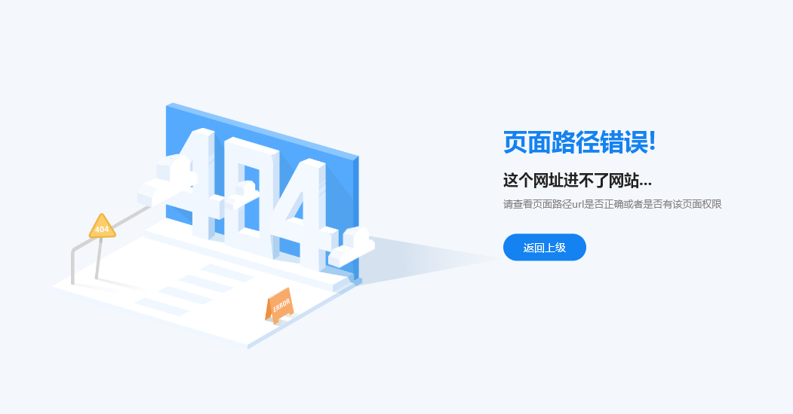

现就这个问题进行分析与尝试提出解决方案。

## 2. 问题分析

对于这个问题，根据互联网检索并结合个人思考，提出以下可能导致的原因：

### 2.1 服务器网络问题

根据当时实际情况，后端接口已经有返回数据，因此不存在此问题。

### 2.2 前端路由配置不一致

由于ERP系统的菜单路由是由后端返回，所以第一考虑是否是线上环境后端接口返回的路由与前端配置的路由不一致导致，前端配置如下：

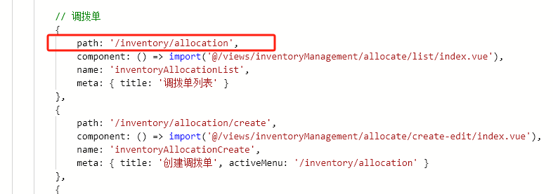

线上环境后端接口返回如下：

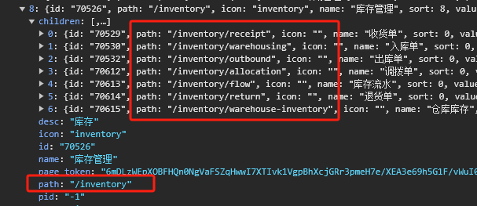

通过检查发现返回并无不一致，因此排除此原因。

### 2.3 前端路由跳转问题

是否是前端菜单栏跳转逻辑有误？

ERP系统的菜单栏用的是同一套方法进行页面跳转，后端数据结构没有重大调整，并且系统的其他页面也正常跳转，因此再排除此问题。

### 2.4 构建工具配置是否有误

检查了vite的配置文件中，并没有与路由、页面跳转相关的配置逻辑，并且如果有问题，可能大部分页面都会有问题，因此再排除此项。

### 2.5 前端文件或目录结构发生变化

在本地开发中，初始化好目录结构并且配置好路由文件后，没有再动过文件或目录结构，并且如果动过，在本地开发时就已经能发现报错，进行打包构建时也会由于找不到相应的资源或路径有误而导致报错；

有没有可能在编译中发生了变化，导致文件路径指向错误呢？

经过简单的学习，得到的结论是可能存在的，而导致这个错误的原因多种多样，但是在本次出现的问题中，由于刷新页面后又能正常访问，说明编译过程没有发生错误导致指向错误，因此在这里不展开讨论。

### 2.6 资源文件问题

在进行新版本的迭代更新上线时，前端构建完成资源文件（图片、字体、css、js等）需要进行部署，在我们的线上服务器中。

服务器中已写好并配置了发布新版本的脚本，在每次发布新的版本后都会将构建打包好的新资源对现有版本进行全面的替换，来完成新版本的上线。

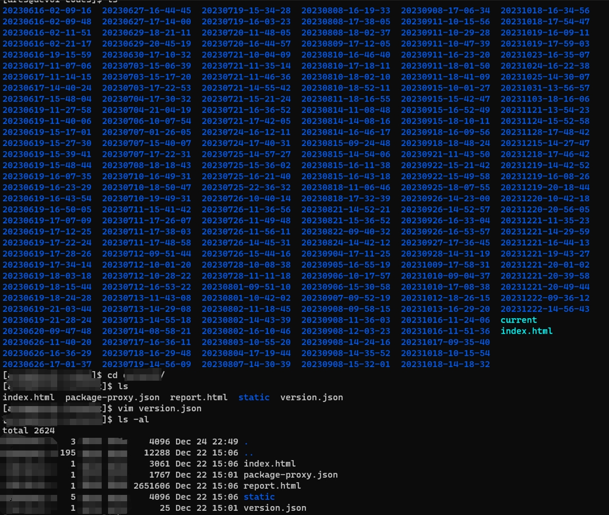

这时候如果部署不正确或者路径替换出现不正确，也可能导致上线失败。

通过查看服务器构建完成后替换目录的文件列出查看，并检查配置的版本信息，发现是正确的，但是路径由于是构建工具编译后加了hash值，不好排查文件路径是否正确，只能通过浏览器控制台判断查看是否存在js文件加载失败。

由于现在复现不了当时的情况，在这里记录下检查方法，如下：

打开浏览器控制台，点击“network”或“网络”，点击“停用缓存”，选择“JS”

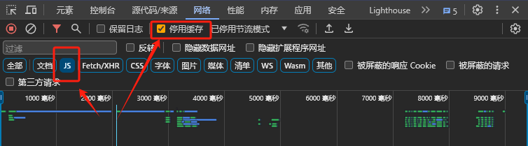

这时候刷新页面或者点击某个页面，查看js加载状态是否是“200”

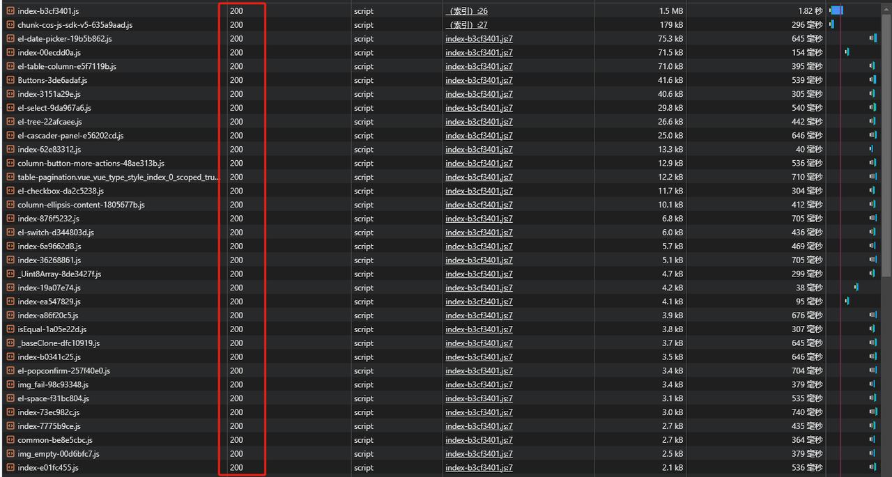

如果存在非200的情况，并且反复出现，则需要检查资源加载失败的原因，在这里没有失败的情况，因此再次排除此项。

### 2.7 服务器/浏览器缓存

#### 2.7.1 服务器缓存

有没有可能是服务器的缓存机制，缓存了旧资源文件，导致新页面无法正确请求呢？

对此想法进行一个基础的分析如下：

**1. 构建**

ERP系统使用的构建打包工具是vite，在其配置文件中已经进行了生成hash名的配置，每次构建打包都会为生成功的资源文件添加哈希值，确保每次执行build后文件名都会变化，使得浏览器能够根据文件名的变化来识别新文件，并重新请求资源。

配置生成hash值：

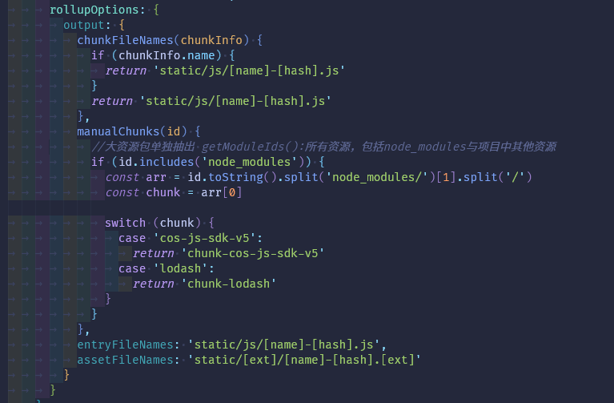

浏览器请求资源：

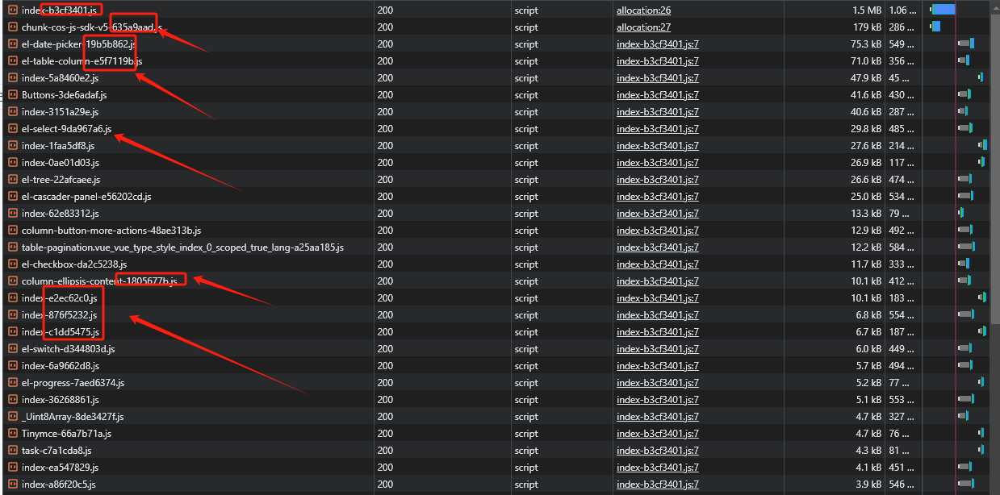

这一步已经可以确定是没有问题，成功生成了hash值。

**2. 检查前后端是否设置缓存机制**

检查前端、后端是否设置了缓存，导致没有在合适的时机清除缓存，使用户访问的页面请求到的是最新的缓存。

前端部分：

一般实在http请求时设置请求头，缓存又分为强制缓存与协商缓存，需要检查是否设置了 HTTP 缓存头部（如 Cache-Control、Expires 和 ETag），在前端项目代码中检查结果是没有设置相关的缓存信息。

后端部分：

需要后端配合检查确认是否设置。

**3. 查看响应标头**

可以看到资源文件的响应表头设置了ETag，该字段用户校验文件资源是否更改，检测到发生更改，则重新从服务器的某个位置请求新资源，反之则使用缓存的资源，以此来提升资源加载速度。

由于前端没有设置该字段，因此只能是后端服务器设置的字段来进行判断，需要后端配合梳理该字段设置新值的机制是否合理，是否确保每次都能准确比较判断版本差异。

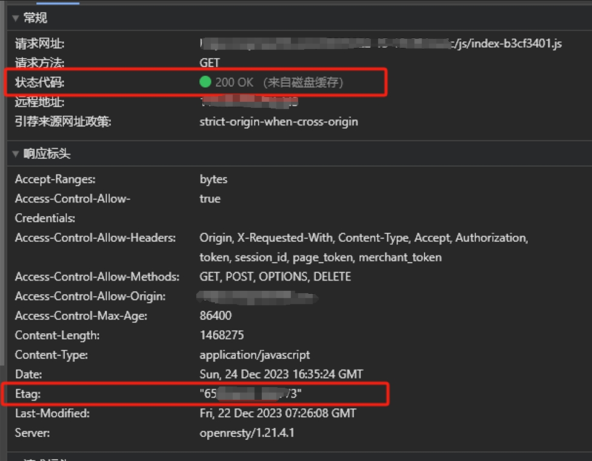

但是在dev测试过程中，用户通过刷新页面是可以获取新资源文件，来加载新版本，不排除是测试手法不对，还需要再多观察。

**4. 小结**

#### 2.7.2 浏览器缓存

浏览器缓存通常使用HTTP请求头中的If-None-Match、If-Modified-Since等字段来标识，在erp线上环境的资源请求标头中，并未发现这两个字段。

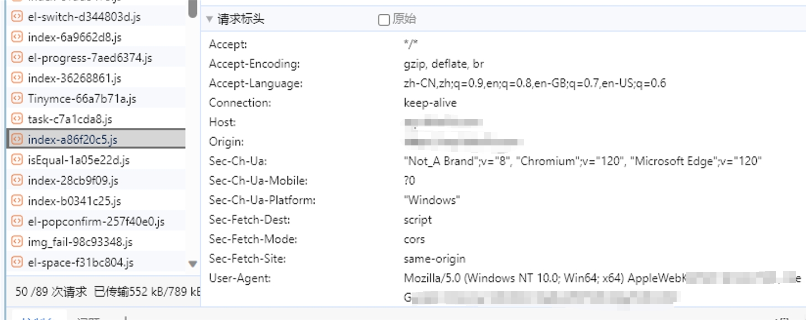

不管是哪个原因导致的，尽量都需要查看一下服务器日志信息：跳转的页面，报错内容，请求信息等。

### 2.8 客户端缓存

当用户长期停留在页面而没有做刷新动作页面时，浏览器也不会主动去请求服务器资源判断是否是新版本，除非代码中有编写此业务逻辑去判断当前版本是否更新。

排查方法：

* 1. 先查看当前版本，并记录下当前版本
* 2. 停留在系统页面，不做刷新动作，随后再推一个新版本，测试一下想法是否正确
* 3. 这时，为了请求到最新的菜单路由，我们需要做登陆动作，前提是后端代码已经生效，菜单栏也已经配置，因此我们发完版后需要在不刷新页面的情况下，做登陆的动作，并重复上面查看版本的步骤验证我们的想法是否正确。
* 4. 已在dev验证，猜想正确

### **结论:**

结合以上各种情况分析，综合判断导致404最可能的原因是：客户端文件没有更新导致

### [附加] 其他复现思路
* 1. 保留页面打开，此时新页面为发布，发布新版本后刷新页面，查看是否可以正常访问，如果第一次404，再次刷新后尝试是否可以正常访问
* 2. 确保本地电脑，同一个浏览器，已经打开过该网站，这时候关闭该标签，发布新版本后，在打开该网页，并保持控制台打开状态，重新进入新页面查看是否404，如果404，再强制刷新查看是否可以正常访问，如果可以正常访问
* 3. 查看控制台

> 打开控制台，发布新版本后需要查看控制台是否出现一下黄色警告，如果出现，则说明新资源没有生效，在刷新一次如果生效，可以正常使用，则可以将问题定位范围缩小为：新资源加载不成功，需要排查是浏览器缓存或服务器缓存导致。

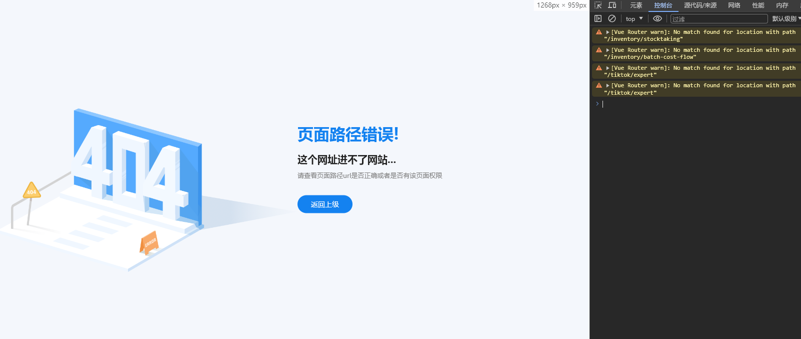

## 3. 解决方案

### 3.1 前端html文件添加meta标签

```html
<meta http-equiv="cache-control" content="no-cache,no-store, must-revalidate" />
<meta http-equiv="pragma" content="no-cache" />
<meta http-equiv="Expires" content="0" />
```

### 3.2 服务器设置入口文件不缓存

```shell
location = /index.html {
  add_header Cache-Control "no-cache, no-store;
}
```

### 3.3 设置自动监测更新

需要后端配合，提供一个检测版本的接口，前端做接口轮询的请求，为了性能考虑，可以做30min或1h的轮询。

同时，为了提高性能，需要增加一个判断，判断用户是否聚焦系统页面，聚焦时发送版本请求，失焦时取消轮询，
为了做版本比较，需要做数据缓存，使用localStorage做持久性缓存。

若本地无版本号的缓存，则先做缓存，若有缓存，则做对比，判断是否是最新版本。

如果不是最新版本，则提醒用户当前不是最新版本，需要做页面刷新动作，或者自动刷新，以帮助用户得以使用最新的版本。

```js
const hiddenProperty =
  'hidden' in document
    ? 'hidden'
    : 'webkitHidden' in document
    ? 'webkitHidden'
    : 'mozHidden' in document
    ? 'mozHidden'
    : null
const visibilityChangeEvent = hiddenProperty.replace(/hidden/i, 'visibilitychange')
const onVisibilityChange = function () {
  if (!document[hiddenProperty]) {
    console.log('页面激活')
  } else {
    console.log('页面非激活')
  }
}
window.addEventListener(visibilityChangeEvent, onVisibilityChange)

//当前窗口得到焦点
window.onfocus = function () {
  //播放动画或视频
  console.log('获取的焦点')
}

//当前窗口失去焦点
window.onblur = function () {
  //暂停动画或视频
  console.log('失去焦点')
}
```

## 4. 思维发散

是否可以尝试在系统中新增“版本管理”模块，每次发完版都能新增一条新版本记录，记录内容包括：

* 1. 版本号
* 2. 发版时间
* 3. 更新内容
* 4. 负责人员
* 5. ......

前端可以通过版本管理的记录获取最新版本与本地版本做匹配，并且在发现有新版本时，提示用户更新，并向用户说明本次更新内容。