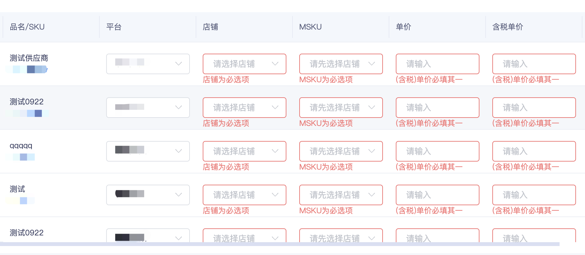

# **Vue的前端业务开发技巧**

记录一下在工作中常用的关于Vue的业务开发技巧。
<!-- more -->

## 1. 目录结构、文件职能

### 1.1 常规文件说明

| 文件名称       | 文件说明                                               |
| -------------- | ------------------------------------------------------ |
| index.vue      | 主要的模板渲染文件，组件主入口 vue 文件                |
| api.js         | 当前组件中，涉及到的数据请求方法集合文件               |
| config.js      | 主配置文件，如表单、表格等可配置化组件的配置数据       |
| useData.js     | 用于编写组件中涉及数据结构的定义、操作方法             |
| useForm.js     | 用于编写涉及表单的方法、校验规则等                     |
| useTable.js    | 用于编写涉及表格的方法、数据处理等                     |
| useAction.js   | 用于处理不涉及接口请求的数据，主要是本地的数据结构处理 |
| useMod.js      | 用于处理涉及接口请求的数据，对后端返回的数据进行处理等 |
| use/\*\*\*/.js | 其他类型的工具方法文件                                 |

### 1.2 数据的暴露与使用

常用 export default  暴露 js 文件中的变量或方法，可将文件暴露为对象或函数，如：

```javascript
// 暴露为对象
export default {
  return ...
}
// 暴露为函数(匿名函数/箭头函数)
export default () => {
  return ...
}
// 暴露为普通函数
export default function useMod() {
  return ...
}
```

在需要使用的文件里，对该 js 文件进行引入，再通过结构的方式把暴露的方法、变量解构出来，以便使用，如：

```vue
// 以vue3为例，在vue文件中引入并使用
<script setup>
import configData from './config.js'

// 如果暴露出来的是对象，则可直接调用，有需要解构则解构

// 如果暴露出来的是函数，则建议定义一个新变量接受函数返回的值
// 如需要解构则进行解构，分两种情况如下：

// 不解构
let config = ref(configData())
// 解构
let { tableConfig, formConfig } = configData()
</script>
```

## 2. 组件开发小技巧

### 2.1 template

#### 2.1.1 v-for

在开发过程中，我们经常会碰到页面中，有相同或类似的部分且由多个类型相同的元素组成，例如：表单、按钮、图表......

这时候可以把解构类似、公共属性抽离出来，每个dom单独配置一个对象，多个dom各种不同配置，最后组成一个对象数组，通过遍历对象数组来循环遍历生成dom。

**用法：**

```html
<template>
  <div v-for="(item, index) in 5" :key="index">
    {{ `${index + 1}： ${item}`}}
  </div>
</template>
```

#### 2.2.2 v-if && v-show

在循环遍历过程中，还可以利用**v-if**或者**v-show**来控制某些元素、解构的现实或隐藏，以达到更强的灵活性。

两者虽说都是控制元素的显示与隐藏，但是其原理以及性能却有所不同。

- **用法：**

```vue
<template>
  <Model v-show="isShow" />
  <Model v-if="isShow" />
</template>
```

- **共同点：**

  - 当表达式为**true**时，元素都会显示
  - 当表达式为**false**时，元素都会隐藏

- **不同点：**
  - 控制手段不同
  - 编译过程不同
  - 编译条件不同

a. 控制手段：**v-show**隐藏则是为该元素添加**css--display:none**，**dom**元素依旧还在。**v-if**显示隐藏是将**dom**元素整个添加或删除，打开 F12 可以看到 dom 元素不存在；
b. 编译过程：**v-if**切换有一个局部编译/卸载的过程，切换过程中合适地销毁和重建内部的事件监听和子组件；**v-show**只是简单的基于 css 切换；
c. 编译条件：**v-if**是真正的条件渲染，它会确保在切换过程中条件块内的事件监听器和子组件适当地被销毁和重建。只有渲染条件为假时，并不做操作，直到为真才渲染；

- **v-show**由 **_false_** 变为 **_true_** 的时候不会触发组件的生命周期
- **v-if**由 **_false_** 变为 **_true_** 的时候，触发组件的**beforeCreate**、**create**、**beforeMount**、**mounted**钩子，由 **_true_** 变为 **_false_** 的时候触发组件的**beforeDestory**、**destoryed**方法

* **性能消耗：**

**v-if**有更高的切换消耗；**v-show**有更高的初始渲染消耗；

- **使用场景**：

**v-if**  与  **v-show**  都能控制**dom**元素在页面的显示；

**v-if**  相比  **v-show**  开销更大（直接操作**dom**节点增加与删除）；

如果需要非常频繁地切换，则使用  v-show  较好；

如果在运行时条件很少改变，则使用  v-if  较好

### 2.2 js部分

通过使用 vue3 的组合式 API 配合 setup 语法糖进行开发，实现对代码的解耦，同个功能相关的业务代码可以集中在一起，方便后期维护，

在一个项目中，如果业务。逻辑比较复杂，可能会导致代码过多，可读性、可维护性都变得较差。通过使用 vue3 的 setpup 进行开发，可以有效解耦，也可以把数据与 vue 文件分开，通过引入的方式开发，可以有效解耦。

在 vue2 中，如果有较多的逻辑复用代码，我们可能是通过**mixin**去复用相同的逻辑，例如：

```javascript
export const MoveMixin = {
  data() {
    return {
      x: 0,
      y: 0
    }
  },

  methods: {
    handleKeyup(e) {
      console.log(e.code)
      // 上下左右 x y
      switch (e.code) {
        case 'ArrowUp':
          this.y--
          break
        case 'ArrowDown':
          this.y++
          break
        case 'ArrowLeft':
          this.x--
          break
        case 'ArrowRight':
          this.x++
          break
      }
    }
  },

  mounted() {
    window.addEventListener('keyup', this.handleKeyup)
  },

  unmounted() {
    window.removeEventListener('keyup', this.handleKeyup)
  }
}
```

使用方式：

```vue
<template>
  <div>Mouse position: x {{ x }} / y {{ y }}</div>
</template>

<script>
  import mousePositionMixin from './mouse'
  export default {
    mixins: [mousePositionMixin]
  }
</script>
```

使用单个**mixin**似乎问题不大，但是当我们一个组件混入大量不同的  **mixins**  的时候

```javascript
mixins: [mousePositionMixin, fooMixin, barMixin, otherMixin]
```

会存在两个非常明显的问题：

- 命名冲突
- 数据来源不清晰

现在通过**Compositon API**这种方式改写上面的代码

```javascript
import { onMounted, onUnmounted, reactive } from 'vue'
export function useMove() {
  const position = reactive({
    x: 0,
    y: 0
  })

  const handleKeyup = e => {
    console.log(e.code)
    // 上下左右 x y
    switch (e.code) {
      case 'ArrowUp':
        // y.value--;
        position.y--
        break
      case 'ArrowDown':
        // y.value++;
        position.y++
        break
      case 'ArrowLeft':
        // x.value--;
        position.x--
        break
      case 'ArrowRight':
        // x.value++;
        position.x++
        break
    }
  }

  onMounted(() => {
    window.addEventListener('keyup', handleKeyup)
  })

  onUnmounted(() => {
    window.removeEventListener('keyup', handleKeyup)
  })

  return { position }
}
```

使用方式：

```vue
<template>
  <div>Mouse position: x {{ x }} / y {{ y }}</div>
</template>

<script>
  import { useMove } from './useMove'
  import { toRefs } from 'vue'
  export default {
    setup() {
      const { position } = useMove()
      const { x, y } = toRefs(position)
      return {
        x,
        y
      }
    }
  }
</script>
```

可以看到，整个数据来源清晰了，即使去编写更多的工具函数，也不会出现命名冲突的问题。

### 2.3 在 CSS 中

我们的 ERP 虽然引入了 Tailwind Css，但是它也不是万能的，我们经常需要具体情况具体分析，根据实际 UI 效果来调整样式，达到 UI 标准。因此，我们有时候也需要自定义 css 样式，且在本项目中使用 SCSS 的预编译处理器，可灵活编写 css 样式，提高开发效率。

但由于我们项目主要依赖于 Elementplus 的 UI 组件库，有部分组件我们不得不用但是样式不符合我们的项目标准，因此需要修改组件的样式，且不能动组件的源码。这时候由两种方式：

&emsp;&emsp; a. &nbsp;需要我们自己去一层一层分析需要修改的样式节点所在层级，通过层级递进来找到对应的层级后覆盖其原本样式；

&emsp;&emsp; b. &nbsp;有时候层级递进的方式无法完成样式修改的需求，或者层级太多，比较难找，这时候可以使用样式穿透的方法来达成需求

我们的ERP虽然引入了Tailwind Css，但是它也不是万能的，我们经常需要具体情况具体分析，根据实际UI效果来调整样式，达到UI标准。

因此，我们有时候也需要自定义css样式，且在本项目中使用SCSS的预编译处理器，可灵活编写css样式，提高开发效率。

但由于我们项目主要依赖于Elementplus的UI组件库，有部分组件我们不得不用但是样式不符合我们的项目标准，因此需要修改组件的样式，且不能动组件的源码。这时候由两种方式：

&emsp;&emsp; (1) 需要我们自己去一层一层分析需要修改的样式节点所在层级，通过层级递进来找到对应的层级后覆盖其原本样式；

&emsp;&emsp; (2) 有时候层级递进的方式无法完成样式修改的需求，或者层级太多，比较难找，这时候可以使用样式穿透的方法来达成需求（:deep(\[父级clssname\])）。

```css
:deep([父级 clssname]): {
  // 编写样式
}
```

### 2.4 常见业务处理

#### 2.4.1. 状态、字段匹配

在开发过程中，经常会碰到根据后端返回的状态码来匹配不同的字段，例如用户状态：

> 0 代表禁用, 1 代表正常, 2 代表冻结, 3 代表软删除, ....

等诸如此类，普通的方法是 if/else 或者 switch case 的条件分支来进行判断匹配，但是这种方式比较不灵活和优雅，我们可以利用对象的键值对特性来实现这种字段匹配的需求。

例如：

```vue
<template> {{ status }} </template>

<script setup>
  // 后端返回关于用户的字段userStatus
  // 0: 禁用，1: 正常，2: 冻结，3: 软删除
  // 第一步，获取字段，例如返回为0
  let { userStatus } = user_info // 0
  // 定义匹配的状态码与含义的数据结构
  let enumStatus = {
    0: '禁用',
    1: '正常',
    2: '冻结',
    3: '软删除'
  }
  // 匹配状态码，获取含义
  let status = enumStatus[userStatus] // '正常'
</script>
```

#### 2.4.2 对象数组去重

业务需求中，常常涉及数组、对象数组的合并，合并问题不大，重要的是去重，通过在网络学习各路神仙的思路和写法，学到下面这种写法：

```js
// 去重函数
// @objArr: 源对象数组，@uniId: 唯一标识
const uniqueFunc = (objArr, uniId) => {
  // 初始化一个map对象
  const res = new Map()
  // 试用filter方法，过滤符合指定条件的元素
  // !res.has(item[uniId]): res的对象中没有uniId的元素
  // res.set(item[uniId], 1)): map对象转set对象
  return objArr.filter(item => !res.has(item[uniId]) && res.set(item[uniId], 1))
}
```

此写法有限是时间复杂度较小，代码量也少。

#### 2.4.3 输入框限制输入

项目中必不可少的有需要用户输入的地方，并且根据实际需求的不同，需要对输入做一些限制，首先是降低用户的输错率，其次是提高数据的安全性，在程序员的代码世界里有一句话：“永远不要相信用户的输入”，因此对用户的输入做一些限制、检验等措施都是比较必要的。

最常见的是输入框的输入限制，常见几种情形：

- 过滤空格；
- 禁止特殊字符如  \/%\*?!&|#  等；
- 仅允许输入正整数；
- 输入长度限制
- ......

根据实际情况对输入进行限制，常用的方法有以下几种：

- 利用组件自带的检验规则；
- 自定义校验方法，通过某种特性的方式来触发校验；
- 利用 input 输入框的原生 api：oninput  或  onblur  来进行输入的过滤；
- 过滤的规则多采用正则匹配的方式；
- ......

## 3. 典型业务及处理方法

### 3.1 表单校验

在需求开发中，表单是无可避免的一种业务组件，通常情况下，表单的业务组件不但有各式各样的数据录入小组件，同时还需要对用户输入的数据进行限制或校验，其中，这两者需求乃是重中之重。

在这里我们以 ELementPlus 这款 UI 框架为例来进行分解说明。

#### 3.1.1  表单的创建与数据绑定

表单创建的基础模板代码参考[ElementPlus 表单组件](https://element-plus.org/zh-CN/component/form.html)文档说明，包括基础配置、可用 Api、配置项等。

表单绑定的数据结构需要具体情况具体分析，与后端提供的接口配合，设计符合实际需求的数据结构，具体细分至：字符串（大小写）、整形、json 数据、数组序列化、json 序列化等。

#### 3.1.2 表单数据的校验

互联网开发中有一句话就是“永远不要相信用户的输入”。

因此，设计校验规则不仅是产品提出的需求，实际业务逻辑的需求，更是对于用户提供的数据安全性做一个评估的重要步骤。

首先是产品需求，根据产品经理或产品文档所述需求，对各种表单输入进行一定的校验；

其次是业务逻辑需求，例如有部分数据需要严格控制空格、回车、@符号等，对输入的数据进行校验后提供相应的提示，给用户一个输入反馈；

最后是数据安全，为了防止一些用户插入恶意代码，例如包括特殊代码字段、数据库字段等有特殊含义的字符或代码，可能导致数据泄漏和注入攻击等。

在[ElementPlus 表单组件](https://element-plus.org/zh-CN/component/form.html)中提供了内置定义好的一些规则，同时也提供了自定义校验规则的方案，我们在实际开发中按照实际需求进行开发。

#### 3.1.3 限制小组件的输入

在近期供应链的开发需求中，经常碰到的需求是 input 输入框进行输入限制，常有一下几种情况：

1.  避免空格输入；
2.  避免特殊符号；
3.  仅允许整数以及小数点；
4.  仅允许 0 ～ 100；
5.  限制两位小时
6.  ......

碰到这种需求时，最好用的莫过于正则匹配，通过编写正则匹配的规则，来对用户输入的数据进行校验和匹配过滤，把不符合规则的字符替换为指定字符或提供输入错误的反馈提示。

```vue
<template>
  <el-form
    ref="ruleFormRef"
    :model="formData"
    label-width="110px"
    class="purchase-form-class flex flex-wrap justify-between"
    :status-icon="false"
  >
    <el-form-item
      v-for="(item, index) in formConfig"
      :key="item.label + index"
      :label="item.label"
      :prop="item.prop"
    >
      <el-input
        v-model.trim="formData[item.prop]"
        :oninput="item.oninput ? (value) => item.oninput(value) : ''"
        :onblur="item.onblur ? (e) => item.onblur(e) : ''"
        :maxlength="item.maxLength ? item.maxLength : ''"
        :placeholder="item.placeholder"
        size="small"
      />
    </el-form-item>
  </el-form>
</template>

<script setup>
  const formData = ref({})
  const formConfig = ref([
    {
      label: '单价费用',
      prop: 'unit_fee',
      maxLength: 3,
      placeholder: '请输入单价',
      oninput: val => {
        val.target.value =
          val.target.value
            .replace(/\D*(\d*)(\.?)(\d{0,3})\d*/, '$1$2$3')
            .replace(/^0+(\d)/, '$1')
            .replace(/^\./, '0.')
            .replace(/^\D*(\d{0,8}(?:\.\d{0,2})?).*$/g, '$1')
            .match(/^\d*(\.?\d{0,2})/g)[0] || ''
      },
      onblur: val => {
        if (val.target.value.substr(val.target.value.length - 1, 1) == '.') {
          val.target.value = val.target.value.slice(0, -1)
        }
      }
    }
  ])
</script>
```

如上代码，通过“oninput”以及“onblur”两个 input 的内置原生方法来控制 input 输入，实现“仅输入正数、小数点、保留两位小数”的需求。

### 3.2 可编辑式表格

在近期供应链相关的需求开发期间，开始出现了需要在表格中进行编辑数据的需求，也就是在表格中嵌入输入框、下拉框或其他小组件。

其中难点是：输入数据的校验，下拉框涉及后端数据请求时，数据过多如何进行优化。

具体需求例子如下：




这种需求界面的实现方式不难，只需要做好布局规划，并在表格的单元格中插入需要的表单小组件即可，然后按照 ui 设计调整各种样式。

难点正如前面所说，在于各种不同需求的数据校验、下拉框选项过多时数据渲染的优化等。

具体实现比较多，不方面在文档中贴出，可阅读 ERP 系统前端“创建采购单”组件代码，此部分仍有优化空间，有待持续优化。

### 3.3 数据格式转换

从后端请求列表数据时，大部分情况下是无法即拿即用的，后端返回的大部分是嵌套的数据结构，他们的子级对象、数组中可能出现不同层级字段名字重复的情况，或者我们需要的字段在返回的数据中，嵌套较深，我们请求到的时候需要将某个字段取出来，因此需要统一作处理。

例如：

```js
    const getSupplierInfo = async (param) => {
    	let { code, data, err } = await Api.getPurchaseDetail(param)

    	if (code == 0) {
    		let { purchase_user } = data?.purchase_info
    		let { supplier } = data?.purchase_info
    		let { warehouse } = data?.purchase_info

      	detailData.value = {
    			purchase_id: purchase_info?.id,
    			warehouse_name: warehouse?.name,
    			receipt_type: purchase_info?.receipt_type || 1,
    			supplier_name: supplier?.supplier_name,
    			purchaser: purchase_user?.nickname,
    			third_purchase_id: purchase_info?.third_purchase_id,
    			third_batch_id: purchase_info?.third_batch_id,
    			carrier_id: null,
    			tracking_number: '',
    			currency_code: supplier?.currency_code,
    			ship_fee: supplier?.ship_fee,
    			ship_currency_code: supplier?.ship_currency_code,
    			other_fee: supplier?.other_fee,
    			other_currency_code: supplier?.other_currency_code,
    			download_paths: '',
    			product_list: purchase_info?.product_list
    		} else {
    			console.log('err', err)
    			return false
    		}
    }
```

同时，还应注意对请求到的数据做好容错处理，防止页面报错而无法渲染。

```js
let resArr = purchase_info?.product_list || []
```

### 3.4 输入框指定位置插入字符

```html
<template>
  <el-button type="primary" @click="insertTemplate">插入字符</el-button>
  <el-input v-model="remark" @blur="onBlur"></el-input>
</template>

<script setup lang="ts">
  let cursorIndex = ref(0)

  const onBlur = (e: Record<string, any>) => {
    // console.log(e.srcElement.selectionStart)
    cursorIndex.value = e.srcElement.selectionStart
  }
  // 文档插入文案模板位置
  const insertTemplate = () => {
    remark =
      remark?.slice(0, cursorIndex.value) +
      '${nodetail}' +
      remark?.slice(cursorIndex.value) +
      '${nodetail}' +
      remark?.slice(cursorIndex.value)
  }
</script>
```

### 3.5 遍历对象，整理数据结构

```javascript
const props = {
  data: {
    payee_detail: {}
  }
}

const reactiveFormOptions: Record<string, any> = reactive({
  dollar: [],
  rmb: []
})

const feeFormParam = ref([
  {
    type: 'dollar',
    param: {}
  },
  {
    type: 'rmb',
    param: {}
  }
])

for (const key in props?.data?.[props?.prop]) {
  for (const sub_key in props?.data?.[props?.prop]?.[key]) {
    formOptions[0].list.forEach((k: Record<string, any>) => {
      k.prepend = key == 'dollar' ? '$' : '￥'
      if (k.prop == sub_key) {
        reactiveFormOptions[key].push({ ...k })
      }
    })
  }
}
feeFormParam.value.forEach((v: Record<string, any>) => {
  if (v.type in props?.data?.[props?.prop]) {
    for (const key in props?.data?.[props?.prop]?.[v.type]) {
      if (key.includes('_ori')) {
        v.param[key.replace(/_ori/, '')] =
          props?.data?.[props?.prop]?.[v.type]?.[key]
      }
    }
  }
})
```